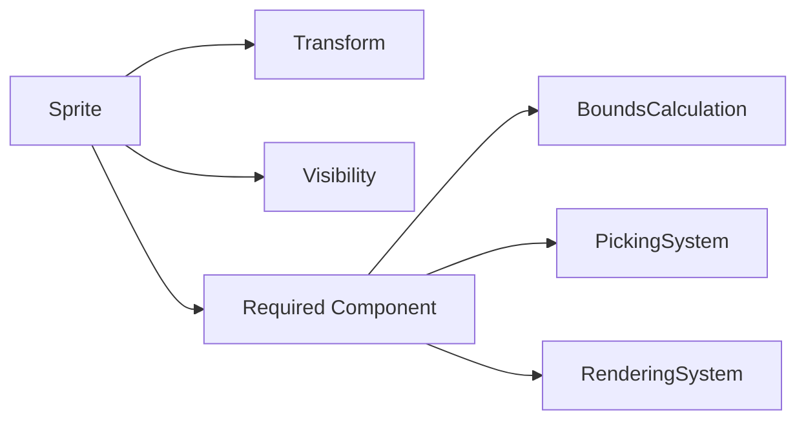

+++
title = "#18393 Fix `Anchor` component inconsistencies"
date = "2025-05-21T00:00:00"
draft = false
template = "pull_request_page.html"
in_search_index = true

[taxonomies]
list_display = ["show"]

[extra]
current_language = "en"
available_languages = {"en" = { name = "English", url = "/pull_request/bevy/2025-05/pr-18393-en-20250521" }, "zh-cn" = { name = "中文", url = "/pull_request/bevy/2025-05/pr-18393-zh-cn-20250521" }}
labels = ["A-Rendering", "C-Code-Quality", "C-Usability", "X-Contentious", "D-Straightforward"]
+++

# Title: Fix `Anchor` component inconsistencies

## Basic Information
- **Title**: Fix `Anchor` component inconsistancies
- **PR Link**: https://github.com/bevyengine/bevy/pull/18393
- **Author**: ickshonpe
- **Status**: MERGED
- **Labels**: A-Rendering, C-Code-Quality, C-Usability, S-Ready-For-Final-Review, M-Needs-Migration-Guide, X-Contentious, D-Straightforward
- **Created**: 2025-03-18T13:33:00Z
- **Merged**: 2025-05-21T15:53:05Z
- **Merged By**: alice-i-cecile

## Description Translation
**Objective**  
Fix the misleading 2D anchor API where `Anchor` is a component required by `Text2d` but stored as a field in `Sprite`.  

**Solution**  
Remove the `anchor` field from `Sprite` and make `Anchor` a required component.  

**Migration Guide**  
The `anchor` field has been removed from `Sprite`. Instead, add the `Anchor` component to entities with `Sprite`.

## The Story of This Pull Request

The core issue stemmed from an inconsistent API design where the `Anchor` component was required for `Text2d` but implemented as a field in `Sprite`. This discrepancy caused confusion and violated the Entity Component System (ECS) pattern's consistency principles. The `Sprite` component contained both rendering properties and layout information, mixing concerns that should be separate components.

The solution involved refactoring the API to treat `Anchor` uniformly across all 2D entities. By removing the `anchor` field from `Sprite` and making it a standalone component, the PR achieved:

1. **API Consistency**: Matching `Text2d`'s component structure
2. **ECS Compliance**: Proper separation of rendering and layout concerns
3. **Simplified Systems**: Queries for sprite-related logic now explicitly include `Anchor`

Key implementation steps included:

- Removing the `anchor` field from `Sprite` struct definition
- Updating all systems accessing sprite anchors to query for `Anchor` component
- Modifying sprite creation in examples and tests to include `Anchor` as a separate component

For example, the sprite bounds calculation system was updated from:
```rust
// Before:
for (entity, sprite) in &sprites_to_recalculate_aabb {
    let center = -sprite.anchor.as_vec() * size;
}

// After:
for (entity, sprite, anchor) in &sprites_to_recalculate_aabb {
    let center = -anchor.as_vec() * size;
}
```

This change propagated through multiple systems including rendering, picking, and texture slicing. The `compute_pixel_space_point` method signature in `Sprite` was updated to accept an `Anchor` parameter instead of using the struct field:
```rust
pub fn compute_pixel_space_point(
    &self,
    point_relative_to_sprite: Vec2,
    anchor: Anchor,  // Now passed as parameter
    // ... other params unchanged
) -> Result<Vec2, Vec2>
```

The migration required updating all entity spawn commands to include `Anchor` as a separate component:
```rust
// Before:
commands.spawn(Sprite {
    anchor: Anchor::TOP_RIGHT,
    // ... other fields
});

// After:
commands.spawn((
    Sprite { /* ... */ },
    Anchor::TOP_RIGHT
));
```

## Visual Representation



## Key Files Changed

1. **crates/bevy_sprite/src/sprite.rs** (+53/-30)  
   - Removed `anchor` field from `Sprite` struct
   - Updated `compute_pixel_space_point` to take `Anchor` parameter
   - Modified test cases to use separate `Anchor` component

2. **crates/bevy_sprite/src/lib.rs** (+12/-10)  
   - Updated bounds calculation system to query for `Anchor` component
   - Modified test spawn commands to include `Anchor`

```rust
// Before test entity:
.spawn(Sprite {
    rect: Some(Rect::new(0., 0., 0.5, 1.)),
    anchor: Anchor::TOP_RIGHT,
    // ...
})

// After test entity:
.spawn((
    Sprite { /* ... */ },
    Anchor::TOP_RIGHT
))
```

3. **crates/bevy_sprite/src/picking_backend.rs** (+7/-5)  
   - Updated picking system to include `Anchor` in queries
   - Modified radix sort key to account for `Anchor` component

4. **crates/bevy_sprite/src/render/mod.rs** (+5/-4)  
   - Updated sprite extraction system to include `Anchor`
   - Passed anchor value to texture slice extraction

5. **examples/picking/sprite_picking.rs**  
   - Updated example entities to use `Anchor` component
   - Fixed sprite spawning syntax

## Further Reading

- [Bevy ECS Guide](https://bevyengine.org/learn/book/ecs-intro/)
- [Component-Based Architecture Patterns](https://gameprogrammingpatterns.com/component.html)
- [API Design Guidelines](https://rust-lang.github.io/api-guidelines/)