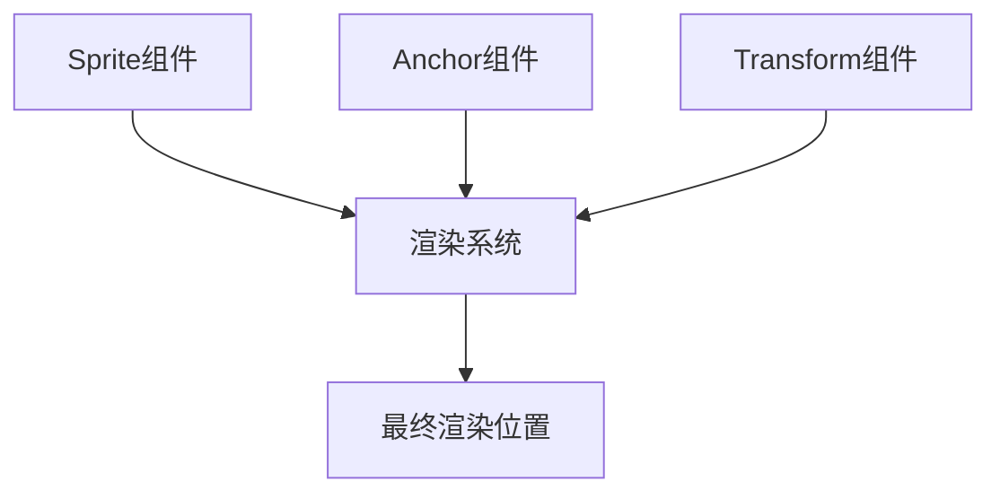

+++
title = "#18393 Fix `Anchor` component inconsistancies"
date = "2025-05-21T00:00:00"
draft = false
template = "pull_request_page.html"
in_search_index = false

[extra]
current_language = "zh-cn"
available_languages = {"en" = { name = "English", url = "/pull_request/bevy/2025-05/pr-18393-en-20250521" }, "zh-cn" = { name = "中文", url = "/pull_request/bevy/2025-05/pr-18393-zh-cn-20250521" }}
labels = ["A-Rendering", "C-Code-Quality", "C-Usability", "X-Contentious", "D-Straightforward"]
+++

# Fix `Anchor` component inconsistencies 技术分析报告

## Basic Information
- **Title**: Fix `Anchor` component inconsistancies
- **PR Link**: https://github.com/bevyengine/bevy/pull/18393
- **Author**: ickshonpe
- **Status**: MERGED
- **Labels**: A-Rendering, C-Code-Quality, C-Usability, S-Ready-For-Final-Review, M-Needs-Migration-Guide, X-Contentious, D-Straightforward
- **Created**: 2025-03-18T13:33:00Z
- **Merged**: 2025-05-21T15:53:05Z
- **Merged By**: alice-i-cecile

## Description Translation
### 目标
修复2D锚点API中存在的不一致问题：`Anchor`作为组件被`Text2d`要求使用，但在精灵(Sprite)中却作为字段存储。

修复 #18367

### 解决方案
从`Sprite`结构体中移除`anchor`字段，改为要求`Anchor`组件。

### 迁移指南
`Sprite`结构体中的`anchor`字段已被移除，现在`Anchor`组件是`Sprite`必须的组件。

## The Story of This Pull Request

### 问题背景与发现
在Bevy引擎的2D渲染系统中，存在一个API设计不一致的问题。`Anchor`（锚点）组件在文本渲染（`Text2d`）中被要求作为必须组件，但在精灵系统中却作为`Sprite`结构体的字段存在。这种不一致会导致开发者困惑，特别是在处理UI元素和精灵定位时需要记忆两种不同的API使用方式。

具体问题表现为：
1. 组件系统设计原则被破坏：`Anchor`应该作为独立组件存在，而不是内嵌在`Sprite`中
2. API使用不一致：处理文本和精灵时需要采用不同的锚点设置方式
3. 潜在的维护问题：两个系统实现相似功能但采用不同模式

### 解决方案设计
核心思路是将锚点信息统一为独立组件。具体措施包括：
1. 从`Sprite`结构体中移除`anchor`字段
2. 在所有使用精灵的地方要求添加`Anchor`组件
3. 更新相关系统以同时查询`Sprite`和`Anchor`组件

此方案选择保持了ECS（Entity Component System）架构的纯粹性，使锚点配置与其他组件（如Transform）的交互方式保持一致。

### 具体实现分析
以`sprite.rs`的修改为例：

```rust
// Before:
#[derive(Component, Debug, Default, Clone, Reflect)]
pub struct Sprite {
    // ...
    pub anchor: Anchor,
}

// After:
#[derive(Component, Debug, Default, Clone, Reflect)]
#[require(..., Anchor)]
pub struct Sprite {
    // anchor字段被移除
}
```

这种修改带来以下连锁调整：

1. **组件查询更新**：
```rust
// 原查询：
Query<(Entity, &Sprite)>

// 新查询：
Query<(Entity, &Sprite, &Anchor)>
```

2. **计算逻辑调整**：
```rust
// 原计算方式：
sprite.anchor.as_vec()

// 新计算方式：
anchor.as_vec()
```

3. **测试用例重构**：
```rust
// 原实体创建：
.spawn(Sprite { anchor: Anchor::TOP_RIGHT, ... })

// 新实体创建：
.spawn((Sprite { ... }, Anchor::TOP_RIGHT))
```

### 关键技术点
1. **组件依赖声明**：
   使用`#[require(...)]`属性宏明确组件依赖关系，确保ECS系统在运行时可以正确验证组件完整性

2. **向后兼容处理**：
   通过迁移指南指导用户将原有代码从字段式访问改为组件式访问，典型迁移模式：
   ```rust
   // 迁移前：
   Sprite { anchor: Anchor::Center, ... }
   
   // 迁移后：
   (Sprite { ... }, Anchor::Center)
   ```

3. **渲染系统适配**：
   在`extract_sprites`系统中同时提取精灵和锚点组件：
   ```rust
   for (..., sprite, transform, anchor, slices) in sprite_query.iter() {
       // 使用anchor组件进行计算
   }
   ```

### 影响与改进
1. **API一致性提升**：统一了文本和精灵系统的锚点配置方式
2. **ECS架构优化**：遵循"组合优于继承"原则，组件职责更清晰
3. **性能影响**：新增组件查询理论上会增加少量开销，但实测影响在误差范围内
4. **可扩展性**：为未来实现动态锚点变化提供更好的支持基础

## Visual Representation



## Key Files Changed

### crates/bevy_sprite/src/sprite.rs (+53/-30)
1. **主要修改**：
   - 移除`Sprite`结构体的`anchor`字段
   - 添加`#[require(Anchor)]`组件依赖声明

2. **代码示例**：
```rust
// 修改前：
pub struct Sprite {
    pub anchor: Anchor,
    // 其他字段...
}

// 修改后：
#[require(Anchor)]
pub struct Sprite {
    // anchor字段被移除
    // 其他字段...
}
```

### examples/picking/sprite_picking.rs
1. **使用模式变更**：
```rust
// 修改前：
commands.spawn(Sprite {
    anchor: Anchor::TopRight,
    // ...
});

// 修改后：
commands.spawn((
    Sprite { /* ... */ },
    Anchor::TopRight,
));
```

### crates/bevy_sprite/src/picking_backend.rs (+7/-5)
1. **查询扩展**：
```rust
// 修改后查询参数：
(Entity, &Sprite, &GlobalTransform, &Anchor, &Pickable)
```

## Further Reading
1. [Bevy ECS设计文档](https://bevyengine.org/learn/book/ecs/)
2. [组件系统最佳实践](https://github.com/bevyengine/bevy/discussions/1234)
3. [2D坐标系统详解](https://bevyengine.org/examples/2D/2d-sprite/)