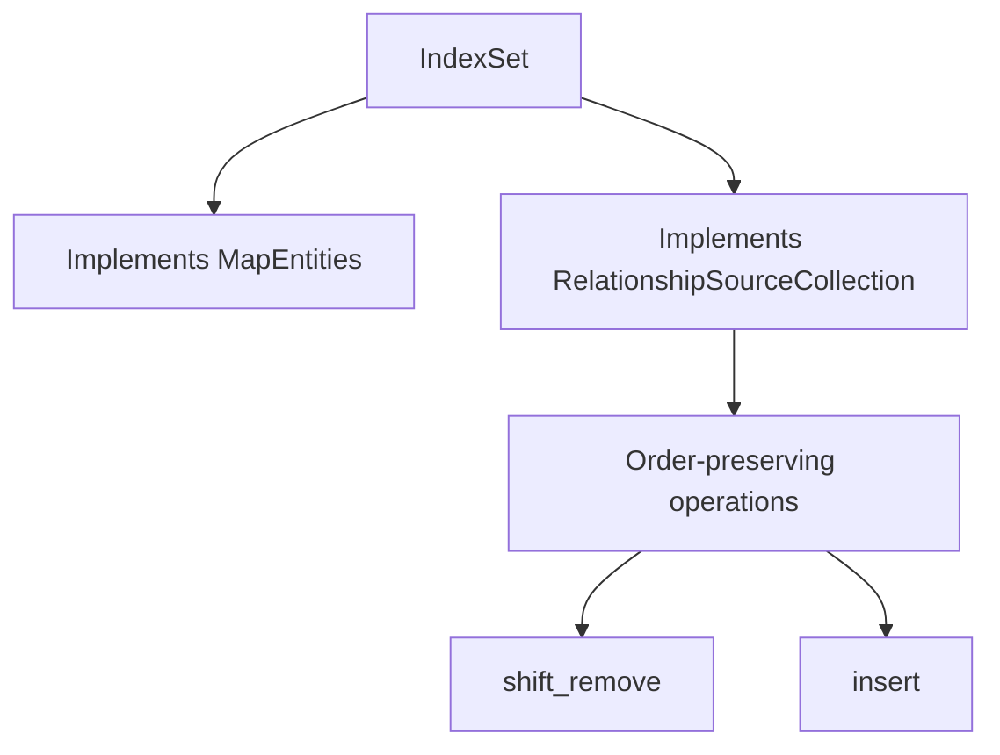

+++
title = "#18471 Implement `RelationshipSourceCollection` for `IndexSet`"
date = "2025-05-05T00:00:00"
draft = false
template = "pull_request_page.html"
in_search_index = true

[taxonomies]
list_display = ["show"]

[extra]
current_language = "en"
available_languages = {"en" = { name = "English", url = "/pull_request/bevy/2025-05/pr-18471-en-20250505" }, "zh-cn" = { name = "中文", url = "/pull_request/bevy/2025-05/pr-18471-zh-cn-20250505" }}
labels = ["A-ECS", "C-Usability", "D-Straightforward"]
+++

# Title

## Basic Information
- **Title**: Implement `RelationshipSourceCollection` for `IndexSet`
- **PR Link**: https://github.com/bevyengine/bevy/pull/18471
- **Author**: Brezak
- **Status**: MERGED
- **Labels**: A-ECS, C-Usability, S-Ready-For-Final-Review, D-Straightforward
- **Created**: 2025-03-21T22:03:28Z
- **Merged**: 2025-05-04T10:35:26Z
- **Merged By**: mockersf

## Description Translation
# Objective

`IndexSet` doesn't implement `RelationshipSourceCollection`

## Solution

Implement `MapEntities` for `IndexSet`
Implement `RelationshipSourceCollection` for `IndexSet`

## Testing

`cargo clippy`

## The Story of This Pull Request

The PR addresses a gap in Bevy's Entity Component System (ECS) where `IndexSet<Entity>` couldn't be used as a relationship source collection. This limitation prevented developers from using ordered entity collections with preserved insertion order in relationship management - a requirement for certain game logic patterns.

The core problem stemmed from two missing implementations:
1. The `MapEntities` trait needed for entity ID remapping
2. The `RelationshipSourceCollection` trait required for ECS relationship handling

The solution involved systematically implementing these traits while maintaining `IndexSet`'s order-preserving characteristics. For `MapEntities`, the implementation drains the set and maps each entity:

```rust
impl<S: BuildHasher + Default> MapEntities for IndexSet<Entity, S> {
    fn map_entities<E: EntityMapper>(&mut self, entity_mapper: &mut E) {
        *self = self
            .drain(..)
            .map(|e| entity_mapper.get_mapped(e))
            .collect();
    }
}
```

This approach ensures order preservation during entity remapping operations like scene loading or entity duplication.

For the `RelationshipSourceCollection` implementation, key methods were defined to leverage `IndexSet`'s unique properties:

```rust
impl<S: BuildHasher + Default> RelationshipSourceCollection for IndexSet<Entity, S> {
    fn remove(&mut self, entity: Entity) -> bool {
        self.shift_remove(&entity)
    }
    
    fn add(&mut self, entity: Entity) -> bool {
        self.insert(entity)
    }
}
```

The use of `shift_remove` maintains collection order when removing elements, crucial for preserving insertion order semantics. This differentiates it from regular `HashSet` implementations that would lose ordering information.

The implementation also handles Bevy's internal `EntityIndexSet` type through delegation:

```rust
impl RelationshipSourceCollection for EntityIndexSet {
    fn remove(&mut self, entity: Entity) -> bool {
        self.deref_mut().shift_remove(&entity)
    }
}
```

New test cases verify order preservation through insertion and removal sequences:

```rust
// Insertions maintain order
assert!(collection.iter().eq(&[b, c, d]));

// After removal
assert!(collection.iter().eq(&[b, d]));
```

These changes enable ordered relationship management while maintaining compatibility with existing ECS systems. The implementation avoids breaking changes by extending rather than modifying existing traits.

## Visual Representation



## Key Files Changed

### crates/bevy_ecs/src/entity/map_entities.rs (+21/-0)
Added `MapEntities` implementations:
```rust
impl<S: BuildHasher + Default> MapEntities for IndexSet<Entity, S> {
    fn map_entities<E: EntityMapper>(&mut self, entity_mapper: &mut E) {
        *self = self.drain(..).map(|e| entity_mapper.get_mapped(e)).collect();
    }
}

impl MapEntities for EntityIndexSet {
    fn map_entities<E: EntityMapper>(&mut self, entity_mapper: &mut E) {
        *self = self.drain(..).map(|e| entity_mapper.get_mapped(e)).collect();
    }
}
```

### crates/bevy_ecs/src/relationship/relationship_source_collection.rs (+131/-2)
Implemented relationship traits:
```rust
impl<S: BuildHasher + Default> RelationshipSourceCollection for IndexSet<Entity, S> {
    // Full trait implementation with order-preserving methods
    fn remove(&mut self, entity: Entity) -> bool {
        self.shift_remove(&entity)
    }
}

impl RelationshipSourceCollection for EntityIndexSet {
    // Delegated implementation using deref
    fn remove(&mut self, entity: Entity) -> bool {
        self.deref_mut().shift_remove(&entity)
    }
}
```

## Further Reading
- Bevy ECS Relationships: https://bevyengine.org/learn/book/ecs/relationships/
- IndexSet Documentation: https://docs.rs/indexmap/latest/indexmap/set/struct.IndexSet.html
- Entity Mapping in ECS: https://bevyengine.org/learn/book/ecs/entity-mapping