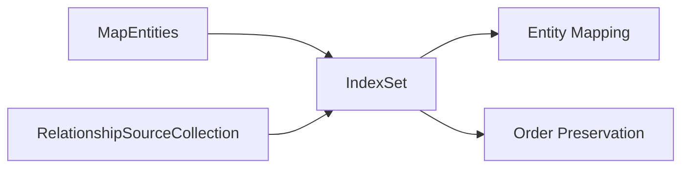

+++
title = "#18471 Implement `RelationshipSourceCollection` for `IndexSet`"
date = "2025-05-05T00:00:00"
draft = false
template = "pull_request_page.html"
in_search_index = false

[extra]
current_language = "zh-cn"
available_languages = {"en" = { name = "English", url = "/pull_request/bevy/2025-05/pr-18471-en-20250505" }, "zh-cn" = { name = "中文", url = "/pull_request/bevy/2025-05/pr-18471-zh-cn-20250505" }}
labels = ["A-ECS", "C-Usability", "D-Straightforward"]
+++

# 为 IndexSet 实现 RelationshipSourceCollection 的技术报告

## Basic Information
- **Title**: Implement `RelationshipSourceCollection` for `IndexSet`
- **PR Link**: https://github.com/bevyengine/bevy/pull/18471
- **Author**: Brezak
- **Status**: MERGED
- **Labels**: A-ECS, C-Usability, S-Ready-For-Final-Review, D-Straightforward
- **Created**: 2025-03-21T22:03:28Z
- **Merged**: 2025-05-04T10:35:26Z
- **Merged By**: mockersf

## Description Translation
### 目标
`IndexSet` 未实现 `RelationshipSourceCollection`

### 解决方案
1. 为 `IndexSet` 实现 `MapEntities`
2. 为 `IndexSet` 实现 `RelationshipSourceCollection`

### 测试
`cargo clippy`

## The Story of This Pull Request

### 问题与上下文
在 Bevy 的 ECS 系统中，`RelationshipSourceCollection` trait 用于管理实体关系的来源集合。现有的实现支持 `HashSet`、`BTreeSet` 等集合类型，但缺少对 `IndexSet` 的支持。`IndexSet` 作为保持插入顺序的集合类型，在某些需要顺序保证的场景（如关系维护、序列化/反序列化）中具有独特优势。这种缺失导致开发者无法在关系系统中利用 `IndexSet` 的特性。

### 解决方案
PR 的核心思路是为 `IndexSet` 实现两个关键 trait：
1. **MapEntities**：用于实体 ID 的映射转换
2. **RelationshipSourceCollection**：用于关系系统的集合操作

实现策略遵循现有集合类型的模式，同时保留 `IndexSet` 的顺序特性。关键决策点包括：
- 保持 `IndexSet` 的插入顺序在映射操作后不变
- 使用 `shift_remove` 代替常规 `remove` 以维持索引连续性
- 复用已有集合类型的实现模式保证一致性

### 实现细节
在 `map_entities.rs` 中新增实现：
```rust
impl<S: BuildHasher + Default> MapEntities for IndexSet<Entity, S> {
    fn map_entities<E: EntityMapper>(&mut self, entity_mapper: &mut E) {
        *self = self
            .drain(..)
            .map(|e| entity_mapper.get_mapped(e))
            .collect();
    }
}
```
此实现通过 `drain` 保持原始顺序，逐个映射实体 ID 后重建集合。

在 `relationship_source_collection.rs` 中的关键实现：
```rust
impl<S: BuildHasher + Default> RelationshipSourceCollection for IndexSet<Entity, S> {
    fn remove(&mut self, entity: Entity) -> bool {
        self.shift_remove(&entity)
    }
    
    fn add(&mut self, entity: Entity) -> bool {
        self.insert(entity)
    }
}
```
使用 `shift_remove` 确保删除操作后保持元素顺序，这是与常规 `HashSet` 实现的主要区别点。

### 技术影响
1. **顺序保留**：使关系系统支持有序实体集合，适用于需要严格顺序控制的场景
2. **API 一致性**：扩展了 ECS 系统的类型支持范围，降低开发者的认知成本
3. **性能考量**：`IndexSet` 的查找性能为 O(1)，插入/删除性能与 `HashSet` 相当，同时额外维护顺序信息

新增的测试用例验证了核心功能：
```rust
#[test]
fn entity_index_map() {
    // ... 测试代码 ...
    // 验证插入顺序保持
    assert!(collection.iter().eq(&[b, c, d]));
    // 验证删除后的顺序保持
    assert!(collection.iter().eq(&[b, d]));
}
```

## Visual Representation


## Key Files Changed

### crates/bevy_ecs/src/entity/map_entities.rs (+21/-0)
```rust
// 新增 IndexSet 的 MapEntities 实现
impl<S: BuildHasher + Default> MapEntities for IndexSet<Entity, S> {
    fn map_entities<E: EntityMapper>(&mut self, entity_mapper: &mut E) {
        *self = self.drain(..).map(|e| entity_mapper.get_mapped(e)).collect();
    }
}

// EntityIndexSet 的特化实现
impl MapEntities for EntityIndexSet {
    fn map_entities<E: EntityMapper>(&mut self, entity_mapper: &mut E) {
        *self = self.drain(..).map(|e| entity_mapper.get_mapped(e)).collect();
    }
}
```

### crates/bevy_ecs/src/relationship/relationship_source_collection.rs (+131/-2)
```rust
// 为 IndexSet 实现 RelationshipSourceCollection
impl<S: BuildHasher + Default> RelationshipSourceCollection for IndexSet<Entity, S> {
    type SourceIter<'a> = core::iter::Copied<indexmap::set::Iter<'a, Entity>>;

    fn remove(&mut self, entity: Entity) -> bool {
        self.shift_remove(&entity)
    }
    
    // 其他方法实现保持与标准集合一致...
}

// EntityIndexSet 的特化实现
impl RelationshipSourceCollection for EntityIndexSet {
    type SourceIter<'a> = core::iter::Copied<crate::entity::index_set::Iter<'a>>;
    
    fn remove(&mut self, entity: Entity) -> bool {
        self.deref_mut().shift_remove(&entity)
    }
    
    // 其他委托方法实现...
}
```

## Further Reading
1. [IndexSet 官方文档](https://docs.rs/indexmap/latest/indexmap/set/struct.IndexSet.html)
2. [Bevy ECS 关系系统指南](https://bevyengine.org/learn/book/ecs/relationships/)
3. [Rust 的 trait 实现模式](https://doc.rust-lang.org/book/ch10-02-traits.html)