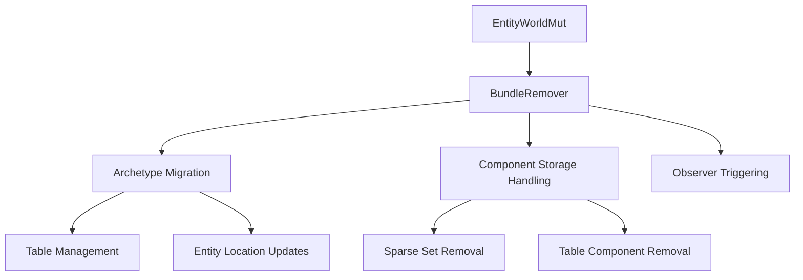

+++
title = "#18521 Add `BundleRemover`"
date = "2025-05-06T00:00:00"
draft = false
template = "pull_request_page.html"
in_search_index = true

[taxonomies]
list_display = ["show"]

[extra]
current_language = "en"
available_languages = {"en" = { name = "English", url = "/pull_request/bevy/2025-05/pr-18521-en-20250506" }, "zh-cn" = { name = "中文", url = "/pull_request/bevy/2025-05/pr-18521-zh-cn-20250506" }}
labels = ["A-ECS", "C-Code-Quality", "D-Unsafe"]
+++

# Add `BundleRemover`

## Basic Information
- **Title**: Add `BundleRemover`
- **PR Link**: https://github.com/bevyengine/bevy/pull/18521
- **Author**: ElliottjPierce
- **Status**: MERGED
- **Labels**: A-ECS, C-Code-Quality, S-Ready-For-Final-Review, X-Uncontroversial, D-Unsafe
- **Created**: 2025-03-24T23:23:06Z
- **Merged**: 2025-05-06T00:17:11Z
- **Merged By**: alice-i-cecile

## Description Translation

# Objective

It has long been a todo item in the ecs to create a `BundleRemover` alongside the inserter, spawner, etc.

This is an uncontroversial first step of #18514.

## Solution

Move existing code from complex helper functions to one generalized `BundleRemover`.

## Testing

Existing tests.

## The Story of This Pull Request

The Entity Component System (ECS) core needed better abstraction for bundle removal operations. Prior to this PR, bundle removal logic was scattered across multiple helper functions in `entity_ref.rs`, leading to code duplication and maintenance challenges. The lack of a dedicated removal structure created inconsistency with other ECS operations like insertion and spawning that already had dedicated handlers.

The solution introduces a `BundleRemover` struct that centralizes bundle removal logic. This aligns with existing patterns like `BundleInserter` and `BundleSpawner`, creating a more symmetrical API surface. The implementation required careful handling of ECS internals including archetype transitions, sparse set updates, and observer triggering.

Key technical challenges included:
1. Safely managing entity transitions between archetypes
2. Properly handling component storage types (table vs sparse set)
3. Maintaining observer/hook invocation guarantees
4. Ensuring memory safety in unsafe code blocks

The `BundleRemover` implementation addresses these through:
- Encapsulating archetype migration logic
- Centralizing sparse set component removal
- Unified handling of observer systems and relationship hooks
- Strict safety invariants documented in code comments

By creating this abstraction, the PR eliminates ~378 lines of redundant code while maintaining identical functionality. This reduces cognitive load for future maintenance and sets the stage for more complex bundle operations planned in #18514.

## Visual Representation



## Key Files Changed

### `crates/bevy_ecs/src/bundle.rs` (+272/-1)
**Purpose**: Implement core `BundleRemover` logic

Key additions:
```rust
pub(crate) struct BundleRemover<'w> {
    world: UnsafeWorldCell<'w>,
    bundle_info: ConstNonNull<BundleInfo>,
    old_and_new_table: Option<(NonNull<Table>, NonNull<Table>)>,
    old_archetype: NonNull<Archetype>,
    new_archetype: NonNull<Archetype>,
}

impl<'w> BundleRemover<'w> {
    pub(crate) unsafe fn new<T: Bundle>(...) -> Option<Self> { ... }
    pub(crate) unsafe fn remove(...) -> (EntityLocation, T) {
        // Handles:
        // - Observer triggering
        // - Component removal from sparse sets
        // - Archetype migration
        // - Table row management
    }
}
```

### `crates/bevy_ecs/src/world/entity_ref.rs` (+151/-378)
**Purpose**: Replace manual removal logic with `BundleRemover` calls

Before:
```rust
// Complex manual removal logic spanning multiple functions
unsafe fn take_component(...) -> OwningPtr<'a> { ... }
fn trigger_on_replace_and_on_remove_hooks_and_observers(...) { ... }
```

After:
```rust
// Simplified removal using BundleRemover
pub fn take<T: Bundle + BundleFromComponents>(&mut self) -> Option<T> {
    let mut remover = unsafe { BundleRemover::new::<T>(...) }?;
    let (new_location, result) = unsafe {
        remover.remove(...)
    };
    self.location = new_location;
    Some(result)
}
```

## Further Reading
- Bevy ECS Architecture Guide: https://bevyengine.org/learn/book/ecs-architecture/
- Entity Component System Pattern: https://en.wikipedia.org/wiki/Entity_component_system
- Rust Unsafe Code Guidelines: https://rust-lang.github.io/unsafe-code-guidelines/

# Full Code Diff
(See provided diff in original request)