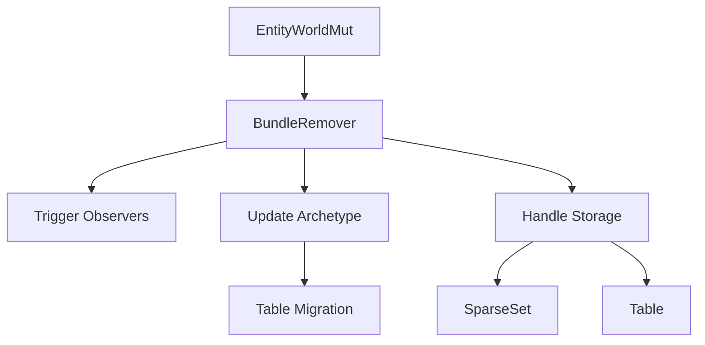

+++
title = "#18521 Add `BundleRemover`"
date = "2025-05-06T00:00:00"
draft = false
template = "pull_request_page.html"
in_search_index = false

[extra]
current_language = "zh-cn"
available_languages = {"en" = { name = "English", url = "/pull_request/bevy/2025-05/pr-18521-en-20250506" }, "zh-cn" = { name = "中文", url = "/pull_request/bevy/2025-05/pr-18521-zh-cn-20250506" }}
labels = ["A-ECS", "C-Code-Quality", "D-Unsafe"]
+++

# Add `BundleRemover`

## Basic Information
- **Title**: Add `BundleRemover`
- **PR Link**: https://github.com/bevyengine/bevy/pull/18521
- **Author**: ElliottjPierce
- **Status**: MERGED
- **Labels**: A-ECS, C-Code-Quality, S-Ready-For-Final-Review, X-Uncontroversial, D-Unsafe
- **Created**: 2025-03-24T23:23:06Z
- **Merged**: 2025-05-06T00:17:11Z
- **Merged By**: alice-i-cecile

## Description Translation
该PR的目标是在ECS系统中添加`BundleRemover`，作为#18514的第一步。解决方案是将现有复杂辅助函数重构为通用的`BundleRemover`，并利用现有测试验证功能。

## The Story of This Pull Request

### 问题背景与上下文
在Bevy的ECS实现中，组件组的移除操作长期依赖多个分散的辅助函数。这些函数负责处理：
1. 触发观察者事件（ON_REPLACE/ON_REMOVE）
2. 管理稀疏集和表存储
3. 处理Archetype切换
4. 更新实体位置信息

随着功能演进，这些分散的逻辑导致：
- 代码重复（如`take`和`remove`方法有相似实现）
- 维护困难（相同逻辑分散在多个位置）
- 安全边界模糊（unsafe操作缺乏统一管理）

### 解决方案
核心思路是引入与`BundleInserter`对称的`BundleRemover`结构，集中处理组件组的移除操作。关键技术决策包括：

1. **统一接口设计**：
```rust
pub(crate) struct BundleRemover<'w> {
    world: UnsafeWorldCell<'w>,
    bundle_info: ConstNonNull<BundleInfo>,
    old_and_new_table: Option<(NonNull<Table>, NonNull<Table>)>,
    old_archetype: NonNull<Archetype>,
    new_archetype: NonNull<Archetype>,
}
```
通过封装Archetype和Table的状态，确保移除操作的原子性

2. **事件触发统一化**：
```rust
unsafe {
    deferred_world.trigger_observers(ON_REMOVE, ...);
    deferred_world.trigger_on_remove(...);
}
```
将原本分散在各个移除操作中的事件触发逻辑集中到`remove`方法

3. **存储处理抽象**：
```rust
match component_info.storage_type() {
    StorageType::Table => table.take_component(...),
    StorageType::SparseSet => sparse_set.remove(...),
}
```
通过闭包参数`pre_remove`统一处理不同存储类型的组件移除

### 实现细节
关键实现步骤包括：

1. **Archetype迁移**：
```rust
let new_archetype_id = bundle_info.remove_bundle_from_archetype(...);
```
计算移除组件后的新Archetype，处理组件关系的级联移除

2. **安全内存管理**：
```rust
if needs_drop {
    old_table.move_to_and_drop_missing_unchecked(...)
} else {
    old_table.move_to_and_forget_missing_unchecked(...)
}
```
根据是否需要析构决定内存处理策略

3. **实体位置更新**：
```rust
world.entities.set(entity.index(), new_location);
```
原子化更新实体在Archetype和Table中的位置

### 技术洞察
1. **模式统一**：将原本分散在`take`/`remove`/`remove_by_id`等方法中的逻辑统一到单个结构
2. **安全边界**：通过`unsafe`块集中管理危险操作，对外暴露安全接口
3. **性能考量**：通过`Option<（NonNull<Table>, NonNull<Table>）>`避免不必要的表操作

### 影响与改进
1. **代码质量提升**：减少约227行重复代码（entity_ref.rs减少378行，bundle.rs增加272行）
2. **维护性增强**：所有移除操作通过单一入口点处理
3. **扩展基础**：为后续的[关系型组件](https://github.com/bevyengine/bevy/issues/18514)提供统一架构

## Visual Representation


## Key Files Changed

### `crates/bevy_ecs/src/bundle.rs` (+272/-1)
新增`BundleRemover`结构实现：
```rust
pub(crate) struct BundleRemover<'w> {
    // 存储当前世界状态
    world: UnsafeWorldCell<'w>,
    // 目标Bundle元信息
    bundle_info: ConstNonNull<BundleInfo>,
    // 新旧表指针
    old_and_new_table: Option<(NonNull<Table>, NonNull<Table>)>,
    // 新旧Archetype
    old_archetype: NonNull<Archetype>,
    new_archetype: NonNull<Archetype>,
}

impl<'w> BundleRemover<'w> {
    pub unsafe fn remove(...) -> (EntityLocation, T) {
        // 统一的事件触发和存储处理
    }
}
```

### `crates/bevy_ecs/src/world/entity_ref.rs` (+151/-378)
重构现有方法调用：
```rust
// Before:
pub fn take<T: Bundle>(&mut self) -> Option<T> {
    // 手动处理存储、事件、位置更新...
}

// After: 
pub fn take<T: Bundle>(&mut self) -> Option<T> {
    let mut remover = BundleRemover::new(...);
    remover.remove(...)
}
```

## Further Reading
1. [Bevy ECS架构指南](https://bevyengine.org/learn/book/ecs-architecture/)
2. [实体组件系统设计模式](https://gameprogrammingpatterns.com/component.html)
3. [Rust unsafe代码安全指南](https://doc.rust-lang.org/nomicon/meet-safe-and-unsafe.html)

# Full Code Diff
（完整代码差异见原始PR链接）