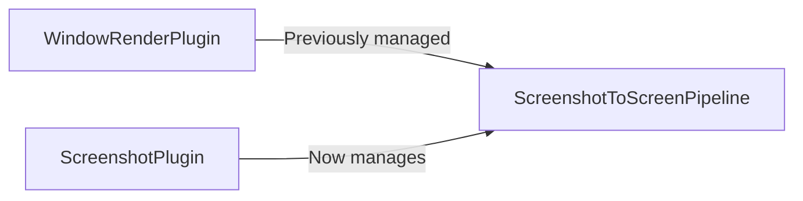

+++
title = "#18524 Move initializing the `ScreenshotToScreenPipeline` to the `ScreenshotPlugin`"
date = "2025-05-06T00:00:00"
draft = false
template = "pull_request_page.html"
in_search_index = true

[taxonomies]
list_display = ["show"]

[extra]
current_language = "en"
available_languages = {"en" = { name = "English", url = "/pull_request/bevy/2025-05/pr-18524-en-20250506" }, "zh-cn" = { name = "中文", url = "/pull_request/bevy/2025-05/pr-18524-zh-cn-20250506" }}
labels = ["D-Trivial", "A-Windowing"]
+++

# Title: Move initializing the `ScreenshotToScreenPipeline` to the `ScreenshotPlugin`

## Basic Information
- **Title**: Move initializing the `ScreenshotToScreenPipeline` to the `ScreenshotPlugin`.
- **PR Link**: https://github.com/bevyengine/bevy/pull/18524
- **Author**: andriyDev
- **Status**: MERGED
- **Labels**: D-Trivial, A-Windowing, S-Ready-For-Final-Review
- **Created**: 2025-03-25T00:54:58Z
- **Merged**: 2025-05-06T00:17:11Z
- **Merged By**: alice-i-cecile

## Description Translation
# Objective

- Minor cleanup.
- This seems to have been introduced in #8336. There is no discussion about it I can see, there's no comment explaining why this is here and not in `ScreenshotPlugin`. This seems to have just been misplaced.

## Solution

- Move this to the ScreenshotPlugin!

## Testing

- The screenshot example still works at least on desktop.

## The Story of This Pull Request

This PR addresses a code organization issue in Bevy's rendering system. The core problem stemmed from misplaced initialization logic for the `ScreenshotToScreenPipeline` resource, which was originally located in the `WindowRenderPlugin` instead of its logical home in the `ScreenshotPlugin`.

The issue was first identified as part of routine code maintenance. The author noticed that while reviewing historical changes from PR #8336, the `ScreenshotToScreenPipeline` initialization had been placed in the `WindowRenderPlugin` without apparent justification. This violated Bevy's plugin architecture principles, where each plugin should manage its own resources and systems.

The solution involved two key file modifications:
1. **Removing initialization from WindowRenderPlugin**: The `finish` method in `window/mod.rs` was eliminated, removing the incorrect resource initialization
2. **Adding initialization to ScreenshotPlugin**: The `ScreenshotPlugin` in `screenshot.rs` gained the missing `init_resource` call for `ScreenshotToScreenPipeline`

This change demonstrates proper use of Bevy's plugin system by:
1. Keeping related functionality colocated
2. Making plugin responsibilities explicit
3. Reducing cross-plugin dependencies

The implementation required careful attention to Bevy's initialization lifecycle. Resources must be initialized on the render app, which both plugins access through their `build` methods. By moving the initialization to `ScreenshotPlugin`, the code becomes more discoverable and maintains the pattern of keeping screenshot-related resources contained within the screenshot module.

Testing confirmed the changes didn't break existing functionality. The screenshot example continued working as expected, verifying that the pipeline initialization timing remained correct despite the organizational change.

## Visual Representation



## Key Files Changed

### `crates/bevy_render/src/view/window/mod.rs` (+1/-7)
**Changes:**
- Removed `ScreenshotToScreenPipeline` resource initialization from `WindowRenderPlugin`
- Cleaned up unnecessary imports

**Code Diff:**
```rust
// Before:
impl Plugin for WindowRenderPlugin {
    // ...
    fn finish(&self, app: &mut App) {
        if let Some(render_app) = app.get_sub_app_mut(RenderApp) {
            render_app.init_resource::<ScreenshotToScreenPipeline>();
        }
    }
}

// After:
// The finish method was completely removed
```

### `crates/bevy_render/src/view/window/screenshot.rs` (+1/-0)
**Changes:**
- Added `ScreenshotToScreenPipeline` initialization to `ScreenshotPlugin`

**Code Diff:**
```rust
impl Plugin for ScreenshotPlugin {
    fn build(&self, app: &mut App) {
        let render_app = app.get_sub_app_mut(RenderApp).unwrap();
        render_app
            // ...
            .init_resource::<SpecializedRenderPipelines<ScreenshotToScreenPipeline>>()
            .init_resource::<ScreenshotToScreenPipeline>(); // New line added
    }
}
```

## Further Reading
- [Bevy Plugin System Documentation](https://bevyengine.org/learn/book/getting-started/plugins/)
- [Resource Initialization in Bevy](https://bevyengine.org/learn/book/programming/resources/)
- [Original PR #8336 Implementing Screenshot Features](https://github.com/bevyengine/bevy/pull/8336)

# Full Code Diff
<... as provided in original question ...>