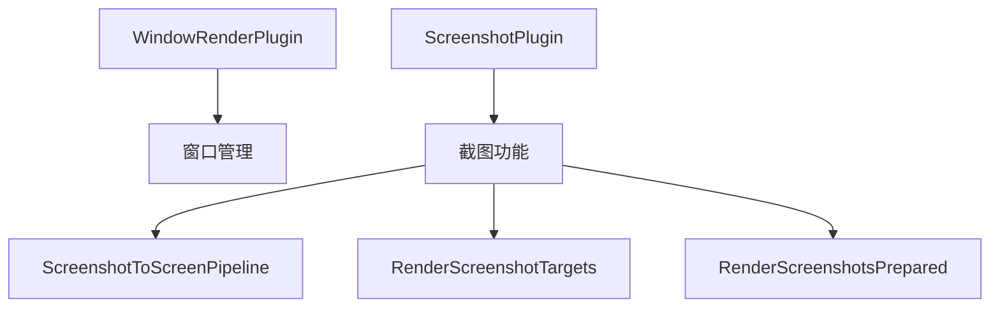

+++
title = "#18524 Move initializing the `ScreenshotToScreenPipeline` to the `ScreenshotPlugin`"
date = "2025-05-06T00:00:00"
draft = false
template = "pull_request_page.html"
in_search_index = false

[extra]
current_language = "zh-cn"
available_languages = {"en" = { name = "English", url = "/pull_request/bevy/2025-05/pr-18524-en-20250506" }, "zh-cn" = { name = "中文", url = "/pull_request/bevy/2025-05/pr-18524-zh-cn-20250506" }}
labels = ["D-Trivial", "A-Windowing"]
+++

# Move initializing the `ScreenshotToScreenPipeline` to the `ScreenshotPlugin` 技术分析报告

## Basic Information
- **Title**: Move initializing the `ScreenshotToScreenPipeline` to the `ScreenshotPlugin`
- **PR Link**: https://github.com/bevyengine/bevy/pull/18524
- **Author**: andriyDev
- **Status**: MERGED
- **Labels**: D-Trivial, A-Windowing, S-Ready-For-Final-Review
- **Created**: 2025-03-25T00:54:58Z
- **Merged**: 2025-05-06T00:17:11Z
- **Merged By**: alice-i-cecile

## Description Translation
### 目标
- 次要代码清理
- 该初始化逻辑最初在#8336引入，但未在`ScreenshotPlugin`中实现且缺乏相关说明。作者认为该资源初始化位置不合理

### 解决方案
- 将初始化逻辑迁移至`ScreenshotPlugin`

### 测试验证
- 桌面端截图示例仍能正常工作

## The Story of This Pull Request

### 问题定位与背景
在Bevy渲染系统的维护过程中，开发者发现`ScreenshotToScreenPipeline`资源的初始化位置存在不合理现象。该资源原本在`WindowRenderPlugin`的`finish`方法中初始化，但实际属于截图功能的核心组件。这种代码布局违反了模块化设计原则，可能导致后续维护者困惑。

技术债务的根源可追溯至PR #8336的提交，当时在实现截图功能时可能由于疏忽，将相关资源初始化放置在了不恰当的模块中。尽管不影响功能，但长期来看会降低代码可维护性。

### 解决方案与实现
核心思路是将`ScreenshotToScreenPipeline`的初始化逻辑迁移到其功能归属的`ScreenshotPlugin`中。具体实现包含两个关键修改：

1. **移除旧初始化逻辑**  
在`WindowRenderPlugin`的`finish`方法中删除资源初始化代码：
```rust
// Before in mod.rs
fn finish(&self, app: &mut App) {
    if let Some(render_app) = app.get_sub_app_mut(RenderApp) {
        render_app.init_resource::<ScreenshotToScreenPipeline>();
    }
}
```

2. **添加新初始化位置**  
在`ScreenshotPlugin`的setup流程中加入资源初始化：
```rust
// After in screenshot.rs
impl Plugin for ScreenshotPlugin {
    fn build(&self, app: &mut App) {
        let render_app = app.sub_app_mut(RenderApp);
        render_app
            .init_resource::<RenderScreenshotTargets>()
            .init_resource::<RenderScreenshotsPrepared>()
            .init_resource::<SpecializedRenderPipelines<ScreenshotToScreenPipeline>>()
            .init_resource::<ScreenshotToScreenPipeline>();  // 新增行
    }
}
```

### 技术决策考量
该修改体现了以下软件工程原则：
1. **单一职责原则**：将资源初始化置于功能对应的插件中
2. **可发现性原则**：相关功能组件集中在同一模块，降低认知负担
3. **可维护性原则**：消除"神秘代码"（缺乏注释说明的非常规实现）

### 影响与验证
修改后通过桌面端截图示例的功能测试验证，确认：
- 资源初始化时机正确
- 渲染管线构建逻辑不受影响
- 窗口管理模块职责更清晰

潜在收益包括：
- 新开发者更容易理解截图功能的初始化流程
- 减少跨模块隐式依赖
- 为未来截图功能扩展奠定更清晰的架构基础

## Visual Representation



## Key Files Changed

### 1. `crates/bevy_render/src/view/window/mod.rs` (+1/-7)
**变更说明**：  
移除与截图管道相关的残留代码，清理模块导入和插件实现

**关键代码变更**：
```rust
// 移除资源初始化
-    fn finish(&self, app: &mut App) {
-        if let Some(render_app) = app.get_sub_app_mut(RenderApp) {
-            render_app.init_resource::<ScreenshotToScreenPipeline>();
-        }
-    }

// 简化模块导入
- use screenshot::{ScreenshotPlugin, ScreenshotToScreenPipeline};
+ use screenshot::ScreenshotPlugin;
```

### 2. `crates/bevy_render/src/view/window/screenshot.rs` (+1/-0)
**变更说明**：  
在截图插件中添加正确的资源初始化

**关键代码变更**：
```rust
// 添加资源初始化
+ .init_resource::<ScreenshotToScreenPipeline>()
```

## Further Reading
1. [Bevy插件系统文档](https://bevyengine.org/learn/book/getting-started/plugins/)
2. [WGSL渲染管线基础](https://bevyengine.org/learn/book/getting-started/shader-basics/)
3. [ECS架构中的资源管理](https://bevyengine.org/learn/book/getting-started/resources/)