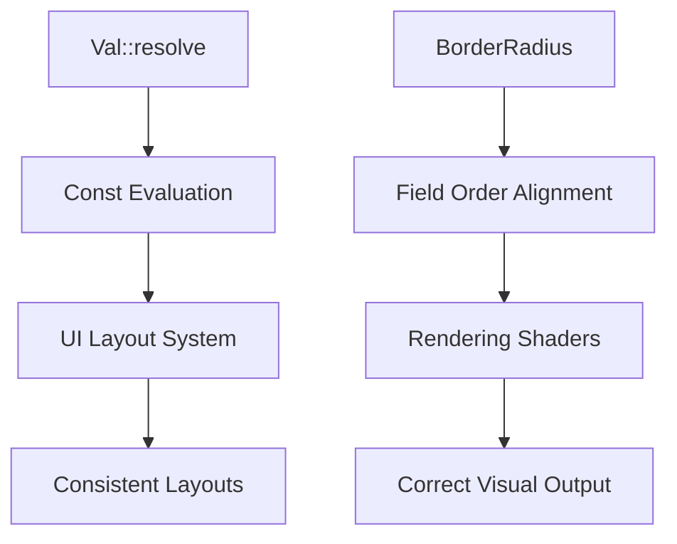

+++
title = "#18595 Constify `Val::resolve` and `BorderRadius::resolve`"
date = "2025-05-26T00:00:00"
draft = false
template = "pull_request_page.html"
in_search_index = true

[taxonomies]
list_display = ["show"]

[extra]
current_language = "en"
available_languages = {"en" = { name = "English", url = "/pull_request/bevy/2025-05/pr-18595-en-20250526" }, "zh-cn" = { name = "中文", url = "/pull_request/bevy/2025-05/pr-18595-zh-cn-20250526" }}
labels = ["D-Trivial", "A-UI"]
+++

# Title: Constify `Val::resolve` and `BorderRadius::resolve`

## Basic Information
- **Title**: Constify `Val::resolve` and `BorderRadius::resolve`
- **PR Link**: https://github.com/bevyengine/bevy/pull/18595
- **Author**: ickshonpe
- **Status**: MERGED
- **Labels**: D-Trivial, A-UI, S-Needs-Review
- **Created**: 2025-03-28T19:26:53Z
- **Merged**: 2025-05-26T22:35:18Z
- **Merged By**: mockersf

## Description Translation
The original description is in English and preserved as-is:

# Objective

Constify `Val::resolve` and  `BorderRadius::resolve`

# Solution

* Replace uses of `Vec2::min_element` and `Vec2::max_element` with `min` and `max` called on the components.
* Make `BorderRadius::resolve` and `BorderRadius::resolve_single_corner` `const`.
* Swap the order of the `bottom_left` and `bottom_right` fields of `BorderRadius` and `ResolvedBorderRadius` so they match the ccw order used in the shader and in css.

## The Story of This Pull Request

The PR addresses two main objectives in Bevy's UI system: enabling compile-time evaluation of layout calculations and improving API consistency with web standards. The changes focus on two core types - `Val` for values and `BorderRadius` for rounded corner calculations.

**Problem Identification**  
The original implementations of `Val::resolve` and `BorderRadius` methods couldn't be used in const contexts due to:
1. Reliance on non-const Vec2 methods (`min_element`, `max_element`)
2. Use of runtime error handling patterns
3. Method chain structures incompatible with const evaluation

**Implementation Strategy**  
For `Val::resolve` in `geometry.rs`:
```rust
// Before:
Val::VMin(value) => Ok(physical_target_size.min_element() * value / 100.0),

// After:
Val::VMin(value) => Ok(physical_target_size.x.min(physical_target_size.y) * value / 100.0)
```
The replacement of `min_element()` with explicit component comparison enables const evaluation while maintaining identical functionality.

For `BorderRadius` in `ui_node.rs`:
```rust
// Before method signature:
pub fn resolve_single_corner(...) -> f32

// After:
pub const fn resolve_single_corner(...) -> f32
```
The conversion to const required restructuring error handling:
```rust
// Before:
radius.resolve(...).unwrap_or(0.).clamp(...)

// After:
if let Ok(radius) = radius.resolve(...) {
    radius.clamp(...)
} else {
    0.
}
```
This if-let structure maintains the same safety guarantees while being const-compatible.

**Field Order Alignment**  
The PR corrects a subtle inconsistency in border radius ordering:
```rust
// Before struct:
pub struct BorderRadius {
    pub top_left: Val,
    pub top_right: Val,
    pub bottom_left: Val,
    pub bottom_right: Val,
}

// After:
pub struct BorderRadius {
    pub top_left: Val,
    pub top_right: Val,
    pub bottom_right: Val,
    pub bottom_left: Val,
}
```
This change aligns with CSS order (top-left, top-right, bottom-right, bottom-left) and Bevy's shader expectations, preventing potential rendering inconsistencies.

**Performance Considerations**  
While the immediate performance impact is minimal, enabling const evaluation:
1. Allows future optimizations through compile-time calculations
2. Reduces runtime branching in layout systems
3. Enables potential use in const contexts for default values or configurations

**Codebase Impact**  
These changes maintain backward compatibility through:
1. Preserving all method signatures
2. Using the same calculation logic
3. Keeping error handling semantics identical

The field order changes are safe due to Bevy's use of named struct fields rather than positional initialization in most cases.

## Visual Representation



## Key Files Changed

1. `crates/bevy_ui/src/geometry.rs` (+13/-12)
```rust
// Before:
pub fn resolve(...) -> Result<f32, ValArithmeticError> {
    match self {
        Val::VMin(value) => Ok(physical_target_size.min_element() * value / 100.0),
    }
}

// After:
pub const fn resolve(...) -> Result<f32, ValArithmeticError> {
    match self {
        Val::VMin(value) => Ok(physical_target_size.x.min(physical_target_size.y) * value / 100.0),
    }
}
```

2. `crates/bevy_ui/src/ui_node.rs` (+7/-3)
```rust
// Before field order:
bottom_left: Val,
bottom_right: Val,

// After:
bottom_right: Val,
bottom_left: Val,

// Before method:
pub fn resolve_single_corner(...) -> f32

// After:
pub const fn resolve_single_corner(...) -> f32
```

## Further Reading

1. Rust const functions: [Rust Reference](https://doc.rust-lang.org/reference/const_eval.html)
2. CSS border-radius order: [MDN Documentation](https://developer.mozilla.org/en-US/docs/Web/CSS/border-radius)
3. Bevy UI Layout System: [Bevy Book](https://bevyengine.org/learn/book/features/ui/)