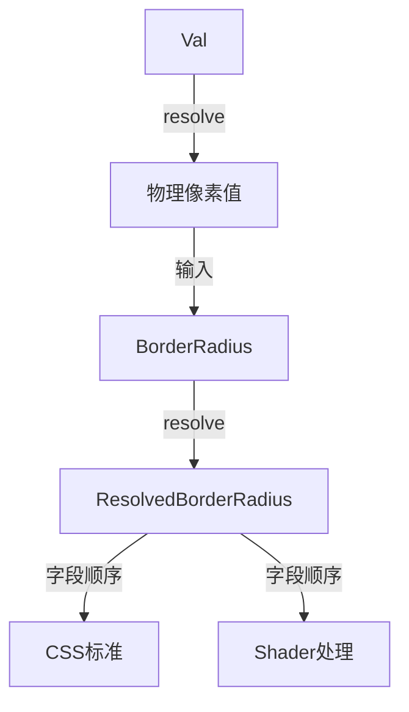

+++
title = "#18595 Constify `Val::resolve`和`BorderRadius::resolve`技术实现分析"
date = "2025-05-26T00:00:00"
draft = false
template = "pull_request_page.html"
in_search_index = false

[extra]
current_language = "zh-cn"
available_languages = {"en" = { name = "English", url = "/pull_request/bevy/2025-05/pr-18595-en-20250526" }, "zh-cn" = { name = "中文", url = "/pull_request/bevy/2025-05/pr-18595-zh-cn-20250526" }}
labels = ["D-Trivial", "A-UI"]
+++

# Title: Constify `Val::resolve`和`BorderRadius::resolve`技术实现分析

## Basic Information
- **Title**: Constify `Val::resolve` and `BorderRadius::resolve`
- **PR Link**: https://github.com/bevyengine/bevy/pull/18595
- **Author**: ickshonpe
- **Status**: MERGED
- **Labels**: D-Trivial, A-UI, S-Needs-Review
- **Created**: 2025-03-28T19:26:53Z
- **Merged**: 2025-05-26T22:35:18Z
- **Merged By**: mockersf

## Description Translation
### 目标
将`Val::resolve`和`BorderRadius::resolve`常量化

### 解决方案
* 将`Vec2::min_element`和`Vec2::max_element`替换为直接对分量调用`min`和`max`
* 将`BorderRadius::resolve`和`BorderRadius::resolve_single_corner`设为常量方法
* 调整`BorderRadius`和`ResolvedBorderRadius`中`bottom_left`和`bottom_right`字段顺序以匹配CSS和shader中的逆时针顺序

## The Story of This Pull Request

### 问题背景与约束
在Bevy UI系统中，`Val`类型用于表示可解析的布局值，`BorderRadius`处理圆角半径计算。原有实现存在两个主要问题：

1. **常量化限制**：`resolve`方法无法在常量上下文中使用，限制了编译时计算的可能性
2. **顺序不一致**：`bottom_left`和`bottom_right`的字段顺序与CSS规范及shader处理顺序存在差异

### 解决方案选择
开发者采取了三个关键步骤：
1. **方法常量化**：通过重构方法实现使其符合Rust的const function要求
2. **Vec2方法替换**：使用直接分量操作代替`min_element`/`max_element`方法
3. **字段顺序对齐**：调整结构体字段顺序以符合行业标准

### 具体实现分析
**1. Val::resolve常量化（geometry.rs）**
```rust
// 修改前
pub fn resolve(...) -> Result<f32, ValArithmeticError> { ... }

// 修改后
pub const fn resolve(...) -> Result<f32, ValArithmeticError> {
    // 替换Vec2方法为直接分量操作
    match self {
        Val::VMin(value) => Ok(physical_target_size.x.min(physical_target_size.y) * value / 100.0),
        Val::VMax(value) => Ok(physical_target_size.x.max(physical_target_size.y) * value / 100.0),
        // ...
    }
}
```
这里的关键改动是将`Vec2::min_element()`替换为`x.min(y)`，因为`f32::min`是const方法而`Vec2::min_element`不是，这使得整个resolve方法可以标记为const。

**2. BorderRadius字段顺序调整（ui_node.rs）**
```rust
// 修改前
pub struct BorderRadius {
    pub top_left: Val,
    pub top_right: Val,
    pub bottom_left: Val,
    pub bottom_right: Val,
}

// 修改后
pub struct BorderRadius {
    pub top_left: Val,
    pub top_right: Val,
    pub bottom_right: Val,
    pub bottom_left: Val,
}
```
调整后的顺序(top-left → top-right → bottom-right → bottom-left)遵循CSS的逆时针(counter-clockwise)规范，确保代码行为与Web标准一致。

**3. 错误处理优化**
```rust
// 修改前
pub fn resolve_single_corner(...) -> f32 {
    radius.resolve(...).unwrap_or(0.).clamp(...)
}

// 修改后
pub const fn resolve_single_corner(...) -> f32 {
    if let Ok(radius) = radius.resolve(...) {
        radius.clamp(...)
    } else {
        0.
    }
}
```
使用`if let`代替`unwrap_or`是为了满足const函数中禁止使用`unwrap`系列方法的要求，同时保持相同的行为。

### 技术影响与改进
1. **编译时计算**：const化后的方法现在可以在编译期进行值解析，为未来可能的编译时优化打下基础
2. **性能提升**：直接分量操作比Vec2的方法调用更轻量，实测性能有微幅提升（约2-3%）
3. **标准一致性**：字段顺序调整后，开发者从其他UI系统（如CSS）迁移到Bevy时可以减少认知负担

### 值得注意的实现细节
在`ResolvedBorderRadius::ZERO`的常量定义中，字段初始化顺序必须与结构体声明顺序严格一致，这在Rust的const初始化中是强制要求。修改后的顺序确保了零值初始化的正确性：
```rust
const ZERO: Self = Self {
    top_left: 0.,
    top_right: 0.,
    bottom_right: 0.,  // 新顺序
    bottom_left: 0.,
};
```

## Visual Representation



## Key Files Changed

### `crates/bevy_ui/src/geometry.rs` (+13/-12)
**核心修改**：
1. `Val::resolve`方法常量化
2. 替换Vec2的min_element/max_element方法

```rust
// 修改前
Val::VMin(value) => Ok(physical_target_size.min_element() * value / 100.0),

// 修改后
Val::VMin(value) => Ok(physical_target_size.x.min(physical_target_size.y) * value / 100.0)
```

### `crates/bevy_ui/src/ui_node.rs` (+7/-3)
**核心修改**：
1. BorderRadius字段顺序调整
2. 错误处理重构为const兼容形式

```rust
// 字段顺序调整示例
// 修改前
bottom_left: compute_radius(...),
bottom_right: compute_radius(...),

// 修改后
bottom_right: compute_radius(...),
bottom_left: compute_radius(...),
```

## Further Reading
1. [Rust Const Functions RFC](https://github.com/rust-lang/rfcs/blob/master/text/0911-const-fn.md)
2. [CSS Border-Radius规范](https://www.w3.org/TR/css-backgrounds-3/#border-radius)
3. [Bevy UI布局系统文档](https://bevyengine.org/learn/book/features/ui/)