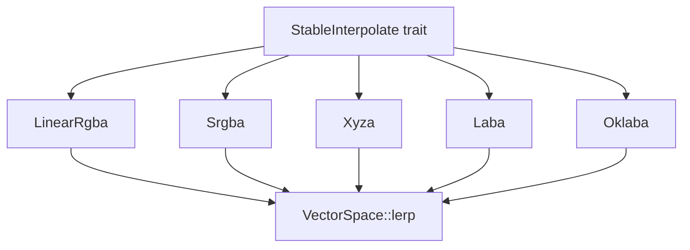

+++
title = "#18601 Added `StableInterpolate` implementations for linear colors"
date = "2025-05-06T00:00:00"
draft = false
template = "pull_request_page.html"
in_search_index = true

[taxonomies]
list_display = ["show"]

[extra]
current_language = "en"
available_languages = {"en" = { name = "English", url = "/pull_request/bevy/2025-05/pr-18601-en-20250506" }, "zh-cn" = { name = "中文", url = "/pull_request/bevy/2025-05/pr-18601-zh-cn-20250506" }}
labels = ["C-Feature", "D-Straightforward", "A-Color"]
+++

# Title: Added `StableInterpolate` implementations for linear colors

## Basic Information
- **Title**: Added `StableInterpolate` implementations for linear colors
- **PR Link**: https://github.com/bevyengine/bevy/pull/18601
- **Author**: mintlu8
- **Status**: MERGED
- **Labels**: C-Feature, S-Ready-For-Final-Review, X-Uncontroversial, D-Straightforward, A-Color
- **Created**: 2025-03-29T03:37:03Z
- **Merged**: 2025-05-06T00:19:28Z
- **Merged By**: alice-i-cecile

## Description Translation
# Objective

Colors currently do not implement `StableInterpolate`, which makes them ineligible for functions like `smooth_nudge` and make some generic APIs awkward.

## Solution

Implemented `StableInterpolate` for linear color types that should be uncontroversial. Non-linear types like `Hsl` are not implemented in this PR.

## Testing

Added a test that checks implementations are correct.

## The Story of This Pull Request

The PR addresses a gap in Bevy's color system where color types lacked `StableInterpolate` implementations, preventing their use with interpolation-dependent APIs. This limitation affected utility functions like `smooth_nudge` and constrained generic programming patterns that rely on stable interpolation.

The implementation strategy focused on linear color spaces (Srgba, LinearRgba, Xyza, Laba, Oklaba) where component-wise linear interpolation is mathematically valid. The author leveraged Bevy's existing `VectorSpace` trait, which provides lerp functionality, to create efficient implementations through a macro. This approach ensured consistency with mathematical primitives while avoiding code duplication.

Key implementation details:
1. Added trait implementations using `impl_componentwise_vector_space` macro:
```rust
impl bevy_math::StableInterpolate for $ty {
    fn interpolate_stable(&self, other: &Self, t: f32) -> Self {
        bevy_math::VectorSpace::lerp(*self, *other, t)
    }
}
```
2. Created comprehensive test coverage verifying mid-point interpolation:
```rust
assert_eq!(b.interpolate_stable(&w, 0.5), Srgba::new(0.5, 0.5, 0.5, 1.0));
```
3. Explicitly excluded non-linear color spaces (noted in TODO comment) due to their more complex interpolation requirements

The changes enable color types to participate in interpolation workflows while maintaining architectural consistency. The choice to defer non-linear space implementations demonstrates prudent scope management, acknowledging these require special handling (e.g., hue wrapping in HSL).

## Visual Representation



## Key Files Changed

1. **crates/bevy_color/src/interpolate.rs** (+37/-0)
- Added test suite verifying interpolation correctness
- Covered all implemented color spaces with specific assertions
- Example test case:
```rust
let b = Laba::BLACK;
let w = Laba::WHITE;
assert_eq!(b.interpolate_stable(&w, 0.5), Laba::new(0.5, 0.0, 0.0, 1.0));
```

2. **crates/bevy_color/src/lib.rs** (+7/-0)
- Integrated new interpolate module
- Extended componentwise vector space macro
- Critical macro expansion:
```rust
impl bevy_math::StableInterpolate for LinearRgba {
    fn interpolate_stable(&self, other: &Self, t: f32) -> Self {
        bevy_math::VectorSpace::lerp(*self, *other, t)
    }
}
```

## Further Reading
- Bevy VectorSpace documentation: https://docs.rs/bevy_math/latest/bevy_math/trait.VectorSpace.html
- Color space interpolation considerations: https://blog.johnnovak.net/2016/09/21/what-every-coder-should-know-about-gamma/
- Bevy color system overview: https://bevyengine.org/learn/book/features/colors/