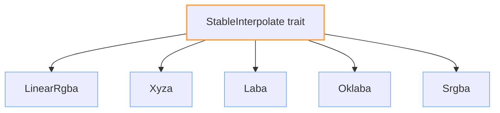

+++
title = "#18601 Added `StableInterpolate` implementations for linear colors."
date = "2025-05-06T00:00:00"
draft = false
template = "pull_request_page.html"
in_search_index = false

[extra]
current_language = "zh-cn"
available_languages = {"en" = { name = "English", url = "/pull_request/bevy/2025-05/pr-18601-en-20250506" }, "zh-cn" = { name = "中文", url = "/pull_request/bevy/2025-05/pr-18601-zh-cn-20250506" }}
labels = ["C-Feature", "D-Straightforward", "A-Color"]
+++

# Added `StableInterpolate` implementations for linear colors.

## Basic Information
- **Title**: Added `StableInterpolate` implementations for linear colors.
- **PR Link**: https://github.com/bevyengine/bevy/pull/18601
- **Author**: mintlu8
- **Status**: MERGED
- **Labels**: C-Feature, S-Ready-For-Final-Review, X-Uncontroversial, D-Straightforward, A-Color
- **Created**: 2025-03-29T03:37:03Z
- **Merged**: 2025-05-06T00:19:28Z
- **Merged By**: alice-i-cecile

## Description Translation
### 目标
当前颜色类型未实现`StableInterpolate`，导致无法使用如`smooth_nudge`等函数，并使某些通用API使用不便。

### 解决方案
为线性颜色类型实现`StableInterpolate`。本PR不处理HSL等非线性颜色类型。

### 测试
新增测试用例验证实现正确性。

## The Story of This Pull Request

### 问题与背景
在Bevy引擎的颜色系统中，多个线性颜色类型（如`LinearRgba`、`Xyza`）缺乏对`StableInterpolate` trait的实现。这导致两个主要问题：

1. 无法使用依赖该trait的API（如`smooth_nudge`）
2. 需要颜色插值的通用代码无法统一处理不同颜色类型

`StableInterpolate`作为稳定插值接口，要求实现类型在插值过程中保持数学稳定性。线性颜色空间由于其向量空间特性，适合直接使用线性插值（lerp）。

### 解决方案选择
开发者选择为以下线性颜色类型实现trait：
- `Srgba`
- `LinearRgba` 
- `Xyza`
- `Laba`
- `Oklaba`

排除非线性类型（如`Hsl`）的原因是它们的插值需要色彩空间转换，实现复杂度较高。这种选择性实现体现了"先解决明确需求，复杂问题后处理"的务实思路。

### 实现细节
核心改动分为两部分：

**1. Trait实现（crates/bevy_color/src/lib.rs）**
通过已有的`impl_componentwise_vector_space!`宏统一实现：

```rust
impl bevy_math::StableInterpolate for $ty {
    fn interpolate_stable(&self, other: &Self, t: f32) -> Self {
        bevy_math::VectorSpace::lerp(*self, *other, t)
    }
}
```
该实现直接复用`VectorSpace`的线性插值方法，保持代码DRY原则。每个颜色类型自动获得稳定插值能力，无需重复编码。

**2. 测试验证（crates/bevy_color/src/interpolate.rs）**
针对每个颜色类型设计边界测试：
```rust
#[test]
pub fn test_color_stable_interpolate() {
    // Srgba测试样例
    let b = Srgba::BLACK;
    let w = Srgba::WHITE;
    assert_eq!(
        b.interpolate_stable(&w, 0.5),
        Srgba::new(0.5, 0.5, 0.5, 1.0),
    );
    
    // 其他颜色类型类似测试...
}
```
测试覆盖黑白中间值、灰度值等关键插值点，确保不同颜色空间的数学正确性。

### 技术洞察
1. **线性空间优势**：选择的颜色类型都基于线性空间（如CIE XYZ、Lab），其插值符合向量空间运算规则，可直接应用`lerp`
2. **类型系统利用**：通过trait实现保持API统一，使用者无需关心具体颜色空间
3. **测试策略**：使用典型边界值而非随机测试，确保核心逻辑可靠性

### 影响与扩展
此次改动：
- 使颜色类型可参与需要稳定插值的动画系统
- 为未来颜色相关泛型代码提供基础
- 明确划分线性/非线性颜色处理边界

未实现的非线性类型（如HSL）需要额外考虑：
- 色彩空间转换开销
- 插值路径的感知均匀性
- 可能的gamma校正问题

## Visual Representation



## Key Files Changed

### crates/bevy_color/src/lib.rs (+7/-0)
1. **新增模块声明**：
```rust
mod interpolate;
```
启用新的测试模块

2. **宏扩展实现**：
```rust
impl bevy_math::StableInterpolate for $ty {
    fn interpolate_stable(&self, other: &Self, t: f32) -> Self {
        bevy_math::VectorSpace::lerp(*self, *other, t)
    }
}
```
通过宏为所有适用颜色类型批量实现trait

### crates/bevy_color/src/interpolate.rs (+37/-0)
1. **测试用例设计**：
```rust
assert_eq!(b.interpolate_stable(&w, 0.5), Xyza::gray(0.5));
```
验证不同颜色空间的中间值计算

## Further Reading
1. [Bevy Color Documentation](https://docs.rs/bevy_color/latest/bevy_color/)
2. [CIELAB Color Space](https://en.wikipedia.org/wiki/CIELAB_color_space)
3. [Linear Interpolation in Computer Graphics](https://www.scratchapixel.com/lessons/mathematics-physics-for-computer-graphics/interpolation/lerp)