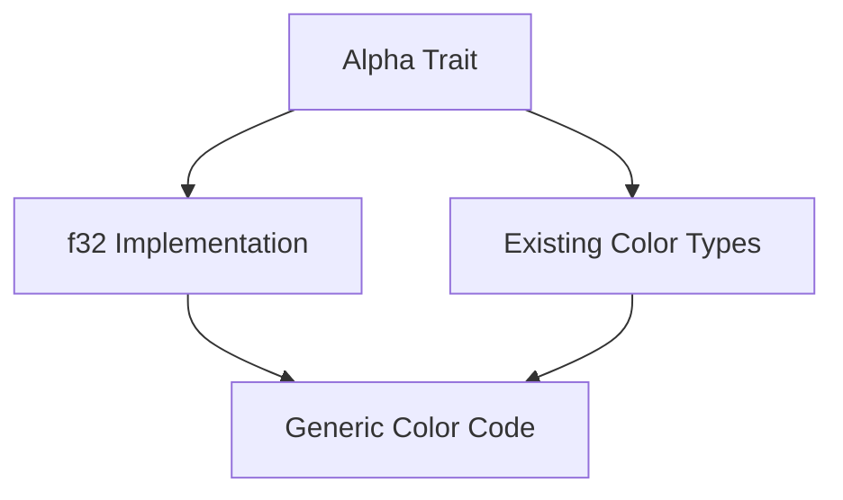

+++
title = "#18653 Implemented `Alpha` for `f32`."
date = "2025-05-06T00:00:00"
draft = false
template = "pull_request_page.html"
in_search_index = true

[taxonomies]
list_display = ["show"]

[extra]
current_language = "en"
available_languages = {"en" = { name = "English", url = "/pull_request/bevy/2025-05/pr-18653-en-20250506" }, "zh-cn" = { name = "中文", url = "/pull_request/bevy/2025-05/pr-18653-zh-cn-20250506" }}
labels = ["C-Feature", "D-Straightforward", "A-Color"]
+++

# Implemented `Alpha` for `f32`

## Basic Information
- **Title**: Implemented `Alpha` for `f32`.
- **PR Link**: https://github.com/bevyengine/bevy/pull/18653
- **Author**: mintlu8
- **Status**: MERGED
- **Labels**: C-Feature, S-Ready-For-Final-Review, D-Straightforward, A-Color
- **Created**: 2025-04-01T02:30:55Z
- **Merged**: 2025-05-06T00:19:28Z
- **Merged By**: alice-i-cecile

## Description Translation
# Objective

`f32` can be used to represent alpha, this streamlines generic code related to colors.

## Solution

- Implemented `Alpha` for `f32`.

## The Story of This Pull Request

The PR addresses a consistency gap in Bevy's color handling system. Prior to this change, generic code working with alpha channels needed special handling for raw floating-point alpha values, despite `f32` being the natural representation for alpha values (typically ranging from 0.0 to 1.0). This created unnecessary friction when writing generic color manipulation code.

The core insight driving this change is that `f32` itself can be treated as an alpha component. By implementing the `Alpha` trait directly for `f32`, the engine now allows developers to use floating-point values interchangeably with color types in generic contexts. This eliminates the need for wrapper types or explicit conversions when working with alpha values alone.

The implementation leverages Rust's trait system to extend existing color infrastructure to bare floats. The `Alpha` trait implementation for `f32` is straightforward but powerful:

```rust
impl Alpha for f32 {
    fn with_alpha(&self, alpha: f32) -> Self {
        alpha
    }

    fn alpha(&self) -> f32 {
        *self
    }

    fn set_alpha(&mut self, alpha: f32) {
        *self = alpha;
    }
}
```

Key technical points:
1. `with_alpha` returns the input parameter directly, treating the float itself as the alpha value
2. `alpha()` acts as a simple getter through dereferencing
3. `set_alpha` directly modifies the float's value

This implementation follows the established pattern used for color types like `Rgba` while maintaining semantic correctness for raw floats. It enables type system-driven alpha manipulation where both color types and standalone alpha values can be used polymorphically.

The change is backward-compatible and introduces no breaking changes. It particularly benefits scenarios like:
- Generic color blending functions
- Material systems handling alpha thresholds
- UI transparency animations
- Shader parameter passing

Future improvements could explore const implementations or additional trait bounds, but the current solution provides immediate utility with minimal overhead.

## Visual Representation



## Key Files Changed

### `crates/bevy_color/src/color_ops.rs` (+14/-0)
Added `Alpha` trait implementation for `f32` type:

```rust
impl Alpha for f32 {
    fn with_alpha(&self, alpha: f32) -> Self {
        alpha
    }

    fn alpha(&self) -> f32 {
        *self
    }

    fn set_alpha(&mut self, alpha: f32) {
        *self = alpha;
    }
}
```

This implementation allows raw floats to participate in alpha operations previously reserved for color types. The methods treat the float itself as the alpha value, creating a natural integration with existing color manipulation code.

## Further Reading

1. [Rust Trait Documentation](https://doc.rust-lang.org/book/ch10-02-traits.html)
2. [Bevy Color Module Overview](https://bevyengine.org/learn/book/next/features/colors/)
3. [Alpha Compositing Fundamentals](https://en.wikipedia.org/wiki/Alpha_compositing)

# Full Code Diff
```diff
diff --git a/crates/bevy_color/src/color_ops.rs b/crates/bevy_color/src/color_ops.rs
index 60a535d9fe7da..b101d587e3d6a 100644
--- a/crates/bevy_color/src/color_ops.rs
+++ b/crates/bevy_color/src/color_ops.rs
@@ -77,6 +77,20 @@ pub trait Alpha: Sized {
     }
 }
 
+impl Alpha for f32 {
+    fn with_alpha(&self, alpha: f32) -> Self {
+        alpha
+    }
+
+    fn alpha(&self) -> f32 {
+        *self
+    }
+
+    fn set_alpha(&mut self, alpha: f32) {
+        *self = alpha;
+    }
+}
+
 /// Trait for manipulating the hue of a color.
 pub trait Hue: Sized {
     /// Return a new version of this color with the hue channel set to the given value.
```