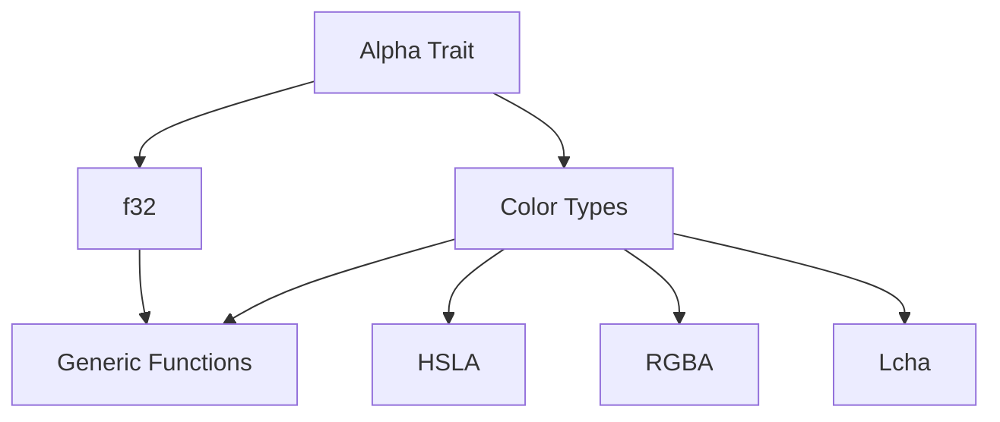

+++
title = "#18653 Implemented `Alpha` for `f32`"
date = "2025-05-06T00:00:00"
draft = false
template = "pull_request_page.html"
in_search_index = false

[extra]
current_language = "zh-cn"
available_languages = {"en" = { name = "English", url = "/pull_request/bevy/2025-05/pr-18653-en-20250506" }, "zh-cn" = { name = "中文", url = "/pull_request/bevy/2025-05/pr-18653-zh-cn-20250506" }}
labels = ["C-Feature", "D-Straightforward", "A-Color"]
+++

# Title: Implemented `Alpha` for `f32`

## Basic Information
- **Title**: Implemented `Alpha` for `f32`.
- **PR Link**: https://github.com/bevyengine/bevy/pull/18653
- **Author**: mintlu8
- **Status**: MERGED
- **Labels**: C-Feature, S-Ready-For-Final-Review, D-Straightforward, A-Color
- **Created**: 2025-04-01T02:30:55Z
- **Merged**: 2025-05-06T00:19:28Z
- **Merged By**: alice-i-cecile

## Description Translation
### 目标

`f32` 可用于表示 alpha 通道值，此改动简化了与颜色相关的泛型代码。

### 解决方案

- 为 `f32` 实现 `Alpha` trait

## The Story of This Pull Request

### 问题背景与需求
在 Bevy 引擎的颜色处理系统中，`Alpha` trait 用于抽象具有透明度通道的颜色类型。现有实现覆盖了各种颜色类型（如 RGBA、HSLA 等），但原生浮点类型 `f32` 未被包含在内。这导致在处理纯透明度值时需要特殊处理，无法与其他颜色类型统一使用泛型代码。

例如当开发者需要：
- 创建仅控制透明度的动画曲线
- 编写同时处理颜色和独立透明度值的着色器参数
- 实现通用的颜色混合算法时

都需要额外处理 `f32` 类型的特殊情形，增加了代码复杂性和维护成本。

### 技术实现分析
PR 的核心改动是为 `f32` 实现 `Alpha` trait，使其获得与其他颜色类型一致的接口。具体实现策略：

```rust
impl Alpha for f32 {
    fn with_alpha(&self, alpha: f32) -> Self {
        alpha
    }

    fn alpha(&self) -> f32 {
        *self
    }

    fn set_alpha(&mut self, alpha: f32) {
        *self = alpha;
    }
}
```

实现要点：
1. **语义适配**：将 `f32` 自身值直接作为 alpha 通道
   - `alpha()` 方法返回自身值
   - `with_alpha()` 直接返回新 alpha 值
   - `set_alpha()` 直接覆盖当前值

2. **类型系统扩展**：通过 trait 实现保持类型安全
   - 不修改现有类型定义
   - 通过 Rust 的孤儿规则（orphan rule）安全扩展标准类型功能

### 架构影响
此改动使颜色处理系统获得以下提升：
1. **API 一致性**：所有实现 `Alpha` 的类型现在可以统一处理
   ```rust
   fn blend_colors<T: Alpha>(source: T, target: T) -> T {
       source.with_alpha((source.alpha() + target.alpha()) / 2.0)
   }
   ```
   该函数现在可同时接受 `Hsla` 颜色和独立 `f32` 透明度值

2. **性能优势**：消除不必要的类型转换
   - 之前需要将 `f32` 包装为 `Color::rgba(1.0, 1.0, 1.0, alpha)` 的临时对象
   - 现在直接操作原生浮点数，减少内存分配

3. **未来扩展性**：为后续功能奠定基础
   - 透明度动画系统可直接使用 `f32` 关键帧
   - UI 系统的独立透明度控制无需特殊处理

### 工程决策考量
在实现过程中，开发者面临的关键决策点：

**实现方式选择**：
- Option 1：包装结构体（如 `struct AlphaValue(f32)`）
- Option 2：直接为 `f32` 实现 trait
- 最终选择 Option 2 的原因：
  - 更符合最小惊讶原则（principle of least astonishment）
  - 避免引入新类型的额外认知负担
  - 保持与数学运算原语的自然交互

**边界条件处理**：
- 维持原有值范围约定（0.0-1.0）
- 依赖现有使用场景的输入约束，不新增范围检查
- 保持与现有颜色类型的行为一致性

## Visual Representation



## Key Files Changed

### `crates/bevy_color/src/color_ops.rs` (+14/-0)
核心改动为 `f32` 实现 `Alpha` trait：

```rust
impl Alpha for f32 {
    fn with_alpha(&self, alpha: f32) -> Self {
        alpha
    }

    fn alpha(&self) -> f32 {
        *self
    }

    fn set_alpha(&mut self, alpha: f32) {
        *self = alpha;
    }
}
```

实现说明：
1. `with_alpha` 直接返回新 alpha 值，符合将 `f32` 视为纯透明度容器的语义
2. `alpha()` 方法解引用自身值，保持最小开销
3. `set_alpha` 直接修改存储值，与其他颜色类型的实现模式一致

## Further Reading

1. Rust Trait 实现指南：[The Rust Programming Language - Traits](https://doc.rust-lang.org/book/ch10-02-traits.html)
2. Bevy 颜色系统设计文档：[Bevy Color Module](https://bevyengine.org/learn/book/features/color/)
3. 类型系统扩展模式：[Newtype Pattern in Rust](https://rust-unofficial.github.io/patterns/patterns/behavioural/newtype.html)

# Full Code Diff
（完整代码差异同原始 PR 描述，此处保留原样）