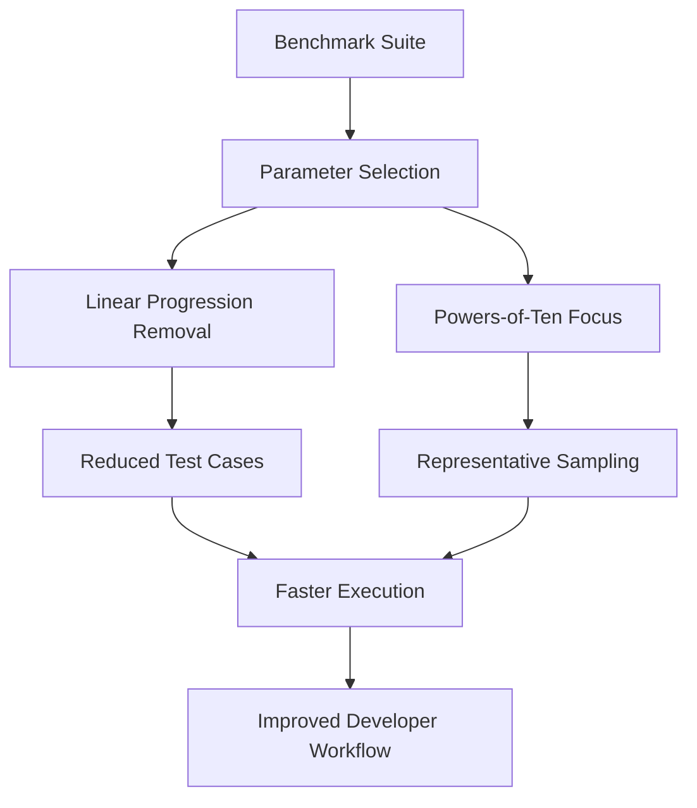

+++
title = "#18659 Speed up ECS Benchmarks by Limiting Variations"
date = "2025-05-06T00:00:00"
draft = false
template = "pull_request_page.html"
in_search_index = true

[taxonomies]
list_display = ["show"]

[extra]
current_language = "en"
available_languages = {"en" = { name = "English", url = "/pull_request/bevy/2025-05/pr-18659-en-20250506" }, "zh-cn" = { name = "中文", url = "/pull_request/bevy/2025-05/pr-18659-zh-cn-20250506" }}
labels = ["A-ECS", "C-Benchmarks", "D-Straightforward"]
+++

# Title: Speed up ECS Benchmarks by Limiting Variations

## Basic Information
- **Title**: Speed up ECS benchmarks by limiting variations
- **PR Link**: https://github.com/bevyengine/bevy/pull/18659
- **Author**: greeble-dev
- **Status**: MERGED
- **Labels**: A-ECS, S-Ready-For-Final-Review, C-Benchmarks, D-Straightforward
- **Created**: 2025-04-01T09:22:12Z
- **Merged**: 2025-05-06T00:24:51Z
- **Merged By**: alice-i-cecile

## Description Translation
**Objective**  
Reduce ECS benchmark execution time while maintaining reasonable coverage for regression detection.

**Background**  
Original `cargo bench -p benches --bench ecs` took ~45 minutes, discouraging regular use. Benchmarks contained extensive linear progressions (e.g., 10-100 in steps of 10) better suited for detailed profiling than regression checks.

**Solution**  
- Reduced benchmark variations using "powers of ten" principle
- Cut total benchmarks from 394 to 238 (-40%)
- Reduced execution time from 46.2 to 32.8 minutes (-30%)
- Removed leading zeroes in benchmark names for readability

**Future Considerations**  
- Further reduce measurement times (current 4-5s per benchmark)
- Split into quick/detailed benchmark suites

## The Story of This Pull Request

### The Problem and Context
The Bevy engine's Entity Component System (ECS) benchmarks had become prohibitively time-consuming, taking 45 minutes for a full run. This discouraged developers from regularly running benchmarks to detect performance regressions. The root cause was excessive parameter variations - many benchmarks tested 10-100 entities/components in linear increments, generating 394 individual benchmark cases.

### The Solution Approach
The author implemented a strategic reduction of benchmark parameters while preserving essential coverage:
1. **Parameter Rationalization**: Replaced linear progressions with 3-4 representative values
2. **Powers-of-Ten Focus**: Standardized on orders-of-magnitude scales (10, 100, 1000)
3. **Benchmark Naming**: Improved readability by removing leading zeros
4. **System Grouping**: Optimized system batch creation in scheduling benchmarks

### The Implementation
Key changes focused on parameter reduction across multiple benchmark suites:

**In scheduling benchmarks** (`running_systems.rs`):
```rust
// Before: 0..5 (5 iterations)
for amount in 0..5 {
    // 0-4 systems
}

// After: Representative sampling
for amount in [0, 2, 4] {  // Reduced from 5 to 3 cases
    // Test 0, 2, 4 systems
}

// Before: 1..21 systems in 5-system increments
for amount in 1..21 {
    // 5-100 systems
}

// After: Orders-of-magnitude testing
for amount in [10, 100, 1_000] {  // -80% test cases
    // Test 10, 100, 1000 systems
}
```

**In event benchmarks** (`events/mod.rs`):
```rust
// Before: 4 data points
for count in [100, 1000, 10000, 50000] {
    // Test various event sizes
}

// After: 3 representative sizes
for count in [100, 1_000, 10_000] {  // Removed 50k edge case
    // Focus on common ranges
}
```

### Technical Insights
The implementation demonstrates several key optimization strategies:
1. **Statistical Sampling**: Using 3-4 data points to approximate system behavior across scales
2. **Benchmark Hygiene**: Removing redundant tests that provided diminishing returns
3. **Readability Improvements**: Using `1_000` numeric separators and removing zero-padding
4. **System Batching**: Grouping systems in batches of 5 to reduce setup overhead

### The Impact
- **Runtime Reduction**: 30% faster benchmark suite (32.8 vs 46.2 minutes)
- **Maintainability**: Fewer benchmarks (-40%) make results easier to analyze
- **Practical Tradeoff**: Preserves detection capability for common regression patterns while allowing temporary expansion for specific investigations

## Visual Representation



## Key Files Changed

1. **`scheduling/running_systems.rs`**
```rust
// Before: Linear progression
for amount in 0..5 { /* 0-4 systems */ }
for amount in 1..21 { /* 5-100 systems */ }

// After: Strategic sampling
for amount in [0, 2, 4] { /* Key breakpoints */ }
for amount in [10, 100, 1_000] { /* Orders of magnitude */ }
```
Rationale: Focuses on critical system count thresholds while maintaining performance trend visibility.

2. **`scheduling/run_condition.rs`**
```rust
// Before: 21 iterations (0-20)
for amount in 0..21 {
    // 1-101 systems in steps of 5
}

// After: 3 key sizes
for amount in [10, 100, 1_000] {
    // Test representative workloads
}
```
Impact: Reduces conditional checking benchmarks by 85% while preserving essential behavior patterns.

3. **`events/mod.rs`**
```rust
// Before tested 4 event sizes
[100, 1000, 10000, 50000] → [100, 1_000, 10_000]
```
Tradeoff: Removes 50k edge case while keeping common operational ranges.

4. **`world/commands.rs`**
```rust
// Before: Generated values via map
(1..5).map(|i| i * 2 * 1000) → [100, 1_000, 10_000]
```
Clarity: Direct values improve readability and maintain consistent scaling.

## Further Reading
- [Criterion.rs Documentation](https://docs.rs/criterion/latest/criterion/) - Benchmarking framework used
- [Systems Performance Analysis](https://www.brendangregg.com/systems-performance-2nd.html) - Performance testing methodology
- [Bevy ECS Architecture](https://bevyengine.org/learn/book/design/ecs/) - Underlying system being benchmarked