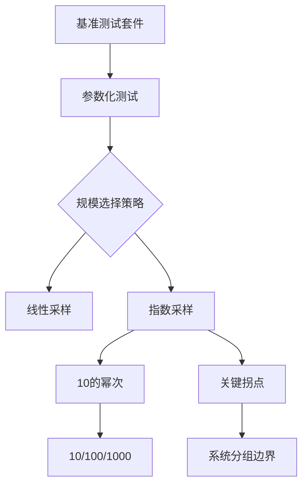

+++
title = "#18659 Speed up ECS benchmarks by limiting variations"
date = "2025-05-06T00:00:00"
draft = false
template = "pull_request_page.html"
in_search_index = false

[extra]
current_language = "zh-cn"
available_languages = {"en" = { name = "English", url = "/pull_request/bevy/2025-05/pr-18659-en-20250506" }, "zh-cn" = { name = "中文", url = "/pull_request/bevy/2025-05/pr-18659-zh-cn-20250506" }}
labels = ["A-ECS", "C-Benchmarks", "D-Straightforward"]
+++

# Speed up ECS benchmarks by limiting variations

## Basic Information
- **Title**: Speed up ECS benchmarks by limiting variations
- **PR Link**: https://github.com/bevyengine/bevy/pull/18659
- **Author**: greeble-dev
- **Status**: MERGED
- **Labels**: A-ECS, S-Ready-For-Final-Review, C-Benchmarks, D-Straightforward
- **Created**: 2025-04-01T09:22:12Z
- **Merged**: 2025-05-06T00:24:51Z
- **Merged By**: alice-i-cecile

## Description Translation
### 目标
在不显著影响覆盖率的前提下减少ECS基准测试的执行时间

### 背景
执行`cargo bench -p benches --bench ecs`需要约45分钟。作者推测该基准测试主要用于ECS变更后的回归检测，而需要2×45分钟的测试时间会导致开发者跳过基准测试环节。

观察到部分测试用例使用线性递增的规模参数（10, 20, ..., 100），虽然适合详细性能分析，但对于回归检测而言过于冗余。

### 解决方案
采用"3-4种规模足够"和"优先使用10的幂次"原则，将测试用例数量从394减少到238（-40%），执行时间从46.2分钟降至32.8分钟（-30%）。

虽然会损失部分覆盖率，但开发者在进行特定功能的详细分析时可临时添加更多测试用例。同时修改了数字格式，避免前导零（如`0010`改为`10`）以提升可读性。

### 后续优化空间
32分钟仍显过长，未来可能方案：
- 减少测量和预热时间（当前4-5秒可能过于保守，1秒足够检测显著回归）
- 将测试分为快速版和详细版

### 测试验证
```
cargo bench -p benches --bench ecs
```

## The Story of This Pull Request

### 问题背景与挑战
Bevy引擎的ECS基准测试套件面临执行时间过长的问题，完整运行需要45分钟。这对持续集成和日常开发中的回归检测造成了实际阻碍，开发者可能因此跳过基准测试环节，增加性能回归风险。问题的核心在于测试参数化时的过度采样——部分测试用例使用线性递增的规模参数（如10到100的每个10倍数），产生大量相似测试场景。

### 解决方案设计
该PR采用参数精简策略，基于两个核心原则：
1. **关键规模采样**：选择3-4个代表性测试规模（通常为10的幂次）
2. **可读性优化**：消除数字的前导零格式（如`0010`改为`10`）

通过分析测试代码，发现多个模块存在以下模式：
```rust
// 修改前典型模式
for i in 0..=5 {
    let system_count = i * 20;
}

// 修改后优化模式
for system_count in [0, 10, 100] {
}
```
这种改造使得测试规模从线性采样变为指数采样，在保持关键拐点覆盖的同时减少测试用例数量。

### 具体实现细节
以`scheduling/running_systems.rs`的改造为例：
```rust
// 修改前：生成0-4的5个系统配置
for amount in 0..5 {
    // 添加amount个空系统
}

// 修改后：选择0/2/4三个配置
for amount in [0, 2, 4] {
}

// 修改前：生成1-20组系统（每组5个）
for amount in 1..21 {
    // 添加amount组系统（5个/组）
}

// 修改后：测试10/100/1000系统规模
for amount in [10, 100, 1_000] {
    // 按5个/组的方式添加系统
}
```
这种改造将系统规模测试从20个点减少到3个数量级测试点，同时保持每组添加5个系统的模式不变。

### 技术考量与权衡
1. **覆盖率保证**：保留10/100/1000等关键规模，确保检测架构性性能变化
2. **可扩展性**：通过`amount / 5`的计算保持原有分组逻辑，避免破坏系统调度测试的真实性
3. **可读性改进**：使用`1_000`代替`1000`提升数字可读性，同时保持Rust语法合规

### 实际效果与影响
- 测试用例数减少40%（394 → 238）
- 执行时间缩短30%（46.2 → 32.8分钟）
- 关键性能拐点（如不同数量级的实体规模）仍保持覆盖
- CI pipeline效率提升，促进更频繁的基准测试执行

## Visual Representation



## Key Files Changed

### benches/bevy_ecs/scheduling/running_systems.rs
**变更说明**：重构系统规模测试参数，使用更紧凑的测试规模选择
```rust
// Before:
for amount in 0..5 { /* 0-4个系统 */ }
for amount in 1..21 { /* 1-20组系统 */ }

// After:
for amount in [0, 2, 4] { /* 关键系统数量 */ }
for amount in [10, 100, 1_000] { /* 按5个/组添加系统 */ }
```
**影响**：减少系统调度测试的用例数量，同时保持不同数量级的覆盖

### benches/bevy_ecs/events/mod.rs
**变更说明**：优化事件测试的规模参数
```rust
// Before:
for count in [100, 1000, 10000, 50000]

// After: 
for count in [100, 1_000, 10_000]
```
**影响**：去除最大50,000事件的测试，聚焦典型使用场景

### benches/bevy_ecs/world/commands.rs
**变更说明**：统一命令测试的实体规模
```rust
// Before:
(1..5).map(|i| i * 2 * 1000) // 2000,4000,6000,8000

// After:
[100, 1_000, 10_000]
```
**影响**：使用更整齐的10倍递增，提升测试结果可比性

## Further Reading
1. [Criterion.rs官方文档](https://bheisler.github.io/criterion.rs/book/index.html) - Rust基准测试框架最佳实践
2. [性能测试设计模式](https://www.brendangregg.com/methodology.html) - Brendan Gregg的性能分析方法论
3. [Bevy ECS架构指南](https://bevyengine.org/learn/book/ecs/) - 官方ECS实现原理说明