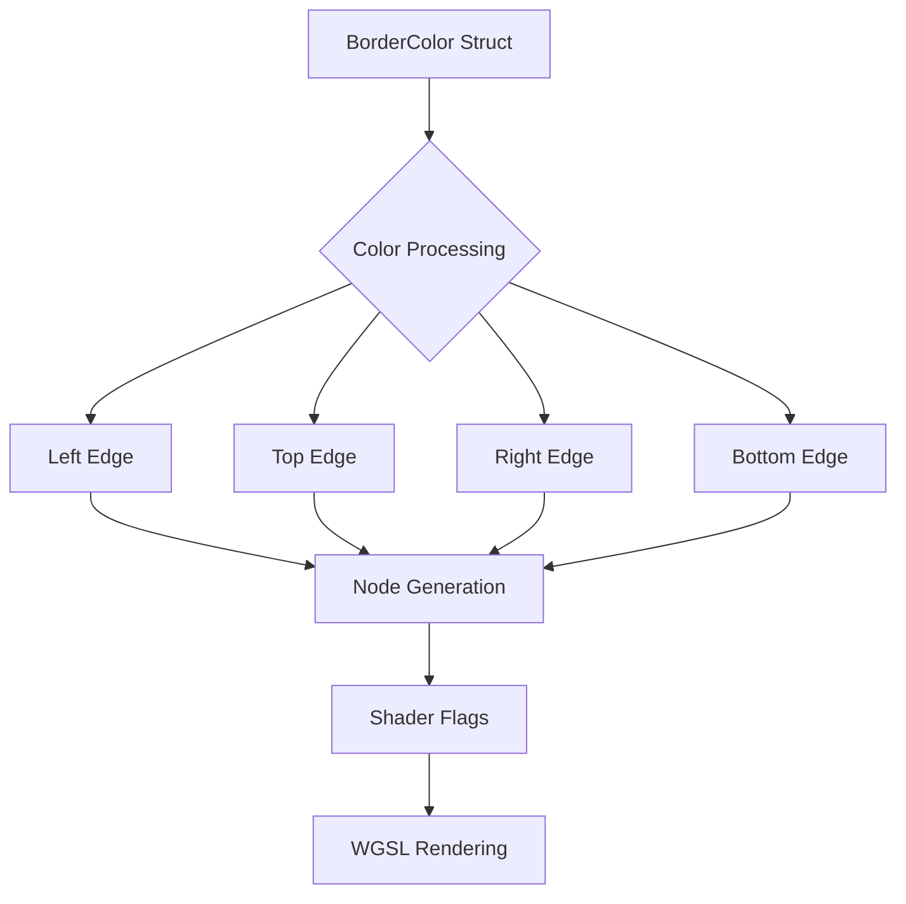

+++
title = "#18682 Separate border colors"
date = "2025-05-26T00:00:00"
draft = false
template = "pull_request_page.html"
in_search_index = true

[taxonomies]
list_display = ["show"]

[extra]
current_language = "en"
available_languages = {"en" = { name = "English", url = "/pull_request/bevy/2025-05/pr-18682-en-20250526" }, "zh-cn" = { name = "中文", url = "/pull_request/bevy/2025-05/pr-18682-zh-cn-20250526" }}
labels = ["C-Feature", "A-Rendering", "A-UI", "D-Straightforward"]
+++

# Title: Separate border colors

## Basic Information
- **Title**: separate border colors
- **PR Link**: https://github.com/bevyengine/bevy/pull/18682
- **Author**: robtfm
- **Status**: MERGED
- **Labels**: C-Feature, A-Rendering, A-UI, S-Ready-For-Final-Review, M-Needs-Migration-Guide, X-Uncontroversial, D-Straightforward
- **Created**: 2025-04-02T15:21:14Z
- **Merged**: 2025-05-26T17:17:53Z
- **Merged By**: alice-i-cecile

## Description Translation
# Objective

allow specifying the left/top/right/bottom border colors separately for ui elements

fixes #14773

## Solution

- change `BorderColor` to 
```rs
pub struct BorderColor {
    pub left: Color,
    pub top: Color,
    pub right: Color,
    pub bottom: Color,
}
```
- generate one ui node per distinct border color, set flags for the active borders
- render only the active borders

i chose to do this rather than adding multiple colors to the ExtractedUiNode in order to minimize the impact for the common case where all border colors are the same.

## Testing

modified the `borders` example to use separate colors:


the behaviour is a bit weird but it mirrors html/css border behaviour.

---

## Migration:

To keep the existing behaviour, just change `BorderColor(color)` into `BorderColor::all(color)`.

## The Story of This Pull Request

The UI rendering system initially used a single color for all border edges, limiting customization options. This PR addresses that limitation by enabling per-edge border colors while maintaining performance for the common case of uniform borders.

The core challenge was modifying the border rendering system to handle multiple colors without significantly impacting performance. The solution involved restructuring the `BorderColor` type to store separate colors for each edge and updating the rendering pipeline to generate multiple UI nodes when border colors differ.

Key implementation steps included:

1. **Data Structure Update**: The `BorderColor` struct was expanded from a single `Color` to four distinct color fields (left, top, right, bottom). A new `all()` constructor maintains backward compatibility for uniform borders.

2. **Node Generation Logic**: The border extraction system in `render/mod.rs` was modified to:
   - Iterate through each edge's color
   - Group adjacent edges with identical colors
   - Create separate render nodes with shader flags indicating active borders

3. **Shader Modifications**: The UI shader was updated to:
   - Use bitflags for border edges (`BORDER_LEFT`, `BORDER_TOP`, etc.)
   - Implement logic to only render active borders
   - Handle color blending at corners where different edges meet

The implementation prioritizes efficiency by:
- Generating multiple nodes only when border colors differ
- Using bitmask flags to minimize GPU data transfer
- Maintaining batch rendering capabilities through shared color nodes

## Visual Representation



## Key Files Changed

### `crates/bevy_ui/src/ui_node.rs`
```rust
// Before:
pub struct BorderColor(pub Color);

// After:
pub struct BorderColor {
    pub top: Color,
    pub right: Color,
    pub bottom: Color,
    pub left: Color,
}

impl BorderColor {
    pub const fn all(color: Color) -> Self {
        Self { top: color, bottom: color, left: color, right: color }
    }
}
```
This change enables storing separate colors for each border edge while maintaining a helper for uniform colors.

### `crates/bevy_ui/src/render/mod.rs`
```rust
// Key extraction logic:
for (i, &color) in border_colors.iter().enumerate() {
    if color.is_fully_transparent() {
        continue;
    }
    
    let mut border_flags = BORDER_FLAGS[i];
    // Group adjacent same-colored borders
    for j in i + 1..4 {
        if color == border_colors[j] {
            border_flags |= BORDER_FLAGS[j];
        }
    }
    // Create node with combined flags
    extracted_uinodes.push(ExtractedUiNode {
        color,
        node_type: NodeType::Border(border_flags),
        // ...
    });
}
```
This logic groups adjacent borders with the same color to minimize node count.

### `crates/bevy_ui/src/render/ui.wgsl`
```wgsl
fn nearest_border_active(...) -> bool {
    return (enabled(flags, BORDER_LEFT) && min_dist == left) ||
        (enabled(flags, BORDER_TOP) && min_dist == top) || 
        (enabled(flags, BORDER_RIGHT) && min_dist == right) || 
        (enabled(flags, BORDER_BOTTOM) && min_dist == bottom);
}
```
The shader determines which border edge is closest to each fragment and checks if that edge should be rendered.

## Further Reading
- CSS Border Specification: https://developer.mozilla.org/en-US/docs/Web/CSS/border
- Bevy UI Rendering Architecture: https://bevyengine.org/learn/book/features/ui/
- WGSL Shader Programming: https://www.w3.org/TR/WGSL/