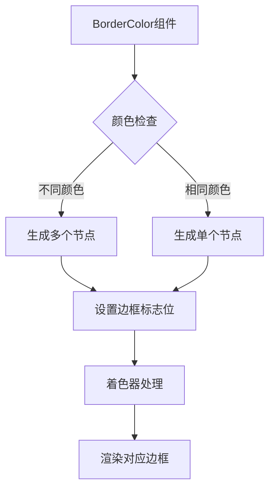

+++
title = "#18682 separate border colors"
date = "2025-05-26T00:00:00"
draft = false
template = "pull_request_page.html"
in_search_index = false

[extra]
current_language = "zh-cn"
available_languages = {"en" = { name = "English", url = "/pull_request/bevy/2025-05/pr-18682-en-20250526" }, "zh-cn" = { name = "中文", url = "/pull_request/bevy/2025-05/pr-18682-zh-cn-20250526" }}
labels = ["C-Feature", "A-Rendering", "A-UI", "D-Straightforward"]
+++

# separate border colors

## Basic Information
- **Title**: separate border colors
- **PR Link**: https://github.com/bevyengine/bevy/pull/18682
- **Author**: robtfm
- **Status**: MERGED
- **Labels**: C-Feature, A-Rendering, A-UI, S-Ready-For-Final-Review, M-Needs-Migration-Guide, X-Uncontroversial, D-Straightforward
- **Created**: 2025-04-02T15:21:14Z
- **Merged**: 2025-05-26T17:17:53Z
- **Merged By**: alice-i-cecile

## Description Translation
# 目标

允许为UI元素分别指定左/上/右/下边框颜色

修复 #14773

## 解决方案

- 将 `BorderColor` 改为：
```rs
pub struct BorderColor {
    pub left: Color,
    pub top: Color,
    pub right: Color,
    pub bottom: Color,
}
```
- 为不同的边框颜色生成多个UI节点，设置活动边框的标志位
- 仅渲染活动边框

选择这种实现方式而不是在ExtractedUiNode中添加多个颜色，是为了最小化对常见情况（所有边框颜色相同）的影响。

## 测试

修改了`borders`示例使用不同颜色：


行为有些特殊但反映了HTML/CSS的边框行为。

---

## 迁移指南：

要保持现有行为，将`BorderColor(color)`改为`BorderColor::all(color)`。

## The Story of This Pull Request

### 问题与背景
在Bevy引擎的UI系统中，边框颜色只能统一设置，无法为不同边指定不同颜色。这限制了UI样式的定制能力，特别是需要实现类似CSS的边框样式时（如不同颜色边框的交界处理）。问题#14773明确提出了这个功能需求，开发者需要一种高效的方式支持单独设置各边边框颜色。

### 解决方案选择
核心挑战在于如何在保持现有性能的前提下实现多颜色边框。主要考虑两种方案：
1. 在ExtractedUiNode中存储多个颜色值
2. 为不同颜色生成独立节点

最终选择方案2，因为：
- 大多数情况下边框颜色相同，方案2保持单节点生成
- 避免在着色器中处理多个颜色混合的复杂度
- 利用现有节点批处理机制

### 具体实现
1. **数据结构重构**：
```rust
// Before:
pub struct BorderColor(pub Color);

// After:
pub struct BorderColor {
    pub left: Color,
    pub top: Color,
    pub right: Color,
    pub bottom: Color,
}
```
添加`all()`构造函数保持向后兼容：
```rust
pub const fn all(color: Color) -> Self {
    Self { top: color, bottom: color, left: color, right: color }
}
```

2. **节点生成逻辑**：
在`extract_uinode_borders`函数中遍历四边颜色：
```rust
for (i, &color) in border_colors.iter().enumerate() {
    if color.is_fully_transparent() { continue }
    // 合并相邻相同颜色边
    let mut border_flags = BORDER_FLAGS[i];
    for j in i + 1..4 {
        if color == border_colors[j] {
            border_flags |= BORDER_FLAGS[j];
        }
    }
    // 生成节点...
}
```

3. **着色器调整**：
在WGSL着色器中添加边框标志判断：
```wgsl
fn nearest_border_active(...) -> bool {
    return (enabled(flags, BORDER_LEFT) && min_dist == left) ||
        (enabled(flags, BORDER_TOP) && min_dist == top) || 
        // ...其他边判断
}
```

### 技术洞察
- **性能优化**：通过合并相同颜色边的标志位，减少生成的节点数量
- **内存效率**：每个ExtractedUiNode仍只携带单一颜色值
- **渲染管线**：利用现有UI渲染流程，仅扩展标志位处理逻辑
- **迁移成本**：通过保持`all()`构造函数最小化现有代码修改

### 影响与启示
- 新增4种shader flags（BORDER_LEFT/TOP/RIGHT/BOTTOM）
- 修改18个示例确保边框颜色设置兼容
- 引入的节点合并逻辑为后续UI优化提供参考模式
- 展示如何在不破坏现有API的情况下扩展组件功能

## Visual Representation



## Key Files Changed

### `crates/bevy_ui/src/ui_node.rs`
```rust
// Before:
pub struct BorderColor(pub Color);

// After:
pub struct BorderColor {
    pub top: Color,
    pub bottom: Color,
    pub left: Color,
    pub right: Color,
}
// 新增构造函数和透明检查方法
```

### `crates/bevy_ui/src/render/mod.rs`
```rust
// 边框处理逻辑重构
for (i, &color) in border_colors.iter().enumerate() {
    // 合并相同颜色边
    // 生成对应节点
}
```

### `crates/bevy_ui/src/render/ui.wgsl`
```wgsl
// 新增边框激活判断函数
fn nearest_border_active(...) -> bool {
    // 根据标志位判断当前点属于哪个边
}
```

## Further Reading
- [WGSL Shader Language Specification](https://www.w3.org/TR/WGSL/)
- [Bevy UI Rendering Architecture](https://bevyengine.org/learn/book/features/ui/)
- [CSS Border Model Reference](https://developer.mozilla.org/en-US/docs/Web/CSS/border)