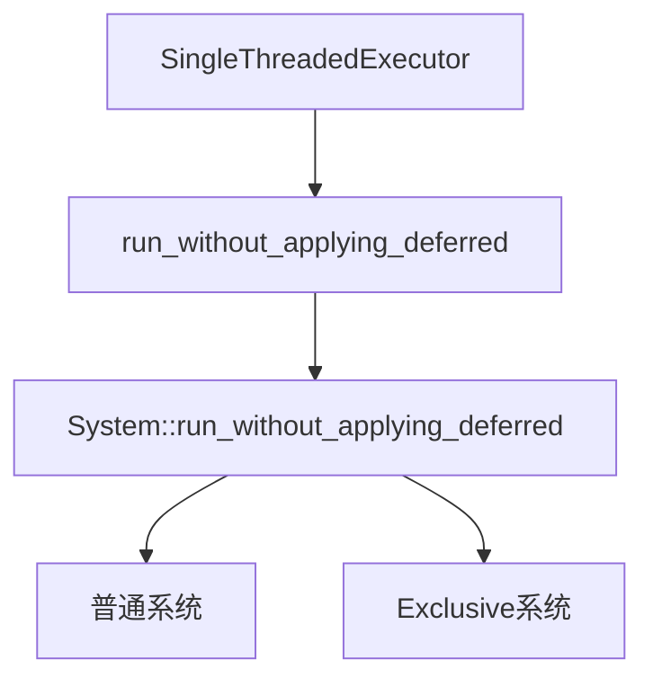

+++
title = "#18684 Use new `run_without_applying_deferred` method in `SingleThreadedExecutor"
date = "2025-05-06T00:00:00"
draft = false
template = "pull_request_page.html"
in_search_index = false

[extra]
current_language = "zh-cn"
available_languages = {"en" = { name = "English", url = "/pull_request/bevy/2025-05/pr-18684-en-20250506" }, "zh-cn" = { name = "中文", url = "/pull_request/bevy/2025-05/pr-18684-zh-cn-20250506" }}
+++

# Use new `run_without_applying_deferred` method in `SingleThreadedExecutor`

## 基本信息
- **标题**: Use new `run_without_applying_deferred` method in `SingleThreadedExecutor
- **PR 链接**: https://github.com/bevyengine/bevy/pull/18684
- **作者**: chescock
- **状态**: MERGED
- **标签**: A-ECS, C-Code-Quality, S-Ready-For-Final-Review, D-Straightforward
- **创建时间**: 2025-04-02T15:32:45Z
- **合并时间**: 2025-05-06T00:35:51Z
- **合并者**: alice-i-cecile

## 描述翻译
### 目标
简化 `SingleThreadedExecutor` 的代码，移除对 exclusive systems 的特殊处理。

`SingleThreadedExecutor` 在运行系统时不会立即应用 deferred buffers。这原本需要调用 `run_unsafe()` 而不是 `run()`，但会导致 exclusive systems 发生 panic，因此代码需要特殊处理。基于 #18076 和 #18406 引入的 `run_without_applying_deferred` 方法，现在可以使用统一的方式处理所有系统类型。

### 解决方案
用 `run_without_applying_deferred()` 替换 `SingleThreadedExecutor` 中的特殊处理逻辑，并在 `__rust_begin_short_backtrace` 模块中添加对应的包装方法以保持堆栈跟踪特性。

## PR 的技术故事

### 问题背景与上下文
在 Bevy 的 ECS 调度系统中，`SingleThreadedExecutor` 需要处理两种不同类型的系统：普通系统和 exclusive systems。原有的实现需要区分这两种情况：

1. 对 exclusive systems 使用 `run()` 方法
2. 对普通系统使用 `run_unsafe()` 方法并手动处理 world 的访问安全

这种差异源于 executor 需要延迟应用 deferred buffers 的特性。直接使用 `run()` 会立即应用这些 buffers，而使用 `run_unsafe()` 则需要复杂的 unsafe 代码块。这导致了代码重复和维护复杂度增加，特别是当处理系统执行错误时需要两套不同的错误处理逻辑。

### 技术方案演进
通过前序 PR #18076 和 #18406 引入的 `run_without_applying_deferred` 方法，现在可以直接使用统一的方法调用来处理所有系统类型。这个方法的核心优势在于：

1. 适用于所有系统类型（包括 exclusive systems）
2. 自动处理 archetype 访问更新
3. 内置安全边界保证

### 具体实现分析
在 `single_threaded.rs` 中，原本的条件分支结构被完全移除：

```rust
// Before:
if system.is_exclusive() {
    __rust_begin_short_backtrace::run(system, world)
} else {
    let world = world.as_unsafe_world_cell();
    // SAFETY: ... 手动安全注释 ...
    __rust_begin_short_backtrace::run_unsafe(system, world)
}

// After:
__rust_begin_short_backtrace::run_without_applying_deferred(system, world)
```

新增的 `run_without_applying_deferred` 包装方法（位于 `mod.rs`）实现了关键的统一调用：

```rust
#[inline(never)]
pub(super) fn run_without_applying_deferred(
    system: &mut ScheduleSystem,
    world: &mut World,
) -> Result {
    let result = system.run_without_applying_deferred((), world);
    black_box(());  // 阻止尾调用优化
    result
}
```

### 技术决策考量
1. **安全边界处理**：通过系统 trait 的内置方法替代手工 unsafe 代码块，减少人为错误风险
2. **执行器架构统一**：使 SingleThreadedExecutor 与其他 executor 的实现模式保持一致
3. **调试支持**：保留 `black_box` 调用确保堆栈跟踪可读性
4. **条件分支消除**：将原本 O(n) 的运行时分支判断转换为编译期静态分发

### 影响与改进
1. **代码简化**：减少 17 行代码（27 行删除 vs 10 行新增）
2. **错误处理统一**：所有系统类型共享同一错误处理路径
3. **执行安全强化**：通过系统 trait 的内置安全保证替代手工 unsafe 代码
4. **维护性提升**：后续功能扩展时无需考虑两种执行路径的差异

## 可视化关系


## 关键文件变更

### `crates/bevy_ecs/src/schedule/executor/single_threaded.rs` (+10/-27)
**变更重点**：移除条件分支，统一系统执行路径

关键修改前对比：
```rust
// 删除的代码片段
if system.is_exclusive() {
    // 处理 exclusive systems 的特殊路径
    __rust_begin_short_backtrace::run(...)
} else {
    // 普通系统的 unsafe 执行路径
    let world = world.as_unsafe_world_cell();
    unsafe { __rust_begin_short_backtrace::run_unsafe(...) }
}

// 新增的统一调用
__rust_begin_short_backtrace::run_without_applying_deferred(...)
```

### `crates/bevy_ecs/src/schedule/executor/mod.rs` (+22/-5)
**变更重点**：新增 `run_without_applying_deferred` 包装方法

新增方法实现：
```rust
#[inline(never)]
pub(super) fn run_without_applying_deferred(
    system: &mut ScheduleSystem,
    world: &mut World,
) -> Result {
    let result = system.run_without_applying_deferred((), world);
    black_box(());  // 阻止尾调用优化
    result
}
```

## 延伸阅读
1. [System Trait 设计文档](https://bevyengine.org/learn/system-design/)
2. [Deferred Buffers 工作机制](https://bevy-cheatbook.github.io/programming/deferred.html)
3. [Rust 的尾调用优化限制](https://github.com/rust-lang/rfcs/issues/2691)