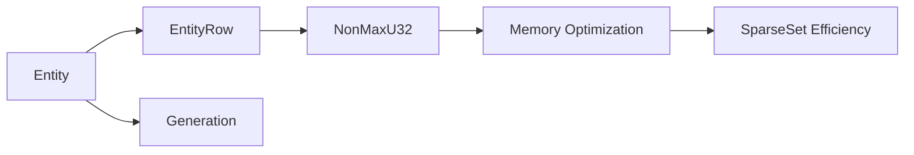

+++
title = "#18704 Make `entity::index` non max"
date = "2025-05-07T00:00:00"
draft = false
template = "pull_request_page.html"
in_search_index = true

[taxonomies]
list_display = ["show"]

[extra]
current_language = "en"
available_languages = {"en" = { name = "English", url = "/pull_request/bevy/2025-05/pr-18704-en-20250507" }, "zh-cn" = { name = "中文", url = "/pull_request/bevy/2025-05/pr-18704-zh-cn-20250507" }}
labels = ["A-ECS", "C-Code-Quality", "D-Complex", "X-Contentious"]
+++

# Title

## Basic Information
- **Title**: Make `entity::index` non max
- **PR Link**: https://github.com/bevyengine/bevy/pull/18704
- **Author**: ElliottjPierce
- **Status**: MERGED
- **Labels**: A-ECS, C-Code-Quality, S-Ready-For-Final-Review, D-Complex, X-Contentious
- **Created**: 2025-04-03T17:45:29Z
- **Merged**: 2025-05-07T18:41:00Z
- **Merged By**: alice-i-cecile

## Description Translation
The original description is already in English and remains unchanged:

# Objective

There are two problems this aims to solve. 

First, `Entity::index` is currently a `u32`. That means there are `u32::MAX + 1` possible entities. Not only is that awkward, but it also make `Entity` allocation more difficult. I discovered this while working on remote entity reservation, but even on main, `Entities` doesn't handle the `u32::MAX + 1` entity very well. It can not be batch reserved because that iterator uses exclusive ranges, which has a maximum upper bound of `u32::MAX - 1`. In other words, having `u32::MAX` as a valid index can be thought of as a bug right now. We either need to make that invalid (this PR), which makes Entity allocation cleaner and makes remote reservation easier (because the length only needs to be u32 instead of u64, which, in atomics is a big deal), or we need to take another pass at `Entities` to make it handle the `u32::MAX` index properly.

Second, `TableRow`, `ArchetypeRow` and `EntityIndex` (a type alias for u32) all have `u32` as the underlying type. That means using these as the index type in a `SparseSet` uses 64 bits for the sparse list because it stores `Option<IndexType>`. By using `NonMaxU32` here, we cut the memory of that list in half. To my knowledge, `EntityIndex` is the only thing that would really benefit from this niche. `TableRow` and `ArchetypeRow` I think are not stored in an `Option` in bulk. But if they ever are, this would help. Additionally this ensures `TableRow::INVALID` and `ArchetypeRow::INVALID` never conflict with an actual row, which in a nice bonus.

As a related note, if we do components as entities where `ComponentId` becomes `Entity`, the the `SparseSet<ComponentId>` will see a similar memory improvement too.

## Solution

Create a new type `EntityRow` that wraps `NonMaxU32`, similar to `TableRow` and `ArchetypeRow`. 
Change `Entity::index` to this type.

## Downsides

`NonMax` is implemented as a `NonZero` with a binary inversion. That means accessing and storing the value takes one more instruction. I don't think that's a big deal, but it's worth mentioning.

As a consequence, `to_bits` uses `transmute` to skip the inversion which keeps it a nop. But that also means that ordering has now flipped. In other words, higher indices are considered less than lower indices. I don't think that's a problem, but it's also worth mentioning.

## Alternatives

We could keep the index as a u32 type and just document that `u32::MAX` is invalid, modifying `Entities` to ensure it never gets handed out. (But that's not enforced by the type system.) We could still take advantage of the niche here in `ComponentSparseSet`. We'd just need some unsafe manual conversions, which is probably fine, but opens up the possibility for correctness problems later.

We could change `Entities` to fully support the `u32::MAX` index. (But that makes `Entities` more complex and potentially slightly slower.)

## Testing

- CI
- A few tests were changed because they depend on different ordering and `to_bits` values.

## Future Work

- It might be worth removing the niche on `Entity::generation` since there is now a different niche.
- We could move `Entity::generation` into it's own type too for clarity.
- We should change `ComponentSparseSet` to take advantage of the new niche. (This PR doesn't change that yet.)
- Consider removing or updating `Identifier`. This is only used for `Entity`, so it might be worth combining since `Entity` is now more unique.

## The Story of This Pull Request

### The Problem and Context
The Entity Component System (ECS) faced two core issues related to entity indexing. First, using `u32` for entity indices created an awkward situation where `u32::MAX + 1` possible entities existed. This caused problems with batch reservation logic that couldn't handle the full range of `u32` values. Second, memory usage in sparse sets was suboptimal because `Option<u32>` index storage required 64 bits per entry.

### The Solution Approach
The PR introduces `EntityRow`, a new type wrapping `NonMaxU32`, to replace raw `u32` indices in entity handling. This approach:
1. Prohibits `u32::MAX` as a valid index through type constraints
2. Enables niche optimization for `Option<EntityRow>`, halving memory usage in sparse sets
3. Simplifies entity allocation logic by eliminating edge cases around maximum index values

### The Implementation
The core changes occur in `crates/bevy_ecs/src/entity/mod.rs`, where the `Entity` struct was refactored to use `EntityRow` instead of raw `u32`:

```rust
// Before:
pub struct Entity {
    index: u32,
    generation: NonZero<u32>,
}

// After:
pub struct Entity {
    row: EntityRow,
    generation: NonZero<u32>,
}

#[repr(transparent)]
pub struct EntityRow(NonMaxU32);
```

Key implementation details:
- `Entity::from_raw` now takes `EntityRow` instead of `u32`
- Added `Entity::from_raw_u32` returning `Option<Entity>` for safe conversion
- Updated comparison operators to account for inverted ordering from `NonMaxU32` bit patterns

### Technical Insights
The use of `NonMaxU32` provides two critical benefits:
1. **Memory Optimization**: `Option<EntityRow>` uses 32 bits instead of 64 due to niche optimization (since `NonMaxU32` can't be `u32::MAX`, that value becomes the `None` representation)
2. **Type Safety**: Invalid indices (`u32::MAX`) are excluded at the type level

The ordering inversion occurs because `NonMaxU32` stores values as `!u32` to utilize the niche. This means higher numeric indices compare as smaller values, which required updates to tests relying on specific entity order.

### The Impact
- **Memory Savings**: Sparse set storage for entity indices uses 50% less memory
- **Safer Entity Handling**: Invalid indices are prevented at compile time
- **API Changes**: Entity creation patterns require adjustment (see migration guide)
- **Performance**: Minimal instruction count increase from bitwise operations, offset by memory savings

## Visual Representation



## Key Files Changed

### `crates/bevy_ecs/src/entity/mod.rs` (+295/-88)
Core entity handling logic updated to use `EntityRow`:
```rust
// Key change in Entity definition
#[cfg(target_endian = "little")]
row: EntityRow,
generation: NonZero<u32>,
```

Added `EntityRow` type and conversion methods:
```rust
#[derive(Clone, Copy, PartialEq, Eq, PartialOrd, Ord, Hash, Debug, Display)]
pub struct EntityRow(NonMaxU32);

impl EntityRow {
    pub const fn new(index: NonMaxU32) -> Self {
        Self(index)
    }
    
    pub const fn index(self) -> u32 {
        self.0.get()
    }
}
```

### `benches/benches/bevy_ecs/world/world_get.rs` (+24/-8)
Updated benchmark entity creation:
```rust
// Before:
let entity = Entity::from_raw(i);

// After:
let entity = Entity::from_raw(EntityRow::new(
    unsafe { NonMaxU32::new_unchecked(i) }
));
```

### `release-content/migration-guides/make_entity_index_non_max.md` (+25/-0)
New migration guide explaining:
- `Entity::from_raw` signature change
- Ordering behavior changes
- Replacement patterns for manual entity creation

## Further Reading
- [NonMaxU32 documentation](https://docs.rs/nonmax/latest/nonmax/struct.NonMaxU32.html)
- [Rust niche optimization](https://rust-lang.github.io/unsafe-code-guidelines/layout/enums.html#niche-optimizations)
- [ECS sparse set internals](https://bevyengine.org/learn/book/implementation-notes/ecs-internals/)