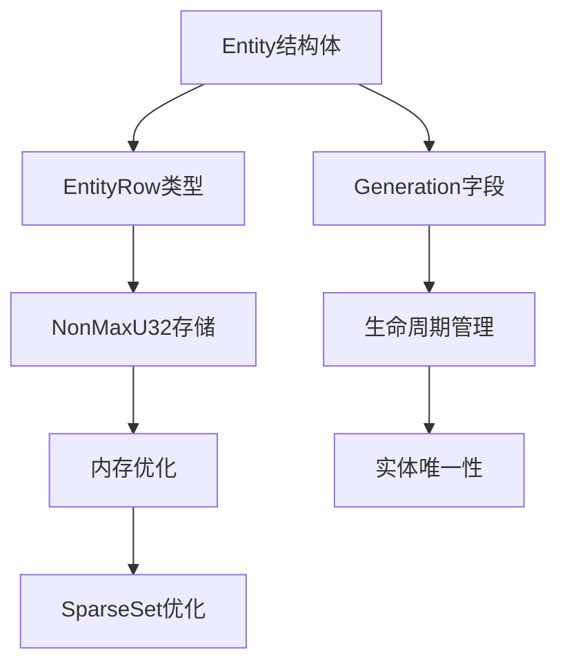

+++
title = "#18704 Make `entity::index` non max"
date = "2025-05-07T00:00:00"
draft = false
template = "pull_request_page.html"
in_search_index = false

[extra]
current_language = "zh-cn"
available_languages = {"en" = { name = "English", url = "/pull_request/bevy/2025-05/pr-18704-en-20250507" }, "zh-cn" = { name = "中文", url = "/pull_request/bevy/2025-05/pr-18704-zh-cn-20250507" }}
labels = ["A-ECS", "C-Code-Quality", "D-Complex", "X-Contentious"]
+++

# Title

## Basic Information
- **Title**: Make `entity::index` non max
- **PR Link**: https://github.com/bevyengine/bevy/pull/18704
- **Author**: ElliottjPierce
- **Status**: MERGED
- **Labels**: A-ECS, C-Code-Quality, S-Ready-For-Final-Review, D-Complex, X-Contentious
- **Created**: 2025-04-03T17:45:29Z
- **Merged**: 2025-05-07T18:41:00Z
- **Merged By**: alice-i-cecile

## Description Translation

### 目标
该PR旨在解决两个核心问题：

1. **实体索引溢出问题**  
   `Entity::index` 使用 `u32` 类型导致最大实体数量限制为 `u32::MAX + 1`。现有 `Entities` 实现无法正确处理 `u32::MAX` 索引，导致批量预留实体时出现范围上限问题。

2. **稀疏集合内存优化**  
   `TableRow`、`ArchetypeRow` 和 `EntityIndex` 使用 `u32` 作为底层类型，导致 `SparseSet` 存储 `Option<IndexType>` 时占用64位。改用 `NonMaxU32` 可减少50%内存占用。

### 解决方案
引入 `EntityRow` 类型封装 `NonMaxU32`，将 `Entity::index` 替换为该类型。通过类型系统确保 `u32::MAX` 不再作为有效索引。

### 技术权衡
- 访问和存储 `NonMax` 类型需要额外指令
- 实体排序规则反转（高索引视为小于低索引）
- 保留原有 `to_bits` 的零开销转换

### 替代方案
- 文档声明 `u32::MAX` 无效（无类型系统保障）
- 修改 `Entities` 实现支持完整 `u32::MAX` 索引（增加复杂度）

## The Story of This Pull Request

### 问题根源与背景
在 Bevy ECS 的核心数据结构中，实体索引使用 `u32` 类型存在两个主要问题。首先，`u32::MAX` 作为有效索引会导致实体分配逻辑复杂化，特别是在远程实体预留场景下，批量预留操作因使用独占范围而无法处理最大索引值。其次，存储系统使用 `Option<u32>` 作为稀疏集合索引时，每个条目需要占用64位内存空间。

### 解决方案选择
作者引入 `EntityRow` 类型作为 `NonMaxU32` 的包装类型，利用 Rust 的 `NonZero` 类型优化内存布局。这种设计选择：
1. 通过类型系统排除 `u32::MAX` 作为有效索引
2. 使 `Option<EntityRow>` 仅占用32位空间
3. 保持与现有API的兼容性

关键决策点在于是否通过类型系统强制执行约束。直接修改 `Entities` 实现虽然可行，但会引入更多复杂度。相比之下，新类型的引入虽然需要修改多处代码，但能提供更强的类型安全保障。

### 具体实现分析
核心修改位于 `crates/bevy_ecs/src/entity/mod.rs`，主要重构了 `Entity` 结构体：

```rust
// 修改前
pub struct Entity {
    index: u32,
    generation: NonZero<u32>,
}

// 修改后
pub struct EntityRow(NonMaxU32);

pub struct Entity {
    row: EntityRow,
    generation: NonZero<u32>,
}
```

新增的 `EntityRow` 实现关键方法：
```rust
impl EntityRow {
    const fn to_bits(self) -> u32 {
        unsafe { mem::transmute(self.0) } // 保持二进制兼容
    }
    
    const fn from_bits(bits: u32) -> Self {
        Self::try_from_bits(bits).expect("Invalid bits")
    }
}
```

实体生成逻辑调整：
```rust
// 新的实体分配路径
let raw = self.meta.len() as IdCursor - n;
let row = unsafe { EntityRow::new(NonMaxU32::new_unchecked(raw as u32)) };
Entity::from_raw(row)
```

### 技术影响与兼容性处理
1. **序列化兼容性**  
   修改了场景文件中的实体ID表示（如 `assets/scenes/load_scene_example.scn.ron`），因为 `to_bits` 的二进制表示发生变化：
   ```diff
   - 4294967296: (
   + 4294967297: (
   ```

2. **测试用例适配**  
   所有手动创建实体的测试改用 `from_raw_u32` 方法：
   ```rust
   // 修改前
   Entity::from_raw(1)
   // 修改后
   Entity::from_raw_u32(1).unwrap()
   ```

3. **性能基准调整**  
   性能测试中的实体创建需要显式处理 `NonMaxU32`：
   ```rust
   let entity = Entity::from_raw(EntityRow::new(
       unsafe { NonMaxU32::new_unchecked(i) }
   ));
   ```

### 技术洞察
1. **内存布局优化**  
   `Option<EntityRow>` 使用 `NonZero` 的 niche 优化，内存占用从8字节降为4字节。这对于存储大量实体索引的 `SparseSet` 结构有显著的内存优化效果。

2. **排序规则变化**  
   由于 `NonMaxU32` 使用二进制取反存储，实体索引的排序规则反转。这要求所有依赖实体顺序的逻辑进行验证，如：
   ```rust
   assert!(Entity::from_raw(row1) > Entity::from_raw(row2)) // 当 row1.index < row2.index 时
   ```

3. **错误处理强化**  
   新增 `from_raw_u32` 方法返回 `Option<Entity>`，强制调用方处理无效的 `u32::MAX` 输入：
   ```rust
   pub const fn from_raw_u32(row: u32) -> Option<Entity> {
       NonMaxU32::new(row).map(|n| Self::from_raw(EntityRow::new(n)))
   }
   ```

## Visual Representation



## Key Files Changed

### `crates/bevy_ecs/src/entity/mod.rs` (+295/-88)
1. **核心结构重构**  
   引入 `EntityRow` 类型替代原始 `u32` 索引：
   ```rust
   #[derive(Clone, Copy, PartialEq, Eq, PartialOrd, Ord, Hash)]
   pub struct EntityRow(NonMaxU32);
   
   impl Entity {
       pub const fn from_raw(row: EntityRow) -> Self {
           Self::from_raw_and_generation(row, NonZero::<u32>::MIN)
       }
   }
   ```

2. **索引访问调整**  
   修改 `index()` 方法实现：
   ```rust
   pub const fn index(self) -> u32 {
       self.row.index() // 通过EntityRow间接访问
   }
   ```

### `crates/bevy_scene/src/serde.rs` (+22/-20)
1. **序列化格式适配**  
   调整实体ID的序列化处理逻辑：
   ```rust
   // 反序列化时处理新的位模式
   let index = EntityRow::from_bits(low).index();
   ```

### `benches/benches/bevy_ecs/world/world_get.rs` (+24/-8)
1. **性能测试改造**  
   显式构造有效实体：
   ```rust
   let entity = Entity::from_raw(EntityRow::new(
       unsafe { NonMaxU32::new_unchecked(i) }
   ));
   ```

## Further Reading

1. [NonMaxU32文档](https://docs.rs/nonmax/latest/nonmax/struct.NonMaxU32.html) - 了解内存优化原理
2. [Rust的Niche优化机制](https://doc.rust-lang.org/nomicon/niches.html) - 理解类型布局优化
3. [Bevy ECS实体管理设计](https://bevyengine.org/learn/book/ecs/entities/) - 官方实体管理文档