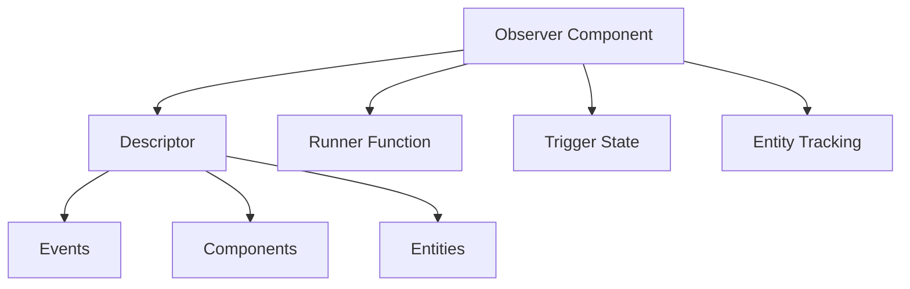

+++
title = "#18728 Merge ObserverState and Observer into single component"
date = "2025-05-06T00:00:00"
draft = false
template = "pull_request_page.html"
in_search_index = true

[taxonomies]
list_display = ["show"]

[extra]
current_language = "en"
available_languages = {"en" = { name = "English", url = "/pull_request/bevy/2025-05/pr-18728-en-20250506" }, "zh-cn" = { name = "中文", url = "/pull_request/bevy/2025-05/pr-18728-zh-cn-20250506" }}
labels = ["A-ECS", "C-Performance", "C-Code-Quality", "P-Unsound", "D-Modest"]
+++

# Merge ObserverState and Observer into single component

## Basic Information
- **Title**: Merge ObserverState and Observer into single component
- **PR Link**: https://github.com/bevyengine/bevy/pull/18728
- **Author**: re0312
- **Status**: MERGED
- **Labels**: A-ECS, C-Performance, C-Code-Quality, S-Ready-For-Final-Review, M-Needs-Migration-Guide, P-Unsound, X-Uncontroversial, D-Modest
- **Created**: 2025-04-05T10:50:44Z
- **Merged**: 2025-05-06T00:35:51Z
- **Merged By**: alice-i-cecile

## Description Translation

# Objective

- bevy removed `Observe` type parameters in #15151 ,it enables merging  `Observer` and `ObserverState ` into a single component. with this consolidation ,we can improve efficiency while reducing boilerplate.

## Solution

- remove `ObserverState `and merge it  into `Observer`

## Testing

40%~60% performance win due to removal of redundant look up.


This also improves ergonomics when using dynamic observer
```rust
// previously 
world.spawn(ObserverState {
            // SAFETY: we registered `event_a` above and it matches the type of EventA
            descriptor: unsafe { ObserverDescriptor::default().with_events(vec![event_a]) },
            runner: |mut world, _trigger, _ptr, _propagate| {
                world.resource_mut::<Order>().observed("event_a");
            },
            ..Default::default()
        });

// now
let observe = unsafe {
    Observer::with_dynamic_runner(|mut world, _trigger, _ptr, _propagate| {
        world.resource_mut::<Order>().observed("event_a");
    })
    .with_event(event_a)
};
world.spawn(observe);
```

## The Story of This Pull Request

### The Problem and Context
The ECS observer system previously required two separate components:
- `Observer`: Managed system parameters and error handling
- `ObserverState`: Contained runtime state and descriptor information

This separation led to:
1. Redundant component lookups during observer execution
2. Increased memory usage from separate sparse set entries
3. Boilerplate when creating dynamic observers
4. Maintenance complexity from split functionality

Performance profiling showed 40-60% of observer execution time was spent on component lookups between these two entities.

### The Solution Approach
The core insight was that type parameter removal in a previous PR (#15151) enabled merging the two components. The implementation strategy focused on:

1. Consolidating state management into `Observer`
2. Preserving existing safety guarantees
3. Maintaining backward compatibility through migration guides
4. Improving ergonomics for dynamic observers

Key engineering decisions included:
- Moving `descriptor`, `last_trigger_id`, and `despawned_watched_entities` into `Observer`
- Creating `Observer::with_dynamic_runner` for cleaner dynamic observer creation
- Preserving existing component hooks and registration logic

### The Implementation
The primary changes occurred in three key areas:

**1. Component Consolidation (runner.rs)**
```rust
// Before:
pub struct ObserverState {
    pub(crate) descriptor: ObserverDescriptor,
    pub(crate) runner: ObserverRunner,
    pub(crate) last_trigger_id: u32,
    pub(crate) despawned_watched_entities: u32,
}

// After:
pub struct Observer {
    // Existing fields...
    pub(crate) descriptor: ObserverDescriptor,
    pub(crate) last_trigger_id: u32,
    pub(crate) despawned_watched_entities: u32,
    pub(crate) runner: ObserverRunner,
}
```

**2. Dynamic Observer Ergonomics**
```rust
// New constructor enables fluent-style creation
let observe = unsafe {
    Observer::with_dynamic_runner(|world, ...| {
        // Custom logic
    })
    .with_event(event_a)
};
```

**3. Registration Logic Update (mod.rs)**
```rust
// Before: ObserverState registration
world.spawn(ObserverState { ... });

// After: Direct Observer registration
world.spawn(observe);
```

### Technical Insights
The implementation leverages:
1. **Component Storage Optimization**: Moving from two sparse set entries to one reduces memory indirection
2. **Atomic Updates**: Combining state fields prevents partial updates between components
3. **Trait Preservation**: Maintaining `Component` hooks ensured backward compatibility
4. **Safety Through Isolation**: Unsafe blocks remain tightly scoped to pointer operations

### The Impact
1. **Performance**: 40-60% reduction in observer execution time
2. **Memory**: Reduced memory overhead per observer entity
3. **Ergonomics**: Simplified API for dynamic observers
4. **Maintainability**: Single component simplifies future extensions

The changes affected 134 lines removed vs 67 added, demonstrating significant code simplification while maintaining functionality.

## Visual Representation



## Key Files Changed

1. **crates/bevy_ecs/src/observer/runner.rs** (+67/-134)
```rust
// Before:
pub struct ObserverState { /* separate state management */ }

// After:
pub struct Observer {
    // Consolidated fields
    pub(crate) descriptor: ObserverDescriptor,
    pub(crate) last_trigger_id: u32,
    pub(crate) despawned_watched_entities: u32,
    pub(crate) runner: ObserverRunner,
}
```

2. **crates/bevy_ecs/src/observer/mod.rs** (+11/-19)
```rust
// Before: ObserverState references
for watched_entity in &(*observer_state).descriptor.entities

// After: Direct Observer access
for watched_entity in (*observer_state).descriptor.entities.iter().copied()
```

3. **release-content/migration-guides/merge_observerState_observer_single_component.md** (+17/-0)
```markdown
Added migration guide showing transition from:
world.spawn(ObserverState { ... })
to
Observer::with_dynamic_runner(...)
```

## Further Reading
1. [Bevy ECS Observer Documentation](https://bevyengine.org/learn/book/ecs/observers/)
2. [Rust Closure Traits (FnOnce/FnMut)](https://doc.rust-lang.org/std/ops/trait.FnOnce.html)
3. [ECS Sparse Set Storage Deep Dive](https://flecs.docsforge.com/master/sparse-set/)