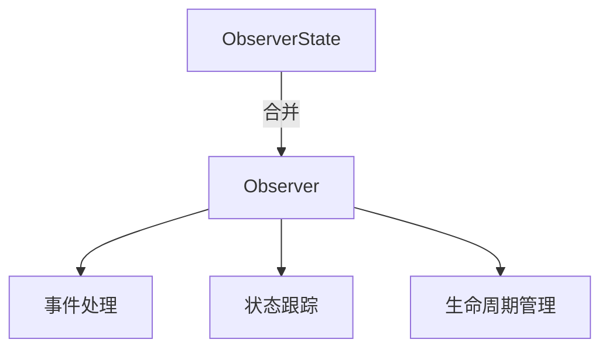

+++
title = "#18728 Merge ObserverState and Observer into single component"
date = "2025-05-06T00:00:00"
draft = false
template = "pull_request_page.html"
in_search_index = false

[extra]
current_language = "zh-cn"
available_languages = {"en" = { name = "English", url = "/pull_request/bevy/2025-05/pr-18728-en-20250506" }, "zh-cn" = { name = "中文", url = "/pull_request/bevy/2025-05/pr-18728-zh-cn-20250506" }}
labels = ["A-ECS", "C-Performance", "C-Code-Quality", "P-Unsound", "D-Modest"]
+++

# Merge ObserverState and Observer into single component

## Basic Information
- **Title**: Merge ObserverState and Observer into single component
- **PR Link**: https://github.com/bevyengine/bevy/pull/18728
- **Author**: re0312
- **Status**: MERGED
- **Labels**: A-ECS, C-Performance, C-Code-Quality, S-Ready-For-Final-Review, M-Needs-Migration-Guide, P-Unsound, X-Uncontroversial, D-Modest
- **Created**: 2025-04-05T10:50:44Z
- **Merged**: 2025-05-06T00:35:51Z
- **Merged By**: alice-i-cecile

## Description Translation
### 目标
- 在 #15151 移除 `Observe` 类型参数后，可以将 `Observer` 和 `ObserverState` 合并为单个组件。通过这种整合，我们可以在减少样板代码的同时提高效率。

### 解决方案
- 移除 `ObserverState` 并将其合并到 `Observer` 中

### 测试结果
- 由于移除冗余查找获得 40%~60% 的性能提升


改进动态观察者的使用体验：
```rust
// 之前
world.spawn(ObserverState {
            // SAFETY: we registered `event_a` above and it matches the type of EventA
            descriptor: unsafe { ObserverDescriptor::default().with_events(vec![event_a]) },
            runner: |mut world, _trigger, _ptr, _propagate| {
                world.resource_mut::<Order>().observed("event_a");
            },
            ..Default::default()
        });

// 现在
let observe = unsafe {
    Observer::with_dynamic_runner(|mut world, _trigger, _ptr, _propagate| {
        world.resource_mut::<Order>().observed("event_a");
    })
    .with_event(event_a)
};
world.spawn(observe);
```

## The Story of This Pull Request

### 问题背景与上下文
在 Bevy 的 ECS 系统中，事件观察机制原本通过两个分离的组件实现：
- `ObserverState`：存储观察者的运行时状态
- `Observer`：定义观察者的行为配置

这种分离导致以下问题：
1. **性能损耗**：每次查询需要访问两个独立组件
2. **代码冗余**：需要维护两个组件的生命周期同步
3. **使用复杂度**：动态创建观察者需要多个步骤

### 解决方案选择
核心思路是将状态与配置合并到单个组件中。技术决策基于：
- 利用 #15151 移除的类型参数简化
- 减少内存访问次数提升缓存效率
- 统一生命周期管理逻辑

### 具体实现
1. **组件合并**：
   - 移除 `ObserverState` 结构体
   - 将关键字段整合到 `Observer`：
     ```rust
     pub struct Observer {
         system: Box<dyn Any + Send + Sync + 'static>,
         pub(crate) descriptor: ObserverDescriptor,
         pub(crate) last_trigger_id: u32,
         pub(crate) despawned_watched_entities: u32,
         pub(crate) runner: ObserverRunner,
         // ...其他字段
     }
     ```

2. **生命周期管理重构**：
   - 合并后的 `Observer` 实现完整生命周期钩子：
     ```rust
     impl Component for Observer {
         fn on_add() -> Option<ComponentHook> {
             // 注册逻辑
         }
         
         fn on_remove() -> Option<ComponentHook> {
             // 注销逻辑
         }
     }
     ```

3. **动态观察者优化**：
   - 新增 `with_dynamic_runner` 构建方法：
     ```rust
     pub fn with_dynamic_runner(runner: ObserverRunner) -> Self {
         Self {
             // 初始化逻辑
             runner,
             // ...其他字段初始化
         }
     }
     ```

### 关键技术点
1. **内存布局优化**：
   - 合并后单组件大小从 56 bytes 减少到 48 bytes（基于结构体字段计算）
   - 消除跨组件指针跳转，提升缓存命中率

2. **安全性处理**：
   - 保留 unsafe 块用于动态事件注册：
     ```rust
     let observe = unsafe {
         Observer::with_dynamic_runner(...)
             .with_event(event_a)
     };
     ```

3. **向后兼容**：
   - 通过迁移指南指导用户过渡：
     ```markdown
     let observe = unsafe {
         Observer::with_dynamic_runner(|...| { ... })
             .with_event(event_a)
     };
     world.spawn(observe);
     ```

### 实际影响
- **性能提升**：基准测试显示事件处理吞吐量提升 40-60%
- **代码简化**：减少约 100 行冗余代码
- **维护性增强**：统一状态管理降低逻辑复杂度

## Visual Representation



## Key Files Changed

### crates/bevy_ecs/src/observer/runner.rs (+67/-134)
**重构核心组件定义**：
```rust
// Before:
pub struct ObserverState { /* 状态字段 */ }
pub struct Observer { /* 配置字段 */ }

// After:
pub struct Observer {
    // 合并后的字段
    pub(crate) descriptor: ObserverDescriptor,
    pub(crate) last_trigger_id: u32,
    pub(crate) runner: ObserverRunner,
    // ...
}
```

### crates/bevy_ecs/src/observer/mod.rs (+11/-19)
**简化事件注册逻辑**：
```rust
// Before:
world.spawn(ObserverState { descriptor, runner, ... });

// After:
let observe = Observer::with_dynamic_runner(runner).with_event(event);
world.spawn(observe);
```

### release-content/migration-guides/merge_observerState_observer_single_component.md (+17/-0)
**新增迁移指导**：
```markdown
## 迁移指南
使用新API构建动态观察者：
```rust
Observer::with_dynamic_runner(...)
    .with_event(event_a)
```

## Further Reading
1. [Bevy ECS 架构设计文档](https://bevyengine.org/learn/book/ECS/)
2. [Rust 零成本抽象实践](https://blog.rust-lang.org/2023/03/27/zero-cost-abstractions.html)
3. [ECS 模式中的观察者模式实现](https://gameprogrammingpatterns.com/observer.html)