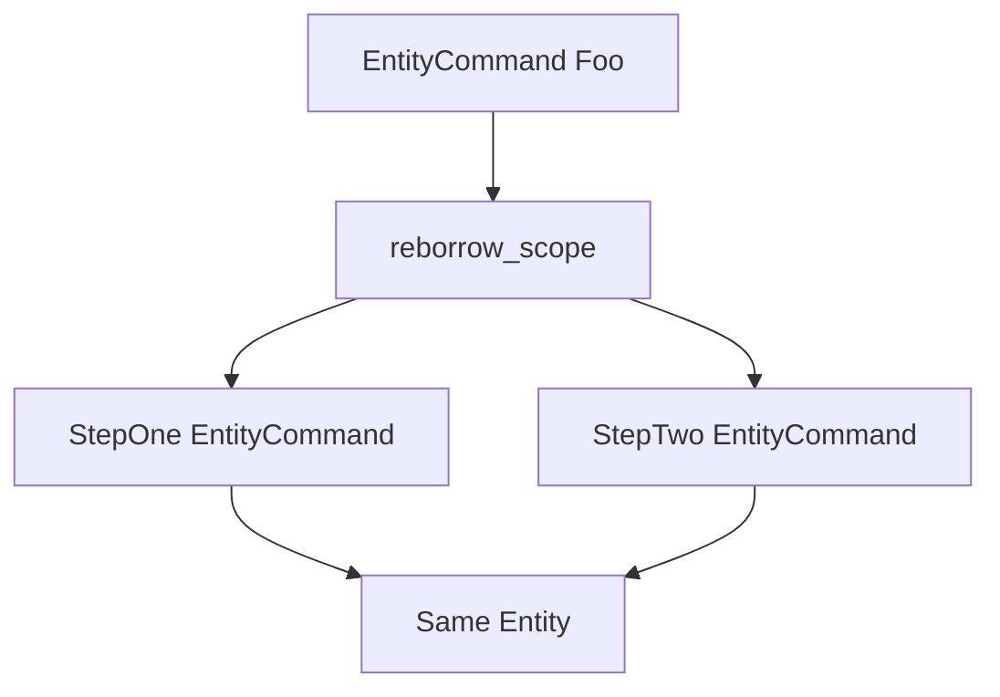

+++
title = "#18730 Add `EntityWorldMut::reborrow_scope()`"
date = "2025-05-06T00:00:00"
draft = false
template = "pull_request_page.html"
in_search_index = true

[taxonomies]
list_display = ["show"]

[extra]
current_language = "en"
available_languages = {"en" = { name = "English", url = "/pull_request/bevy/2025-05/pr-18730-en-20250506" }, "zh-cn" = { name = "中文", url = "/pull_request/bevy/2025-05/pr-18730-zh-cn-20250506" }}
labels = ["A-ECS", "C-Usability", "D-Complex", "D-Unsafe"]
+++

# Add `EntityWorldMut::reborrow_scope()`

## Basic Information
- **Title**: Add `EntityWorldMut::reborrow_scope()`
- **PR Link**: https://github.com/bevyengine/bevy/pull/18730
- **Author**: SOF3
- **Status**: MERGED
- **Labels**: A-ECS, C-Usability, S-Ready-For-Final-Review, D-Complex, D-Unsafe
- **Created**: 2025-04-05T15:44:47Z
- **Merged**: 2025-05-06T00:40:27Z
- **Merged By**: alice-i-cecile

## Description Translation

# Objective

Allow `EntityCommand` implementors to delegate to other entity commands easily:

```rs
impl EntityCommand for Foo {
    fn apply(self, mut entity: EntityWorldMut) {
        entity.reborrow_scope(|e| StepOne.apply(e));
        entity.reborrow_scope(|e| StepTwo.apply(e));
    }
}
```

## The Story of This Pull Request

### The Problem and Context
When working with Bevy's Entity Component System (ECS), developers often need to apply multiple entity commands sequentially to the same entity. The existing `EntityWorldMut` API presented a ownership challenge: each `EntityCommand::apply` call consumes the `EntityWorldMut` instance, making it impossible to perform multiple operations on the same entity without complex workarounds. This limitation hindered code composition and forced developers into awkward patterns when trying to delegate commands.

### The Solution Approach
The PR introduces a `reborrow_scope` method that enables temporary borrowing of the entity reference. This approach leverages Rust's ownership system to create short-lived borrows within a scoped context, allowing multiple operations on the same entity while maintaining the original `EntityWorldMut` instance's ownership. The key insight was to combine existing `world_scope` functionality with careful management of entity location metadata.

### The Implementation
The core implementation adds a single method to `EntityWorldMut`:

```rust
pub fn reborrow_scope<U>(&mut self, f: impl FnOnce(EntityWorldMut) -> U) -> U {
    let Self { entity, location, .. } = *self;
    self.world_scope(move |world| {
        f(EntityWorldMut {
            world,
            entity,
            location,
        })
    })
}
```

This method:
1. Captures the current entity ID and location
2. Uses `world_scope` to safely access the World reference
3. Constructs a new `EntityWorldMut` for the closure execution
4. Preserves the original instance's ownership outside the scope

### Technical Insights
The implementation addresses three key challenges:
1. **Lifetime Management**: By using `world_scope`, it ensures the borrowed World reference doesn't outlive the closure
2. **Entity Consistency**: Preserves the entity's location metadata to maintain valid entity state
3. **API Ergonomics**: Maintains the original `EntityWorldMut` instance's usability after scope execution

The `D-Unsafe` label likely relates to the underlying ECS operations rather than this specific method, which contains no unsafe code itself.

### The Impact
This change enables new composition patterns in Bevy ECS:
- Sequential application of multiple commands to the same entity
- Clean delegation between entity commands
- Reduced need for workaround patterns involving entity lookup

Developers can now write more modular entity command implementations without fighting the ownership system. The solution maintains Bevy's safety guarantees while improving ergonomics for common ECS patterns.

## Visual Representation



## Key Files Changed

### `crates/bevy_ecs/src/world/entity_ref.rs` (+16/-0)
Added the `reborrow_scope` method to enable temporary entity borrowing:

```rust
pub fn reborrow_scope<U>(&mut self, f: impl FnOnce(EntityWorldMut) -> U) -> U {
    let Self { entity, location, .. } = *self;
    self.world_scope(move |world| {
        f(EntityWorldMut {
            world,
            entity,
            location,
        })
    })
}
```

This implementation:
- Uses destructuring to capture current state
- Leverages existing `world_scope` for safe World access
- Constructs a new temporary `EntityWorldMut` for the closure
- Returns the closure's result while preserving original ownership

## Further Reading
1. [Rust Ownership and Borrowing](https://doc.rust-lang.org/book/ch04-00-understanding-ownership.html)
2. [Bevy EntityCommands Documentation](https://docs.rs/bevy_ecs/latest/bevy_ecs/system/trait.EntityCommand.html)
3. [Rust Scoped Threads Pattern](https://doc.rust-lang.org/std/thread/fn.scope.html) (Similar scoping concept)

# Full Code Diff
```diff
diff --git a/crates/bevy_ecs/src/world/entity_ref.rs b/crates/bevy_ecs/src/world/entity_ref.rs
index 22383e86b36e9..d5fe06a2e02f3 100644
--- a/crates/bevy_ecs/src/world/entity_ref.rs
+++ b/crates/bevy_ecs/src/world/entity_ref.rs
@@ -2952,6 +2952,22 @@ impl<'w> EntityWorldMut<'w> {
             .entity_get_spawned_or_despawned_by(self.entity)
             .map(|location| location.unwrap())
     }
+
+    /// Reborrows this entity in a temporary scope.
+    /// This is useful for executing a function that requires a `EntityWorldMut`
+    /// but you do not want to move out the entity ownership.
+    pub fn reborrow_scope<U>(&mut self, f: impl FnOnce(EntityWorldMut) -> U) -> U {
+        let Self {
+            entity, location, ..
+        } = *self;
+        self.world_scope(move |world| {
+            f(EntityWorldMut {
+                world,
+                entity,
+                location,
+            })
+        })
+    }
 }
 
 /// # Safety
```