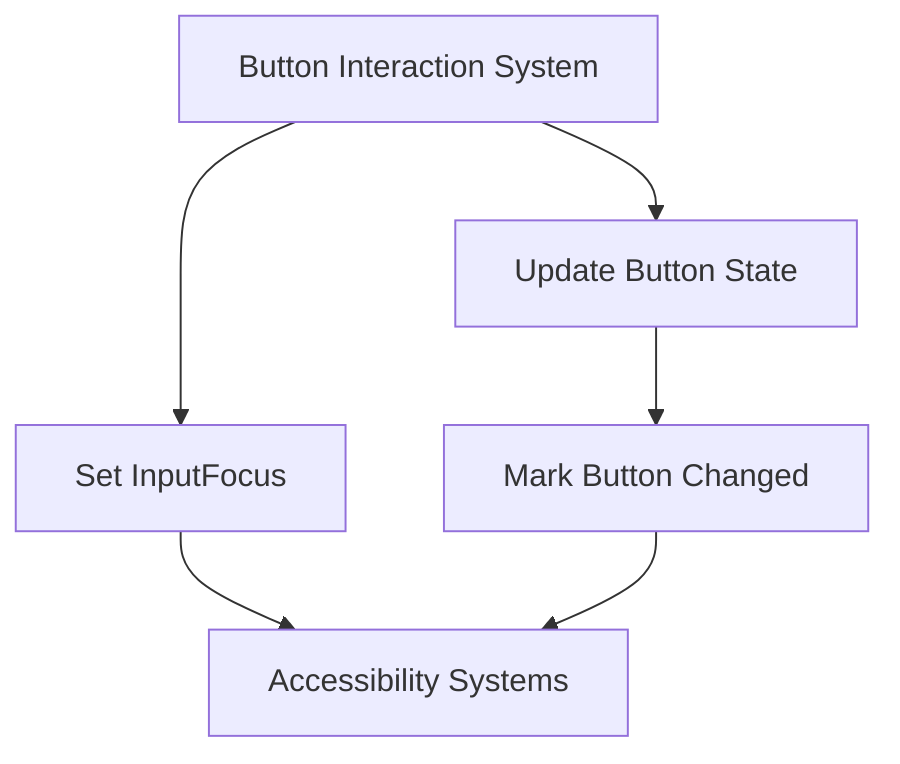

+++
title = "#18749 Enable accessibility features for the button example"
date = "2025-05-26T00:00:00"
draft = false
template = "pull_request_page.html"
in_search_index = true

[taxonomies]
list_display = ["show"]

[extra]
current_language = "en"
available_languages = {"en" = { name = "English", url = "/pull_request/bevy/2025-05/pr-18749-en-20250526" }, "zh-cn" = { name = "中文", url = "/pull_request/bevy/2025-05/pr-18749-zh-cn-20250526" }}
labels = ["C-Examples", "A-Accessibility", "A-UI", "D-Straightforward"]
+++

# Title: Enable accessibility features for the button example

## Basic Information
- **Title**: Enable accessibility features for the button example
- **PR Link**: https://github.com/bevyengine/bevy/pull/18749
- **Author**: ickshonpe
- **Status**: MERGED
- **Labels**: C-Examples, A-Accessibility, A-UI, S-Ready-For-Final-Review, D-Straightforward
- **Created**: 2025-04-07T12:37:29Z
- **Merged**: 2025-05-26T15:37:49Z
- **Merged By**: alice-i-cecile

## Description Translation
# Objective

Accessibility features don't work with the UI `button` example because `InputFocus` must be set for the accessibility systems to recognise the button.

Fixes #18760

## Solution

* Set the button entity as the `InputFocus` when it is hovered or pressed.
* Call `set_changed` on the `Button` component when the button's state changes to hovered or pressed (the accessibility system's only update the button's state when the `Button` component is marked as changed).

## Testing

Install NVDA, it should say "hover" when the button is hovered and "pressed" when the button is pressed.

The bounds of the accessibility node are reported incorrectly. I thought we fixed this, I'll take another look at it. It's not a problem with this PR.

## The Story of This Pull Request

The PR addresses a critical gap in the Bevy UI system's accessibility support. The original button example lacked proper screen reader integration because the accessibility systems required two specific pieces of information that weren't being provided: focus management and state change notifications.

**The Core Problem** emerged from Bevy's accessibility implementation requiring explicit tracking of focused UI elements through the `InputFocus` resource. Without this tracking, assistive technologies like NVDA couldn't recognize button state changes. Additionally, the accessibility systems only processed updates when the `Button` component itself was marked as changed - a detail that wasn't handled in the original implementation.

**The Solution Approach** required two parallel fixes:
1. **Focus Management**: Setting the `InputFocus` resource to track the active button entity during interactions
2. **State Change Signaling**: Explicitly marking the `Button` component as changed to trigger accessibility updates

The implementation modified both system setup and interaction handling:

```rust
// Added to app initialization
.init_resource::<InputFocus>()
```

In the button system query:
```rust
// Modified query to include Entity and Button component
Query<
    (
        Entity,
        &Interaction,
        &mut BackgroundColor,
        &mut BorderColor,
        &mut Button,  // Added to access Button component
        &Children,
    ),
    Changed<Interaction>,
>
```

Interaction handling gained focus management:
```rust
match *interaction {
    Interaction::Pressed => {
        input_focus.set(entity);  // Set focus on press
        button.set_changed();  // Force accessibility update
    }
    // Similar handling for Hovered state
}
```

**Key Technical Insights**:
1. The `InputFocus` resource acts as a global tracker for accessibility focus
2. Bevy's ECS requires explicit change detection for components not directly modified by systems
3. Accessibility systems rely on component change flags rather than indirect state changes

**Impact**:
- Enables proper screen reader feedback for UI buttons
- Demonstrates correct accessibility integration patterns
- Provides reference implementation for other UI components

## Visual Representation



## Key Files Changed

**File**: `examples/ui/button.rs` (+18/-3)

Key modifications:
```rust
// Before:
use bevy::{..., prelude::*, winit::WinitSettings};

fn button_system(
    mut interaction_query: Query<
        (&Interaction, &mut BackgroundColor, &mut BorderColor, &Children),
        (Changed<Interaction>, With<Button>),
    >,
) { ... }

// After:
use bevy::{..., input_focus::InputFocus, ...};

.init_resource::<InputFocus>()

fn button_system(
    mut input_focus: ResMut<InputFocus>,
    mut interaction_query: Query<
        (Entity, &Interaction, &mut BackgroundColor, &mut BorderColor, &mut Button, &Children),
        Changed<Interaction>,
    >,
) {
    // Added focus management and change marking
    input_focus.set(entity);
    button.set_changed();
}
```

These changes connect the button's interaction states to Bevy's accessibility infrastructure through proper focus management and change detection.

## Further Reading

1. [Bevy Accessibility Documentation](https://bevyengine.org/learn/book/accessibility/)
2. [WAI-ARIA Authoring Practices](https://www.w3.org/WAI/ARIA/apg/)
3. [Bevy Change Detection System](https://bevyengine.org/learn/book/ecs/change-detection/)