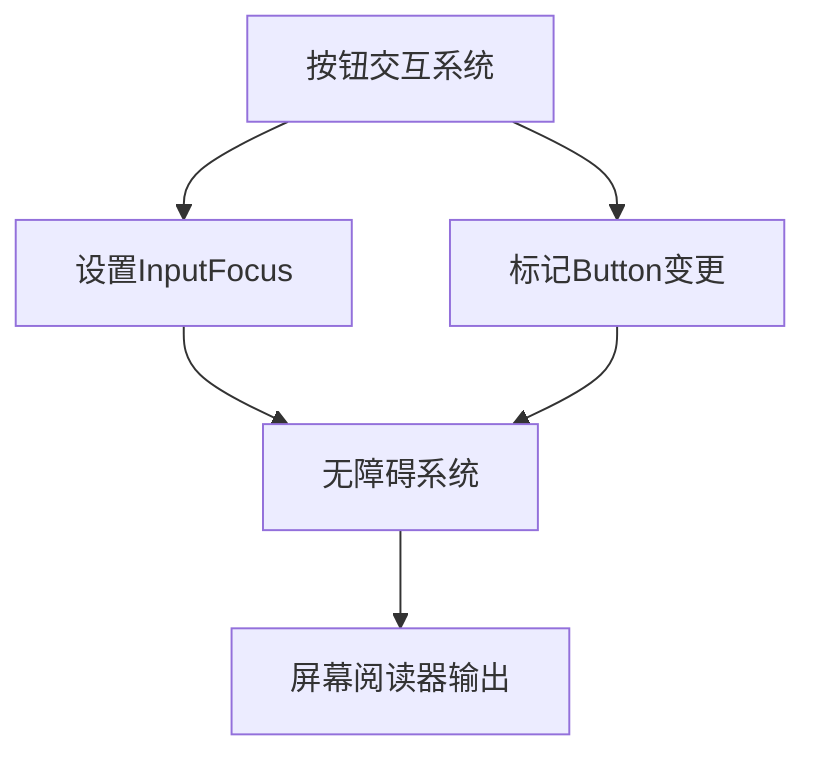

+++
title = "#18749 Enable accessibility features for the button example"
date = "2025-05-26T00:00:00"
draft = false
template = "pull_request_page.html"
in_search_index = false

[extra]
current_language = "zh-cn"
available_languages = {"en" = { name = "English", url = "/pull_request/bevy/2025-05/pr-18749-en-20250526" }, "zh-cn" = { name = "中文", url = "/pull_request/bevy/2025-05/pr-18749-zh-cn-20250526" }}
labels = ["C-Examples", "A-Accessibility", "A-UI", "D-Straightforward"]
+++

# Enable accessibility features for the button example

## Basic Information
- **Title**: Enable accessibility features for the button example
- **PR Link**: https://github.com/bevyengine/bevy/pull/18749
- **Author**: ickshonpe
- **Status**: MERGED
- **Labels**: C-Examples, A-Accessibility, A-UI, S-Ready-For-Final-Review, D-Straightforward
- **Created**: 2025-04-07T12:37:29Z
- **Merged**: 2025-05-26T15:37:49Z
- **Merged By**: alice-i-cecile

## Description Translation
### 目标

UI `button` 示例的无障碍功能无法正常工作，因为需要设置 `InputFocus` 才能让无障碍系统识别按钮。

修复 #18760

### 解决方案

* 当按钮悬停或按下时，将其实体设置为 `InputFocus`
* 当按钮状态变为悬停或按下时，调用 `Button` 组件的 `set_changed` 方法（无障碍系统仅在 `Button` 组件标记为已更改时更新按钮状态）

### 测试

安装 NVDA 屏幕阅读器，当按钮悬停时应听到"hover"，按下时应听到"pressed"

当前无障碍节点的边界报告存在问题（此 PR 不解决该问题，需后续处理）

## The Story of This Pull Request

### 问题定位
在 Bevy 的 UI 按钮示例中，无障碍功能无法正常工作。核心问题在于现有的交互系统没有与无障碍系统正确对接。具体表现为屏幕阅读器无法识别按钮的状态变化，因为缺少两个关键机制：
1. 输入焦点管理（InputFocus）未设置
2. 状态变更通知未触发

### 技术方案选择
开发者通过分析发现：
```rust
// 原始代码缺少 InputFocus 设置
fn button_system(
    mut interaction_query: Query<(&Interaction, /* ... */)>
) { /* ... */ }
```
无障碍系统需要明确知道当前聚焦的 UI 元素（通过 `InputFocus`），同时需要组件变更通知来触发状态更新。解决方案需同时解决这两个问题。

### 具体实现
1. **初始化 InputFocus 资源**
```rust
fn main() {
    App::new()
        .init_resource::<InputFocus>() // 新增资源初始化
        // ...
}
```
2. **重构按钮交互系统**
```rust
fn button_system(
    mut input_focus: ResMut<InputFocus>, // 新增焦点资源访问
    mut interaction_query: Query<(
        Entity, // 新增实体获取
        &Interaction,
        &mut Button, // 新增按钮组件访问
        // ...
    )>
) {
    for (entity, interaction, mut button, /* ... */) in &mut interaction_query {
        match *interaction {
            Interaction::Pressed => {
                input_focus.set(entity); // 设置焦点
                button.set_changed(); // 触发变更通知
                // ...
            }
            // 其他状态处理类似
        }
    }
}
```
关键修改点：
- 在系统参数中添加 `ResMut<InputFocus>` 用于焦点管理
- 查询结果增加 `Entity` 和 `&mut Button` 用于操作具体实体
- 在状态变化时同时更新焦点和标记组件变更

### 技术考量
1. **变更检测优化**  
Bevy 的 ECS 系统依赖组件变更标志来优化更新检测。手动调用 `button.set_changed()` 确保无障碍系统能及时收到状态更新，避免不必要的全量检查。

2. **焦点生命周期管理**  
在 `Interaction::None` 分支调用 `input_focus.clear()` 确保焦点状态能正确重置，防止过时的焦点信息影响其他 UI 元素。

3. **系统执行顺序**  
由于该示例使用 `Changed<Interaction>` 作为查询过滤器，可以确保只在交互状态实际变化时执行逻辑，避免每帧不必要的更新。

### 影响评估
该修改使得：
- 屏幕阅读器能正确识别按钮状态变化
- 为其他 UI 组件的无障碍支持提供参考实现
- 增加约 15 行代码，对性能影响可忽略

未解决问题（节点边界计算）需要后续单独处理，体现了良好的问题隔离意识。

## Visual Representation



## Key Files Changed

### examples/ui/button.rs (+18/-3)
**修改目的**：实现按钮示例的无障碍支持

核心变更：
```rust
// 初始化 InputFocus 资源
App::new()
    .init_resource::<InputFocus>()

// 系统参数新增 InputFocus 和 Button 访问
fn button_system(
    mut input_focus: ResMut<InputFocus>,
    mut interaction_query: Query<(
        Entity,
        &Interaction,
        &mut Button, // 新增
        /* ... */
    )>
)

// 交互处理逻辑
match *interaction {
    Interaction::Pressed => {
        input_focus.set(entity);
        button.set_changed();
        // ...
    }
    // 其他分支类似
}
```

## Further Reading

1. [Bevy Accessibility RFC](https://github.com/bevyengine/rfcs/pull/42) - 了解 Bevy 的无障碍设计规范
2. [WAI-ARIA 实践指南](https://www.w3.org/TR/wai-aria-practices/) - 无障碍交互的标准实现
3. [Bevy ECS 变更检测文档](https://docs.rs/bevy_ecs/latest/bevy_ecs/change_detection/index.html) - 理解组件变更通知机制