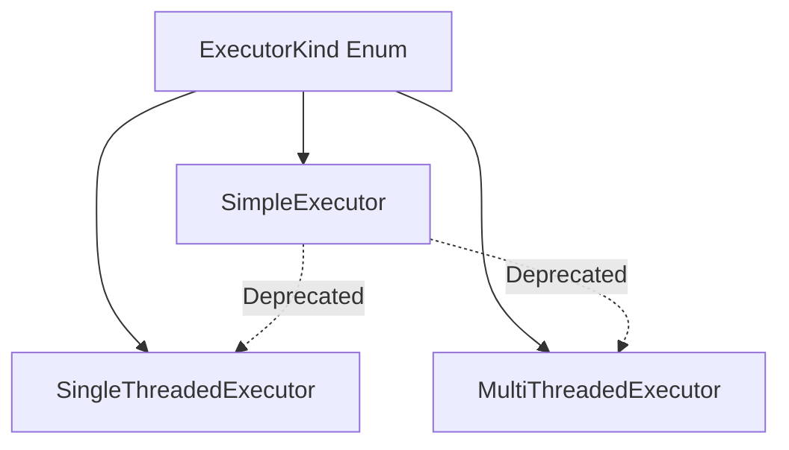

+++
title = "#18753 Deprecate `SimpleExecutor` (PR #18753)"
date = "2025-05-06T00:00:00"
draft = false
template = "pull_request_page.html"
in_search_index = true

[taxonomies]
list_display = ["show"]

[extra]
current_language = "en"
available_languages = {"en" = { name = "English", url = "/pull_request/bevy/2025-05/pr-18753-en-20250506" }, "zh-cn" = { name = "中文", url = "/pull_request/bevy/2025-05/pr-18753-zh-cn-20250506" }}
labels = ["A-ECS", "X-Contentious", "D-Straightforward"]
+++

# Title: Deprecate `SimpleExecutor` (PR #18753)

## Basic Information
- **Title**: deprecate `SimpleExecutor`
- **PR Link**: https://github.com/bevyengine/bevy/pull/18753
- **Author**: ElliottjPierce
- **Status**: MERGED
- **Labels**: A-ECS, S-Ready-For-Final-Review, M-Needs-Migration-Guide, X-Contentious, D-Straightforward
- **Created**: 2025-04-07T19:31:13Z
- **Merged**: 2025-05-06T00:40:27Z
- **Merged By**: alice-i-cecile

## Description Translation
The original PR description in English:

# Objective

Contributes to #18741 and #18453.

## Solution

Deprecate `SimpleExecutor`. If users run into migration issues, we can backtrack. Otherwise, we follow this up with  #18741 

We can't easily deprecate the module too because of [this](https://github.com/rust-lang/rust/issues/47238).

## Testing

CI

## The Story of This Pull Request

### The Problem and Context
The Bevy engine's Entity Component System (ECS) contained three executors for system scheduling:
1. `MultiThreadedExecutor` (default)
2. `SingleThreadedExecutor`
3. `SimpleExecutor`

The `SimpleExecutor` had become problematic due to:
- Suboptimal performance characteristics
- Implicit system ordering based on insertion order
- Maintenance overhead from diverging executor behaviors
- Confusing behavior for new users when compared with other executors

The core issue stemmed from `SimpleExecutor`'s immediate command application after each system, which created fragile implicit dependencies between systems. This violated Bevy's design philosophy of explicit system ordering through constraints like `.before()` and `.after()`.

### The Solution Approach
The decision was made to deprecate `SimpleExecutor` in favor of:
- `SingleThreadedExecutor` for single-threaded execution
- `MultiThreadedExecutor` for parallel execution

Key engineering considerations:
1. Maintain backward compatibility during deprecation period
2. Provide clear migration path for existing users
3. Preserve test coverage for deprecated code until removal
4. Address Rust's module deprecation limitations

### The Implementation
The deprecation was implemented through:

1. **API Deprecation Markers**
```rust
// crates/bevy_ecs/src/schedule/executor/simple.rs
#[deprecated(
    since = "0.17.0",
    note = "Use SingleThreadedExecutor instead..."
)]
pub struct SimpleExecutor { ... }
```

2. **Executor Kind Handling**
```rust
// crates/bevy_ecs/src/schedule/schedule.rs
fn make_executor(kind: ExecutorKind) -> Box<dyn SystemExecutor> {
    match kind {
        #[expect(deprecated, reason = "We still need to support this.")]
        ExecutorKind::Simple => Box::new(SimpleExecutor::new()),
        // ... other cases
    }
}
```

3. **Test Preservation**
```rust
// crates/bevy_ecs/src/schedule/mod.rs
#[test]
#[expect(deprecated, reason = "We still need to test this.")]
fn simple_executor() {
    assert_executor_supports_stepping!(ExecutorKind::Simple);
}
```

### Technical Insights
The implementation demonstrates several key patterns:
1. **Gradual Deprecation Strategy**
   - Uses Rust's `#[deprecated]` attribute
   - Maintains existing functionality during transition
   - Suppresses warnings in test code with `#[expect(deprecated)]`

2. **Migration Safety**
   - Preserves executor selection logic
   - Maintains benchmark comparisons
   - Provides detailed migration guide

3. **Performance Considerations**
   - Benchmarks kept for historical comparison
   - Encourages migration to more efficient executors

### The Impact
1. **Codebase Improvements**
   - Reduces maintenance surface for ECS scheduling
   - Eliminates confusing executor behavior
   - Encourages explicit system ordering

2. **User Impact**
   - Existing users must migrate to supported executors
   - Potential discovery of hidden system dependencies
   - Performance improvements for migrated code

3. **Lessons Learned**
   - Importance of explicit system ordering
   - Value of gradual deprecation strategies
   - Challenges in module-level deprecations in Rust

## Visual Representation



## Key Files Changed

1. **Migration Guide**
```markdown
# release-content/migration-guides/simple_executor_going_away.md
+---
+title: Deprecated Simple Executor
+pull_requests: [18753]
+---
+
+Bevy has deprecated `SimpleExecutor`... 
+When migrating, you might uncover bugs... 
+Consider upgrading to `SingleThreadedExecutor`...
```

2. **Executor Deprecation**
```rust
// crates/bevy_ecs/src/schedule/executor/simple.rs
+#![expect(deprecated, reason = "Everything here is deprecated")]
+
+#[deprecated(
+    since = "0.17.0",
+    note = "Use SingleThreadedExecutor instead..."
+)]
 pub struct SimpleExecutor { ... }
```

3. **Executor Kind Update**
```rust
// crates/bevy_ecs/src/schedule/executor/mod.rs
 pub enum ExecutorKind {
     SingleThreaded,
+    #[deprecated(
+        since = "0.17.0",
+        note = "Use SingleThreaded instead..."
+    )]
     Simple,
     #[cfg(feature = "std")]
     MultiThreaded,
```

## Further Reading
1. [Bevy ECS Scheduling Documentation](https://bevyengine.org/learn/book/ecs/schedules/)
2. [Rust Deprecation Attributes](https://doc.rust-lang.org/reference/attributes/diagnostics.html#the-deprecated-attribute)
3. [Original Issue #18453](https://github.com/bevyengine/bevy/issues/18453)
4. [System Ordering Best Practices](https://bevyengine.org/learn/book/ecs/system-order/)