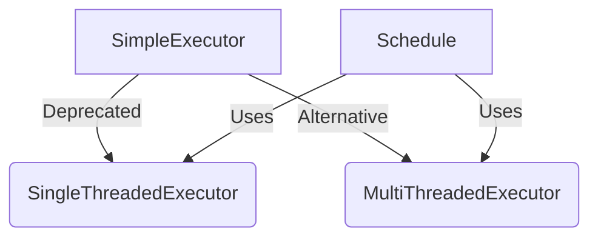

+++
title = "#18753 deprecate `SimpleExecutor`"
date = "2025-05-06T00:00:00"
draft = false
template = "pull_request_page.html"
in_search_index = false

[extra]
current_language = "zh-cn"
available_languages = {"en" = { name = "English", url = "/pull_request/bevy/2025-05/pr-18753-en-20250506" }, "zh-cn" = { name = "中文", url = "/pull_request/bevy/2025-05/pr-18753-zh-cn-20250506" }}
labels = ["A-ECS", "X-Contentious", "D-Straightforward"]
+++

# Deprecate `SimpleExecutor` 技术分析报告

## Basic Information
- **Title**: deprecate `SimpleExecutor`
- **PR Link**: https://github.com/bevyengine/bevy/pull/18753
- **Author**: ElliottjPierce
- **Status**: MERGED
- **Labels**: A-ECS, S-Ready-For-Final-Review, M-Needs-Migration-Guide, X-Contentious, D-Straightforward
- **Created**: 2025-04-07T19:31:13Z
- **Merged**: 2025-05-06T00:40:27Z
- **Merged By**: alice-i-cecile

## Description Translation
### 目标
为实现 #18741 和 #18453 做准备

### 解决方案
弃用 `SimpleExecutor`。如果用户遇到迁移问题，我们可以回退。否则我们将继续推进 #18741

由于 [Rust 语言限制](https://github.com/rust-lang/rust/issues/47238)，无法直接弃用整个模块

### 测试
持续集成测试

## The Story of This Pull Request

### 问题背景
Bevy 引擎的 ECS 模块维护着三个系统执行器（System Executor）实现：
- `SimpleExecutor`（简单执行器）
- `SingleThreadedExecutor`（单线程执行器） 
- `MultiThreadedExecutor`（多线程执行器）

其中 `SimpleExecutor` 的特殊性在于它会在每个系统运行后立即应用延迟命令（apply_deferred），这与其它执行器的行为模式存在根本差异。这种差异导致：
1. 系统执行顺序的隐式依赖（依赖添加到 Schedule 的顺序）
2. 与其它执行器行为不一致带来的维护成本
3. 用户容易混淆不同执行器的行为特性

### 解决方案选择
开发团队经过讨论决定：
1. 将 `SimpleExecutor` 标记为 deprecated
2. 推荐用户迁移到 `SingleThreadedExecutor`
3. 保留代码实现但添加弃用警告
4. 提供详细的迁移指南

这个折中方案考虑到：
- 立即移除会破坏现有用户代码
- 通过渐进式弃用降低迁移成本
- 保留测试用例确保兼容性

### 具体实现细节
整个改动遵循 Rust 的弃用模式：
1. 在类型声明处添加 `#[deprecated]` 属性
```rust
// crates/bevy_ecs/src/schedule/executor/simple.rs
#[deprecated(
    since = "0.17.0",
    note = "Use SingleThreadedExecutor instead..."
)]
pub struct SimpleExecutor {
    // ...
}
```

2. 在枚举值处标记弃用
```rust
// crates/bevy_ecs/src/schedule/executor/mod.rs
pub enum ExecutorKind {
    #[deprecated(since = "0.17.0", note = "...")]
    Simple,
}
```

3. 使用 `#[expect]` 处理测试代码的警告
```rust
// benches/benches/bevy_ecs/scheduling/schedule.rs
#[expect(deprecated, reason = "We still need to test/bench this.")]
schedule.set_executor_kind(bevy_ecs::schedule::ExecutorKind::Simple);
```

### 技术洞察
1. **兼容性处理**：
   - 保持旧版执行器的完整功能
   - 在测试和基准代码中使用 `expect` 抑制警告
   - 允许用户逐步迁移而非强制升级

2. **迁移策略**：
   - 创建专门的迁移指南文档
   - 建议使用 `chain` 显式声明系统顺序
   - 推荐优先使用 `SingleThreadedExecutor`

3. **架构影响**：
   - 统一执行器行为模式
   - 减少隐式执行顺序带来的调试成本
   - 为后续执行器优化铺平道路

## Visual Representation



## Key Files Changed

### 1. `release-content/migration-guides/simple_executor_going_away.md` (+25/-0)
新增迁移指南文档，包含：
- 弃用原因说明
- 新旧执行器行为对比
- 具体迁移步骤示例
- 常见问题处理建议

### 2. `crates/bevy_ecs/src/schedule/executor/simple.rs` (+10/-1)
```rust
// Before:
pub struct SimpleExecutor { /* ... */ }

// After:
#[deprecated(since = "0.17.0", note = "...")]
pub struct SimpleExecutor { /* ... */ }

// 新增模块级弃用警告
#![expect(deprecated, reason = "Everything here is deprecated")]
```

### 3. `crates/bevy_ecs/src/schedule/executor/mod.rs` (+7/-0)
```rust
// 在枚举定义处添加弃用标记
#[deprecated(
    since = "0.17.0",
    note = "Use SingleThreaded instead..."
)]
ExecutorKind::Simple,
```

### 4. `benches/benches/bevy_ecs/scheduling/schedule.rs` (+1/-0)
```rust
// 在基准测试中抑制警告
#[expect(deprecated, reason = "We still need to test/bench this.")]
```

### 5. `crates/bevy_ecs/src/schedule/mod.rs` (+1/-0)
```rust
// 测试代码中标记预期弃用
#[expect(deprecated, reason = "We still need to test this.")]
```

## Further Reading
1. [Bevy ECS 执行器设计文档](https://bevyengine.org/learn/book/ecs/schedules/)
2. [Rust 属性宏使用指南](https://doc.rust-lang.org/reference/attributes.html)
3. [系统排序最佳实践](https://bevy-cheatbook.github.io/programming/system-order.html)