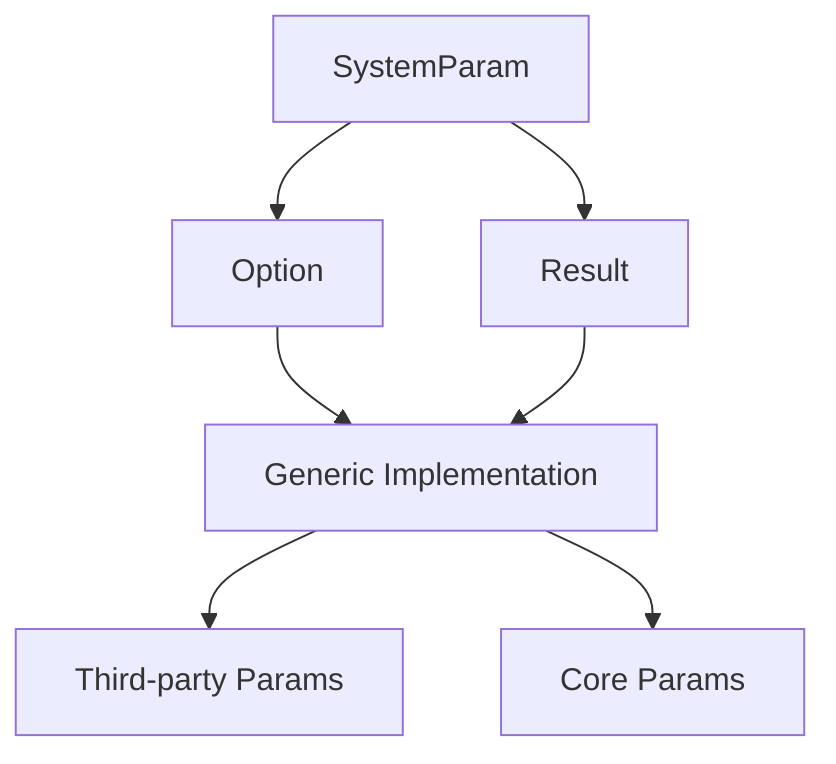

+++
title = "#18766 Generic `SystemParam` impls for `Option` and `Result`"
date = "2025-05-07T00:00:00"
draft = false
template = "pull_request_page.html"
in_search_index = true

[taxonomies]
list_display = ["show"]

[extra]
current_language = "en"
available_languages = {"en" = { name = "English", url = "/pull_request/bevy/2025-05/pr-18766-en-20250507" }, "zh-cn" = { name = "中文", url = "/pull_request/bevy/2025-05/pr-18766-zh-cn-20250507" }}
labels = ["C-Feature", "A-ECS"]
+++

# Generic `SystemParam` impls for `Option` and `Result`

## Basic Information
- **Title**: Generic `SystemParam` impls for `Option` and `Result`
- **PR Link**: https://github.com/bevyengine/bevy/pull/18766
- **Author**: chescock
- **Status**: MERGED
- **Labels**: C-Feature, A-ECS, S-Ready-For-Final-Review, M-Needs-Migration-Guide
- **Created**: 2025-04-08T18:12:35Z
- **Merged**: 2025-05-07T18:39:46Z
- **Merged By**: alice-i-cecile

## Description Translation

# Objective

Provide a generic `impl SystemParam for Option<P>` that uses system parameter validation.  This immediately gives useful impls for params like `EventReader` and `GizmosState` that are defined in terms of `Res`.  It also allows third-party system parameters to be usable with `Option`, which was previously impossible due to orphan rules.  

Note that this is a behavior change for `Option<Single>`.  It currently fails validation if there are multiple matching entities, but with this change it will pass validation and produce `None`.  

Also provide an impl for `Result<P, SystemParamValidationError>`.  This allows systems to inspect the error if necessary, either for bubbling it up or for checking the `skipped` flag.  

Fixes #12634
Fixes #14949
Related to #18516

## Solution

Add generic `SystemParam` impls for `Option` and `Result`, and remove the impls for specific types.  

Update documentation and `fallible_params` example with the new semantics for `Option<Single>`.  

## The Story of This Pull Request

### The Problem and Context
The Bevy ECS system parameters faced two key limitations:
1. Existing `Option` implementations were type-specific (e.g., `Option<Res<T>>`), requiring duplicate code and preventing third-party parameters from working with `Option`
2. `Option<Single>` exhibited inconsistent behavior by failing validation for multiple entities instead of returning `None`

These limitations violated the DRY principle and restricted extensibility. The orphan rule prevented external crates from implementing `SystemParam` for `Option` of their custom parameters.

### The Solution Approach
The core insight was to create generic implementations for `Option<P>` and `Result<P, SystemParamValidationError>` that delegate to the underlying `P`'s validation logic. This approach:

1. Eliminates redundant implementations
2. Enables automatic support for any existing/future `SystemParam`
3. Provides consistent error handling through Rust's standard types

Key engineering decisions included:
- Leveraging `SystemParam` validation in wrapper types
- Preserving existing safety guarantees through trait bounds
- Maintaining backward compatibility where possible

### The Implementation
The primary changes occurred in `system_param.rs` with new blanket implementations:

```rust
// Generic Option implementation
unsafe impl<T: SystemParam> SystemParam for Option<T> {
    type State = T::State;

    unsafe fn get_param<'world, 'state>(
        state: &'state mut Self::State,
        system_meta: &SystemMeta,
        world: UnsafeWorldCell<'world>,
        change_tick: Tick,
    ) -> Self::Item<'world, 'state> {
        T::validate_param(state, system_meta, world)
            .ok()
            .map(|()| T::get_param(state, system_meta, world, change_tick))
    }
}

// Generic Result implementation
unsafe impl<T: SystemParam> SystemParam for Result<T, SystemParamValidationError> {
    type State = T::State;

    unsafe fn get_param<'world, 'state>(
        state: &'state mut Self::State,
        system_meta: &SystemMeta,
        world: UnsafeWorldCell<'world>,
        change_tick: Tick,
    ) -> Self::Item<'world, 'state> {
        T::validate_param(state, system_meta, world)
            .map(|()| T::get_param(state, system_meta, world, change_tick))
    }
}
```

These implementations delegate validation to the underlying parameter while handling the wrapper type semantics. The PR removed ~197 lines of type-specific `Option` implementations while adding 85 lines of generic code.

### Technical Insights
Key technical aspects include:

1. **Validation Delegation**: The wrapper types use `T::validate_param` to determine validity before accessing the parameter
2. **State Management**: Both wrappers reuse the underlying parameter's state type
3. **Safety Preservation**: The `unsafe impl` blocks maintain safety through trait bounds that ensure proper world access
4. **Error Propagation**: `Result` captures validation errors for explicit error handling

A notable behavior change affects `Option<Single<D, F>>`:
```rust
// Before: Panicked on multiple entities
// After: Returns None for 0 or multiple entities
fn system(query: Option<Single<&Transform>>) {
    if let Some(transform) = query {
        // Exactly one entity
    } else {
        // 0 or multiple entities
    }
}
```

### The Impact
These changes provide:
1. **Extended Functionality**: Third-party parameters now work with `Option`/`Result`
2. **Consistent Semantics**: Uniform error handling across parameter types
3. **Code Maintainability**: Reduced duplication and easier future extensions

The migration guide addresses breaking changes for `Option<Single>` users, demonstrating how to handle multiple entities explicitly.

## Visual Representation



## Key Files Changed

1. `crates/bevy_ecs/src/system/system_param.rs` (+85/-197)
```rust
// Before: Multiple type-specific Option impls
unsafe impl<'a, T: Resource> SystemParam for Option<Res<'a, T>> { /* ... */ }

// After: Single generic impl
unsafe impl<T: SystemParam> SystemParam for Option<T> {
    // Delegates to T's implementation
    unsafe fn get_param(...) -> Option<T::Item> {
        T::validate_param(...).ok().map(...)
    }
}
```

2. `examples/ecs/fallible_params.rs` (+3/-4)
```rust
// Updated example comments
// Before: "system will not run" for multiple entities
// After: "will be None" for multiple entities
fn track_targets(
    enemy: Option<Single<...>>, // Now None for multiple enemies
    // ...
)
```

3. `release-content/migration-guides/generic-option-parameter.md` (+28/-0)
```markdown
// New migration guidance
- 0.16: Option<Single<&Player>>
- 0.17: Query<&Player> with manual handling
```

## Further Reading
1. [Rust Orphan Rules](https://doc.rust-lang.org/book/ch10-02-traits.html#implementing-a-trait-on-a-type)
2. [Bevy SystemParam Documentation](https://docs.rs/bevy-ecs/latest/bevy_ecs/system/trait.SystemParam.html)
3. [Type-Driven API Design](https://rust-lang.github.io/api-guidelines/type-safety.html)