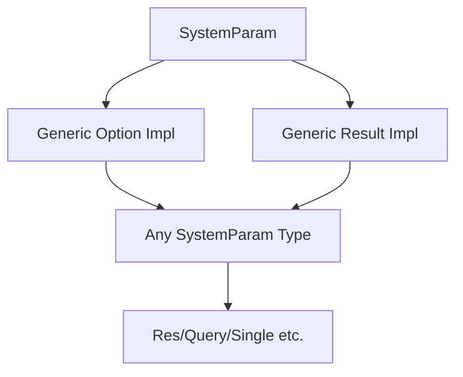

+++
title = "#18766 Generic `SystemParam` impls for `Option` and `Result`"
date = "2025-05-07T00:00:00"
draft = false
template = "pull_request_page.html"
in_search_index = false

[extra]
current_language = "zh-cn"
available_languages = {"en" = { name = "English", url = "/pull_request/bevy/2025-05/pr-18766-en-20250507" }, "zh-cn" = { name = "中文", url = "/pull_request/bevy/2025-05/pr-18766-zh-cn-20250507" }}
labels = ["C-Feature", "A-ECS"]
+++

# Generic `SystemParam` impls for `Option` and `Result`

## Basic Information
- **Title**: Generic `SystemParam` impls for `Option` and `Result`
- **PR Link**: https://github.com/bevyengine/bevy/pull/18766
- **Author**: chescock
- **Status**: MERGED
- **Labels**: C-Feature, A-ECS, S-Ready-For-Final-Review, M-Needs-Migration-Guide
- **Created**: 2025-04-08T18:12:35Z
- **Merged**: 2025-05-07T18:39:46Z
- **Merged By**: alice-i-cecile

## Description Translation
目标

提供通用的`impl SystemParam for Option<P>`实现，利用系统参数验证机制。该改动使得基于`Res`定义的参数（如`EventReader`和`GizmosState`）可以立即获得可用实现，同时允许第三方系统参数与`Option`配合使用（之前由于孤儿规则无法实现）。

注意：这是对`Option<Single>`行为的变更。当前实现中当存在多个匹配实体时会验证失败，而本次改动后它将通过验证并返回`None`。

同时提供`Result<P, SystemParamValidationError>`的实现，允许系统在必要时检查错误（用于向上传递或检查`skipped`标志）。

解决方案

添加`Option`和`Result`的通用`SystemParam`实现，并移除针对特定类型的实现。更新文档和`fallible_params`示例以反映`Option<Single>`的新语义。

## The Story of This Pull Request

### 问题背景与动机
Bevy引擎的ECS系统中，`SystemParam` trait用于定义系统函数的参数类型（如`Query`、`Res`等）。原有实现中，`Option`包装器（wrapper）类型（如`Option<Single>`、`Option<Res<T>>`）需要为每个具体类型单独实现`SystemParam`。这导致两个主要问题：

1. **代码重复**：每个系统参数类型都需要重复实现`Option`版本的逻辑
2. **扩展性限制**：第三方库无法为其自定义参数类型实现`Option`版本（受孤儿规则限制）

此外，`Option<Single>`原有行为存在不一致性：当查询到多个实体时会导致系统跳过执行，而非返回`None`。

### 解决方案设计
核心思路是通过泛型实现覆盖所有`SystemParam`类型：
```rust
// 通用Option实现
unsafe impl<T: SystemParam> SystemParam for Option<T> {
    type State = T::State;
    
    unsafe fn get_param(...) -> Option<T::Item> {
        T::validate_param(...).ok().map(|()| T::get_param(...))
    }
}

// 通用Result实现 
unsafe impl<T: SystemParam> SystemParam for Result<T, SystemParamValidationError> {
    type State = T::State;
    
    unsafe fn get_param(...) -> Result<T::Item, SystemParamValidationError> {
        T::validate_param(...).map(|()| T::get_param(...))
    }
}
```
这两个实现通过委托模式，复用底层参数的初始化、验证和获取逻辑，实现以下关键改进：

1. **统一验证流程**：通过`validate_param`方法集中处理参数有效性检查
2. **行为一致性**：`Option`返回`None`表示参数无效，`Result`携带具体错误信息
3. **扩展性**：任何实现`SystemParam`的类型自动获得`Option`和`Result`支持

### 实现细节与关键技术点
1. **参数验证重构**：
   - 移除原有`Option<Single>`等特定实现
   - 在通用实现中调用`validate_param`进行前置验证
   ```rust
   // 验证逻辑示例
   T::validate_param(state, system_meta, world)
       .ok()
       .map(|()| T::get_param(...))
   ```

2. **构建器模式扩展**：
   ```rust
   // Option构建器
   pub struct OptionBuilder<T>(T);
   
   unsafe impl<P: SystemParam, B: SystemParamBuilder<P>> SystemParamBuilder<Option<P>> 
       for OptionBuilder<B> { /* 复用底层构建器逻辑 */ }
   ```

3. **行为变更处理**：
   - `Option<Single>`现在在查询到多个实体时返回`None`而非跳过系统
   - 更新示例展示新行为：
   ```diff
   - // Option<Single>确保系统仅在0或1个实体时执行
   + // Option<Single>不阻止系统执行，查询多个实体时返回None
   ```

### 影响与迁移指南
主要行为变更：
- `Option<Single>`在多个匹配实体时返回`None`（原跳过系统）
- 新增`Result`参数类型支持错误处理

迁移策略：
```rust
// 旧方案（0.16）
fn system(param: Option<Single<...>>) { ... }

// 新方案（0.17）
fn system(query: Query<...>) {
    let result = query.single();
    if let Err(QuerySingleError::MultipleEntities(_)) = result {
        return;
    }
    let param = result.ok();
}
```

## Visual Representation



## Key Files Changed

### `crates/bevy_ecs/src/system/system_param.rs` (+85/-197)
1. **核心改动**：
   - 删除所有具体类型的`Option`实现（如`Option<Single>`、`Option<Res<T>>`）
   - 新增泛型实现：
   ```rust
   unsafe impl<T: SystemParam> SystemParam for Option<T> {
       // 复用底层参数的State和方法
       unsafe fn get_param(...) -> Option<T::Item> {
           T::validate_param(...).ok().map(|()| T::get_param(...))
       }
   }
   ```

2. **验证逻辑调整**：
   ```diff
   - // 旧版Single的Option实现中直接panic
   + // 新版通过validate_param控制返回None
   ```

### `crates/bevy_ecs/src/system/builder.rs` (+32/-1)
1. **构建器扩展**：
   ```rust
   pub struct OptionBuilder<T>(T);
   
   unsafe impl<P, B> SystemParamBuilder<Option<P>> for OptionBuilder<B> {
       fn build(...) { self.0.build(...) } // 委托底层构建器
   }
   ```

### `examples/ecs/fallible_params.rs` (+3/-4)
1. **示例更新**：
   ```diff
   - // 原注释：Option<Single>确保系统仅在0或1个实体时执行
   + // 新注释：Option<Single>不阻止系统执行，返回None表示无效
   ```

### `release-content/migration-guides/generic-option-parameter.md` (+28/-0)
1. **迁移指南**：
   ```markdown
   ## 行为变更说明
   - `Option<Single>`现在在多个实体时返回None
   - 需要手动处理多个实体情况的系统需改用Query
   ```

## Further Reading
1. [Bevy ECS SystemParam文档](https://bevyengine.org/learn/book/ecs/system-params/)
2. [Rust孤儿规则与特质实现](https://doc.rust-lang.org/book/ch10-02-traits.html#implementing-a-trait-on-a-type)
3. [泛型编程模式](https://practice.rs/generics-traits/generics.html)