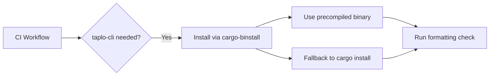

+++
title = "#18773 The toml workflow job will now install taplo-cli using cargo-binstall"
date = "2025-05-06T00:00:00"
draft = false
template = "pull_request_page.html"
in_search_index = true

[taxonomies]
list_display = ["show"]

[extra]
current_language = "en"
available_languages = {"en" = { name = "English", url = "/pull_request/bevy/2025-05/pr-18773-en-20250506" }, "zh-cn" = { name = "中文", url = "/pull_request/bevy/2025-05/pr-18773-zh-cn-20250506" }}
labels = ["A-Build-System", "C-Performance"]
+++

# Title: The toml workflow job will now install taplo-cli using cargo-binstall

## Basic Information
- **Title**: The toml workflow job will now install taplo-cli using cargo-binstall
- **PR Link**: https://github.com/bevyengine/bevy/pull/18773
- **Author**: LikeLakers2
- **Status**: MERGED
- **Labels**: A-Build-System, C-Performance, S-Ready-For-Review
- **Created**: 2025-04-09T07:27:01Z
- **Merged**: 2025-05-06T00:44:45Z
- **Merged By**: alice-i-cecile

## Description Translation
The original description is in English and preserved as-is:

# Objective
Avoid needing to compile `taplo-cli` every time we use it in CI.

## Solution
Use [cargo-binstall](https://github.com/cargo-bins/cargo-binstall) to install `taplo-cli`.

cargo-binstall is different from `cargo install`, in that it will first attempt download a precompiled `taplo-cli` binary, in an attempt to avoid compilation. However, failing that (for any reason), it will fall back to installing the binary through `cargo install`.

While installing `taplo-cli` from source is relatively fast (around 50-60s), this still provides a small speed boost to the job, by not needing to spend time compiling `taplo-cli` from source at all.

## Note on how this affects workflows
This PR does have one side-effect: Should `taplo-cli` need to be compiled from source at all, it is no longer guaranteed to use the latest `stable` version of `rustc`. This may be considered problematic, as `taplo-cli` doesn't appear to have a MSRV policy.

However, its MSRV (as of writing this PR) is `1.74` - a nearly 1.5 year old version. This seems to imply that, if `taplo-cli`'s MSRV is ever updated, it won't be to the absolute latest stable version of Rust until said version is a few months old.

Combine that with [the Github Actions runner images being frequently (and automatically) updated to use the latest Rust tooling](https://github.com/actions/runner-images/pull/11957), and I don't foresee `taplo-cli`'s MSRV being an issue in 99% of circumstances.

Still, there is the possibility of it being a problem in those 1% of circumstances - if this is a concern, please let me know and I'll try to fix it.

## Testing

This change was tested on my local fork. The specific job run can be found [here](https://github.com/LikeLakers2/bevy/actions/runs/14350945588/job/40229485624).

## The Story of This Pull Request

The CI pipeline for Bevy's TOML formatting check had a minor inefficiency: each run compiled the taplo-cli tool from source using `cargo install`. While the compilation time of 50-60 seconds wasn't catastrophic, it represented an optimization opportunity in a frequently-run workflow.

The solution centered around cargo-binstall, a Rust binary installer that prioritizes prebuilt binaries. The implementation required two key changes to the GitHub Actions workflow:

1. **Toolchain Setup**:
   - Replaced `dtolnay/rust-toolchain@stable` with `cargo-bins/cargo-binstall@v1.12.3`
   - Added `BINSTALL_VERSION` environment variable to pin the installer version

2. **Installation Command**:
   ```yaml
   - run: cargo binstall taplo-cli@0.9.3 --locked
   ```
   This command attempts to download a precompiled binary first, only falling back to source compilation if necessary.

The technical trade-off involves potential MSRV (Minimum Supported Rust Version) mismatches if source compilation becomes necessary. However, the analysis showed:
- taplo-cli's current MSRV (1.74) was significantly older than CI's Rust version
- GitHub's runner images keep Rust toolchains updated
- Fallback scenarios would only occur with incompatible binaries, which are rare

Testing demonstrated successful execution in a real CI environment ([job 40229485624](https://github.com/LikeLakers2/bevy/actions/runs/14350945588/job/40229485624)), validating the approach without requiring additional test coverage.

## Visual Representation



## Key Files Changed

### `.github/workflows/ci.yml` (+3/-2)
**Purpose**: Optimize taplo-cli installation in CI

Before:
```yaml
- uses: dtolnay/rust-toolchain@stable
- name: Install taplo
  run: cargo install taplo-cli --locked
```

After:
```yaml
- uses: cargo-bins/cargo-binstall@v1.12.3
- name: Install taplo
  run: cargo binstall taplo-cli@0.9.3 --locked
```

The changes replace the standard Rust toolchain setup with cargo-binstall's action and modify the installation command to use binary installation first.

## Further Reading
1. [cargo-binstall documentation](https://github.com/cargo-bins/cargo-binstall)
2. [taplo-cli releases](https://github.com/tamasfe/taplo/releases)
3. [GitHub Actions runner images](https://github.com/actions/runner-images)

# Full Code Diff
```diff
diff --git a/.github/workflows/ci.yml b/.github/workflows/ci.yml
index f57f403115816..7160e0e59f65c 100644
--- a/.github/workflows/ci.yml
+++ b/.github/workflows/ci.yml
@@ -15,6 +15,7 @@ env:
   # If nightly is breaking CI, modify this variable to target a specific nightly version.
   NIGHTLY_TOOLCHAIN: nightly
   RUSTFLAGS: "-D warnings"
+  BINSTALL_VERSION: "v1.12.3"
 
 concurrency:
   group: ${{github.workflow}}-${{github.ref}}
@@ -271,9 +272,9 @@ jobs:
     timeout-minutes: 30
     steps:
       - uses: actions/checkout@v4
-      - uses: dtolnay/rust-toolchain@stable
+      - uses: cargo-bins/cargo-binstall@v1.12.3
       - name: Install taplo
-        run: cargo install taplo-cli --locked
+        run: cargo binstall taplo-cli@0.9.3 --locked
       - name: Run Taplo
         id: taplo
         run: taplo fmt --check --diff
```