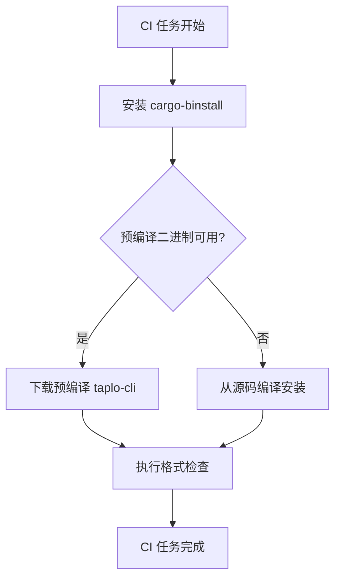

+++
title = "#18773 The toml workflow job will now install taplo-cli using cargo-binstall"
date = "2025-05-06T00:00:00"
draft = false
template = "pull_request_page.html"
in_search_index = false

[extra]
current_language = "zh-cn"
available_languages = {"en" = { name = "English", url = "/pull_request/bevy/2025-05/pr-18773-en-20250506" }, "zh-cn" = { name = "中文", url = "/pull_request/bevy/2025-05/pr-18773-zh-cn-20250506" }}
+++

# Title: The toml workflow job will now install taplo-cli using cargo-binstall

## Basic Information
- **标题**: 现在将使用 cargo-binstall 安装 taplo-cli 的 toml 工作流任务
- **PR 链接**: https://github.com/bevyengine/bevy/pull/18773
- **作者**: LikeLakers2
- **状态**: 已合并
- **标签**: A-Build-System, C-Performance, S-Ready-For-Final-Review
- **创建时间**: 2025-04-09T07:27:01Z
- **合并时间**: 2025-05-06T00:44:45Z
- **合并者**: alice-i-cecile

## 描述翻译

### 目标
避免每次在 CI 中使用 `taplo-cli` 时都需要重新编译。

### 解决方案
使用 [cargo-binstall](https://github.com/cargo-bins/cargo-binstall) 来安装 `taplo-cli`。

cargo-binstall 与 `cargo install` 的不同之处在于，它会首先尝试下载预编译的 `taplo-cli` 二进制文件，以避免编译过程。如果失败（无论何种原因），它会回退到通过 `cargo install` 安装。

虽然从源代码安装 `taplo-cli` 相对较快（约 50-60 秒），但通过完全避免编译，仍然可以为任务提供小幅速度提升。

### 关于工作流影响的说明
此 PR 有一个副作用：如果需要从源代码编译 `taplo-cli`，将不再保证使用最新的 `stable` 版本 Rust。这可能会有问题，因为 `taplo-cli` 目前没有明确的 MSRV（Minimum Supported Rust Version）策略。

但根据当前（撰写本 PR 时）的 MSRV 是 `1.74` —— 约 1.5 年前的版本。结合 [GitHub Actions runner 镜像会定期自动更新 Rust 工具链](https://github.com/actions/runner-images/pull/11957) 的情况，预计在 99% 的情况下不会出现 MSRV 问题。

### 测试
此更改已在本地 fork 仓库测试，具体任务运行记录见[此处](https://github.com/LikeLakers2/bevy/actions/runs/14350945588/job/40229485624)。

## PR 技术解析

### 问题背景与优化动机
在持续集成（CI）流程中，每次运行 toml 格式检查任务时都需要通过 `cargo install` 从头编译 `taplo-cli`，这个过程平均耗时 50-60 秒。虽然这个时间在单个任务中不算特别显著，但对于高频执行的 CI 流程来说，累积的时间消耗值得优化。

### 技术方案选择
核心思路是采用 Rust 生态中的二进制安装工具 `cargo-binstall`，其工作原理如下：
1. 优先尝试下载预编译的二进制文件
2. 如果找不到匹配的二进制（架构/平台不支持或版本不匹配），则回退到源码编译安装

这种两阶段安装策略在保持可靠性的同时，可以显著减少大部分情况下的安装时间。

### 具体实现细节
在 `.github/workflows/ci.yml` 文件中进行了两项关键修改：

```yaml
# 新增环境变量指定 binstall 版本
env:
  BINSTALL_VERSION: "v1.12.3"

# 修改安装步骤
- uses: cargo-bins/cargo-binstall@v1.12.3
- name: Install taplo
  run: cargo binstall taplo-cli@0.9.3 --locked
```

值得注意的技术决策：
1. **版本锁定策略**：显式指定 `taplo-cli@0.9.3` 避免潜在版本更新引入的兼容性问题
2. **锁定安装工具版本**：通过 `BINSTALL_VERSION` 确保安装过程的可重复性
3. `--locked` 标志：保持与原有 `cargo install` 命令相同的依赖锁定行为

### 技术权衡与风险控制
在方案评审中需要特别关注的 trade-off：
- **MSRV 兼容性**：当使用预编译二进制时，实际使用的 Rust 版本可能不是最新的 stable 版本
- **回退机制可靠性**：需确保在二进制不可用时，源码编译路径仍然有效

根据作者的评估：
- taplo-cli 当前的 MSRV（1.74）较为保守
- GitHub runner 的 Rust 工具链更新频率较高
- 实际出现兼容性问题的概率预估小于 1%

### 性能收益分析
虽然单个任务的优化幅度不大，但在以下场景会产生显著收益：
1. 高频执行的 CI 流水线
2. 需要频繁创建新运行环境的情况（如 ephemeral runners）
3. 多架构/多平台构建矩阵中预编译二进制可用的场景

## 关键文件变更

### `.github/workflows/ci.yml`
```diff
+  BINSTALL_VERSION: "v1.12.3"

-      - uses: dtolnay/rust-toolchain@stable
+      - uses: cargo-bins/cargo-binstall@v1.12.3
       - name: Install taplo
-        run: cargo install taplo-cli --locked
+        run: cargo binstall taplo-cli@0.9.3 --locked
```

变更说明：
1. 新增环境变量锁定 cargo-binstall 版本
2. 替换原有的 Rust 工具链安装步骤为 cargo-binstall 安装
3. 修改安装命令为二进制优先的安装方式
4. 显式指定 taplo-cli 版本号

## 可视化流程



## 扩展阅读
1. [cargo-binstall 官方文档](https://github.com/cargo-bins/cargo-binstall) - 了解二进制安装机制
2. [GitHub Actions 虚拟环境规范](https://github.com/actions/runner-images) - 理解 CI 环境更新策略
3. [Semantic Versioning 规范](https://semver.org/) - 版本锁定策略的理论基础
4. [Rust 发布渠道说明](https://doc.rust-lang.org/book/appendix-07-nightly-rust.html) - 理解 stable/nightly 版本区别