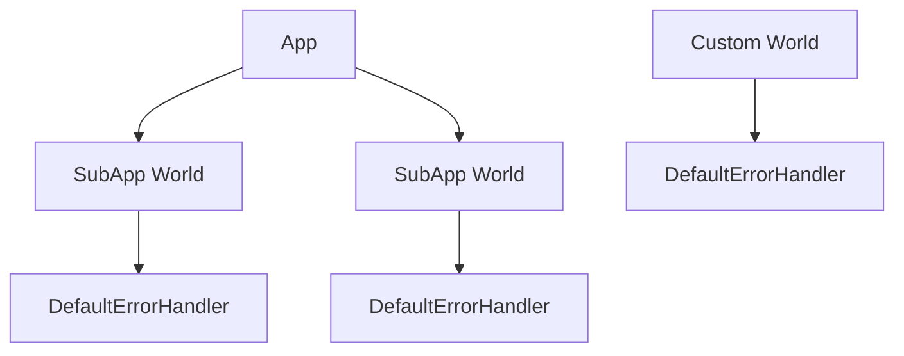

+++
title = "#18810 Per world error handler"
date = "2025-05-19T00:00:00"
draft = false
template = "pull_request_page.html"
in_search_index = true

[taxonomies]
list_display = ["show"]

[extra]
current_language = "en"
available_languages = {"en" = { name = "English", url = "/pull_request/bevy/2025-05/pr-18810-en-20250519" }, "zh-cn" = { name = "中文", url = "/pull_request/bevy/2025-05/pr-18810-zh-cn-20250519" }}
labels = ["A-ECS"]
+++

# Per world error handler

## Basic Information
- **Title**: Per world error handler
- **PR Link**: https://github.com/bevyengine/bevy/pull/18810
- **Author**: SpecificProtagonist
- **Status**: MERGED
- **Labels**: A-ECS, S-Ready-For-Final-Review, M-Needs-Migration-Guide
- **Created**: 2025-04-11T16:36:41Z
- **Merged**: 2025-05-19T01:52:56Z
- **Merged By**: alice-i-cecile

## Description Translation

# Objective

[see original comment](https://github.com/bevyengine/bevy/pull/18801#issuecomment-2796981745)
> Alternately, could we store it on the World instead of a global? I think we have a World nearby whenever we call default_error_handler(). That would avoid the need for atomics or locks, since we could do ordinary reads and writes to the World.

Global error handlers don't actually need to be global – per world is enough. This allows using different handlers for different worlds and also removes the restrictions on changing the handler only once.

## Solution

Each `World` can now store its own error handler in a resource.

For convenience, you can also set the default error handler for an `App`, which applies it to the worlds of all `SubApp`s. The old behavior of only being able to set the error handler once is kept for apps.

We also don't need the `configurable_error_handler` feature anymore now.

## Testing

New/adjusted tests for failing schedule systems & observers.

---

## Showcase

```rust
App::new()
    .set_error_handler(info)
    …
```

## The Story of This Pull Request

### The Problem and Context
Bevy's error handling system previously used a global error handler stored in a static `OnceLock`. This approach had several limitations:
1. Global state prevented using different handlers for different worlds
2. The handler could only be configured once at startup
3. Required atomic operations even when not needed
4. Feature-gated behind `configurable_error_handler`

These constraints became problematic for advanced use cases like:
- Applications with multiple isolated worlds
- Dynamic error handling strategies
- Plugin systems needing custom error handling

### The Solution Approach
The core insight was to leverage Bevy's ECS architecture by storing error handlers as world resources. This approach:
- Eliminates global state
- Enables per-world customization
- Removes synchronization overhead
- Simplifies feature configuration

Key engineering decisions:
1. Introduce `DefaultErrorHandler` resource wrapping an `ErrorHandler` function
2. Store handler in each World rather than global static
3. Maintain app-level default through `App::set_error_handler`
4. Remove `configurable_error_handler` feature flag

### The Implementation
The solution required changes across multiple subsystems:

**Error Handler Storage**
```rust
// Before: Global static
static GLOBAL_ERROR_HANDLER: OnceLock<fn(BevyError, ErrorContext)>;

// After: World resource
#[derive(Resource)]
struct DefaultErrorHandler(pub ErrorHandler);
```

**App Integration**
```rust
impl App {
    pub fn set_error_handler(&mut self, handler: ErrorHandler) {
        self.default_error_handler = Some(handler);
        for sub_app in self.sub_apps.iter_mut() {
            sub_app.world_mut()
                .insert_resource(DefaultErrorHandler(handler));
        }
    }
}
```

**Command Handling**
```rust
impl<C> HandleError for C {
    fn handle_error(self) -> impl Command {
        move |world: &mut World| {
            let handler = world.default_error_handler();
            // Handle error using world-specific handler
        }
    }
}
```

**Observer Initialization**
```rust
fn hook_on_add(world: &mut World) {
    let default_handler = world.default_error_handler();
    world.commands().queue(|world: &mut World| {
        if observe.error_handler.is_none() {
            observe.error_handler = Some(default_handler);
        }
    });
}
```

### Technical Insights
1. **Resource-Based Configuration**: Leveraging Bevy's resource system provides natural scoping and inheritance
2. **Backwards Compatibility**: Maintained app-level single configuration through `App::set_error_handler`
3. **Performance**: Eliminated atomic operations for handler access
4. **Flexibility**: Allows dynamic handler changes per-world while schedule is running

### The Impact
- Removed 50+ lines of global state management
- Enabled true multi-world error handling scenarios
- Simplified error handling configuration
- Removed feature flag complexity
- Improved thread safety through reduced atomic usage

## Visual Representation



## Key Files Changed

1. `crates/bevy_ecs/src/error/handler.rs` (+21/-50)
   - Removed global handler infrastructure
   - Added `DefaultErrorHandler` resource
   ```rust
   #[derive(Resource, Default)]
   pub struct DefaultErrorHandler(pub ErrorHandler);
   ```

2. `crates/bevy_app/src/app.rs` (+52/-1)
   - Added app-level error handler propagation
   ```rust
   pub fn insert_sub_app(&mut self, label: impl AppLabel, mut sub_app: SubApp) {
       if let Some(handler) = self.default_error_handler {
           sub_app.world_mut().insert_resource(DefaultErrorHandler(handler));
       }
   }
   ```

3. `crates/bevy_ecs/src/observer/runner.rs` (+29/-14)
   - Updated observer initialization to use world handler
   ```rust
   let default_handler = world.default_error_handler();
   observe.error_handler = Some(default_handler);
   ```

4. `crates/bevy_ecs/src/error/command_handling.rs` (+26/-15)
   - Modified command handling to use world context
   ```rust
   world.default_error_handler()(err, context);
   ```

5. `crates/bevy_ecs/src/schedule/schedule.rs` (+30/-2)
   - Integrated world handler into schedule execution
   ```rust
   let error_handler = world.default_error_handler();
   self.executor.run(&mut schedule, world, error_handler);
   ```

## Further Reading
- [Bevy ECS World Documentation](https://bevyengine.org/learn/book/ecs/world/)
- [Resource Management in Bevy](https://bevyengine.org/learn/book/ecs/resources/)
- [Error Handling Patterns in Rust](https://doc.rust-lang.org/book/ch09-00-error-handling.html)