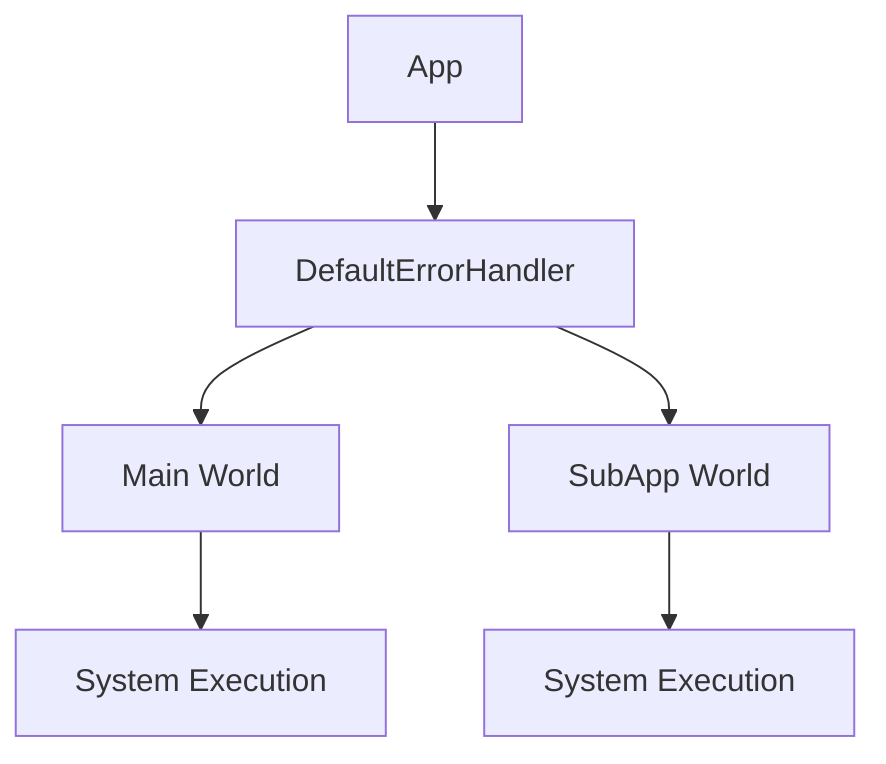

+++
title = "#18810 Per world error handler"
date = "2025-05-19T00:00:00"
draft = false
template = "pull_request_page.html"
in_search_index = false

[extra]
current_language = "zh-cn"
available_languages = {"en" = { name = "English", url = "/pull_request/bevy/2025-05/pr-18810-en-20250519" }, "zh-cn" = { name = "中文", url = "/pull_request/bevy/2025-05/pr-18810-zh-cn-20250519" }}
labels = ["A-ECS"]
+++

# Per world error handler

## Basic Information
- **Title**: Per world error handler
- **PR Link**: https://github.com/bevyengine/bevy/pull/18810
- **Author**: SpecificProtagonist
- **Status**: MERGED
- **Labels**: A-ECS, S-Ready-For-Final-Review, M-Needs-Migration-Guide
- **Created**: 2025-04-11T16:36:41Z
- **Merged**: 2025-05-19T01:52:56Z
- **Merged By**: alice-i-cecile

## Description Translation
### 目标
[查看原始评论](https://github.com/bevyengine/bevy/pull/18801#issuecomment-2796981745)
> 或者，我们可以将错误处理器存储在World而不是全局变量中吗？我认为在调用default_error_handler()时，我们附近总有一个World。这样可以避免使用原子操作或锁，因为我们可以直接对World进行普通的读写操作。

全局错误处理器实际上不需要全局存在——每个World单独存储即可。这允许为不同World使用不同的处理器，同时解除只能修改一次处理器的限制。

### 解决方案
每个`World`现在可以存储自己的错误处理器作为资源。为方便使用，可以为`App`设置默认错误处理器，该处理器将应用到所有`SubApp`的World中。原有只能设置一次错误处理器的行为在App层面仍然保留。

现在也不再需要`configurable_error_handler`特性。

### 测试
新增/调整了针对失败调度系统和观察者的测试。

---

### 示例
```rust
App::new()
    .set_error_handler(info)
    …
```

## The Story of This Pull Request

### 问题与背景
原错误处理机制使用全局静态变量`GLOBAL_ERROR_HANDLER`，存在三个主要问题：
1. 全局锁带来性能开销
2. 无法为不同World配置不同处理器
3. 全局处理器只能设置一次

这在需要多World场景（如多线程执行）或动态切换处理策略时不够灵活。例如，编辑器可能需要调试时panic而正式运行时记录错误。

### 解决方案
将错误处理器从全局静态变量改为World资源：
```rust
#[derive(Resource, Deref, DerefMut, Copy, Clone)]
pub struct DefaultErrorHandler(pub ErrorHandler);
```
通过ECS的资源系统管理，每个World可独立配置。

### 实现细节
1. **资源定义**：新增`DefaultErrorHandler`资源类型封装错误处理函数
2. **App接口**：
   ```rust
   pub fn set_error_handler(&mut self, handler: ErrorHandler) -> &mut Self {
       // 设置默认处理器并传播到所有子App
   }
   ```
3. **World访问**：
   ```rust
   impl World {
       pub fn default_error_handler(&self) -> ErrorHandler {
           self.get_resource::<DefaultErrorHandler>().unwrap_or_default().0
       }
   }
   ```
4. **迁移路径**：移除`configurable_error_handler`特性，原有全局配置方式改为App级配置

### 技术洞察
1. **资源系统优势**：利用ECS已有的资源同步机制，避免自行实现线程安全
2. **向后兼容**：通过`App::set_error_handler`保持原有配置方式
3. **性能提升**：移除全局锁，访问变为普通资源查找

### 影响
1. 允许不同World使用不同错误策略
2. 错误处理器可动态修改（通过修改资源）
3. 性能优化：命令执行减少原子操作
4. 简化特性矩阵：移除`configurable_error_handler`

## Visual Representation



## Key Files Changed

### `crates/bevy_ecs/src/error/handler.rs` (+21/-50)
**变更重点**：移除全局处理器，引入资源类型
```rust
// Before:
#[cfg(feature = "configurable_error_handler")]
pub static GLOBAL_ERROR_HANDLER: OnceLock<fn(BevyError, ErrorContext)> = OnceLock::new();

// After:
#[derive(Resource, Deref, DerefMut, Copy, Clone)]
pub struct DefaultErrorHandler(pub ErrorHandler);
```

### `crates/bevy_app/src/app.rs` (+52/-1)
**新增功能**：App级错误处理器配置
```rust
pub fn set_error_handler(&mut self, handler: ErrorHandler) -> &mut Self {
    // 传播到所有子App
    for sub_app in self.sub_apps.iter_mut() {
        sub_app.world_mut().insert_resource(DefaultErrorHandler(handler));
    }
}
```

### `crates/bevy_ecs/src/observer/runner.rs` (+29/-14)
**适配修改**：从World获取处理器
```rust
let handler = state.error_handler.unwrap_or_else(|| world.default_error_handler());
```

## Further Reading
1. [ECS资源系统文档](https://bevyengine.org/learn/book/next/ecs/resources/)
2. [Bevy错误处理最佳实践](https://github.com/bevyengine/bevy/discussions/18825)
3. [Rust错误处理模式](https://doc.rust-lang.org/book/ch09-00-error-handling.html)