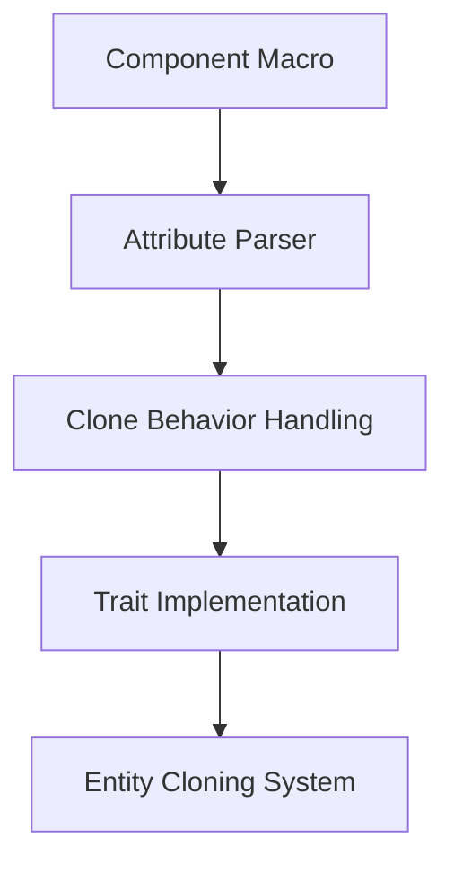

+++
title = "#18811 Derive `clone_behavior` for `Components`"
date = "2025-05-06T00:00:00"
draft = false
template = "pull_request_page.html"
in_search_index = true

[taxonomies]
list_display = ["show"]

[extra]
current_language = "en"
available_languages = {"en" = { name = "English", url = "/pull_request/bevy/2025-05/pr-18811-en-20250506" }, "zh-cn" = { name = "中文", url = "/pull_request/bevy/2025-05/pr-18811-zh-cn-20250506" }}
labels = ["A-ECS", "C-Usability", "D-Straightforward", "D-Macros"]
+++

# Derive `clone_behavior` for `Components`

## Basic Information
- **Title**: Derive `clone_behavior` for `Components`
- **PR Link**: https://github.com/bevyengine/bevy/pull/18811
- **Author**: Bleachfuel
- **Status**: MERGED
- **Labels**: A-ECS, C-Usability, S-Ready-For-Final-Review, D-Straightforward, D-Macros
- **Created**: 2025-04-11T18:31:06Z
- **Merged**: 2025-05-06T00:55:35Z
- **Merged By**: alice-i-cecile

## Description Translation
Allow Derive(Component) to specify a clone_behavior

```rust
#[derive(Component)]
#[component(clone_behavior = Ignore)]
MyComponent;
```

## The Story of This Pull Request

### The Problem and Context
The Entity Component System (ECS) in Bevy required manual implementation of component cloning behavior when entities were duplicated. Previously, custom clone behavior required implementing the `Component` trait manually rather than using the derive macro, creating unnecessary boilerplate and maintenance overhead. This was particularly problematic for components like `RenderEntity` that needed special handling during cloning operations.

### The Solution Approach
The PR introduces a new attribute `clone_behavior` to the `#[derive(Component)]` macro, allowing developers to specify cloning strategies directly in the component definition. This approach maintains backward compatibility while extending the derive macro's capabilities. The implementation needed to:

1. Add attribute parsing to the component macro
2. Handle conflicts with existing relationship targets
3. Generate appropriate trait implementations
4. Update documentation and existing components

### The Implementation
The core changes occur in the macro implementation where attribute parsing was extended. The `Attrs` struct gained a `clone_behavior` field to store the specified behavior:

```rust
struct Attrs {
    // ...
    clone_behavior: Option<Expr>,
}
```

The macro now checks for the `clone_behavior` attribute and generates corresponding code:

```rust
let clone_behavior = if relationship_target.is_some() {
    // Existing relationship handling
} else if let Some(behavior) = attrs.clone_behavior {
    quote!(#bevy_ecs_path::component::ComponentCloneBehavior::#behavior)
} else {
    // Default behavior
}
```

A validation check prevents conflicting attributes:
```rust
if attrs.relationship_target.is_some() && attrs.clone_behavior.is_some() {
    return Err(syn::Error::new(
        attrs.clone_behavior.span(),
        "A Relationship Target already has its own clone behavior...",
    ));
}
```

### Technical Insights
The implementation leverages Rust's procedural macros to inspect attributes and generate trait implementations at compile time. Key considerations included:

- Maintaining compatibility with existing `relationship` attributes
- Preserving default behaviors when no attribute is specified
- Ensuring proper error reporting for invalid combinations
- Updating documentation to reflect new capabilities

### The Impact
This change significantly reduces boilerplate code for component authors. The `RenderEntity` component demonstrates the improvement:

**Before:**
```rust
impl Component for RenderEntity {
    const STORAGE_TYPE: StorageType = StorageType::Table;
    type Mutability = Mutable;
    fn clone_behavior() -> ComponentCloneBehavior {
        ComponentCloneBehavior::Ignore
    }
}
```

**After:**
```rust
#[derive(Component)]
#[component(clone_behavior = Ignore)]
pub struct RenderEntity(Entity);
```

The PR also added comprehensive test coverage in `crates/bevy_ecs/src/lib.rs` to validate different clone behaviors.

## Visual Representation



## Key Files Changed

1. **crates/bevy_ecs/macros/src/component.rs** (+15/-0)
   - Added attribute parsing for `clone_behavior`
   - Implemented conflict checking with relationship targets
   - Integrated new behavior into macro output

2. **crates/bevy_ecs/src/component.rs** (+15/-0)
   - Updated documentation with new usage examples
   - Added example showing `clone_behavior` attribute usage

3. **crates/bevy_render/src/sync_world.rs** (+2/-12)
   - Simplified `RenderEntity` component definition
   - Replaced manual Component implementation with derive macro

**Example Diff:**
```rust
// Before:
impl Component for RenderEntity {
    fn clone_behavior() -> ComponentCloneBehavior {
        ComponentCloneBehavior::Ignore
    }
}

// After:
#[derive(Component)]
#[component(clone_behavior = Ignore)]
pub struct RenderEntity(Entity);
```

## Further Reading
- [Bevy ECS Component Documentation](https://docs.rs/bevy_ecs/latest/bevy_ecs/component/trait.Component.html)
- [Rust Procedural Macros Guide](https://doc.rust-lang.org/reference/procedural-macros.html)
- [Entity Cloning in ECS](https://bevyengine.org/learn/ecs-in-depth/entity-cloning/)