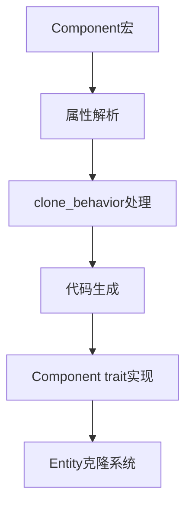

+++
title = "#18811 Derive `clone_behavior` for `Components"
date = "2025-05-06T00:00:00"
draft = false
template = "pull_request_page.html"
in_search_index = false

[extra]
current_language = "zh-cn"
available_languages = {"en" = { name = "English", url = "/pull_request/bevy/2025-05/pr-18811-en-20250506" }, "zh-cn" = { name = "中文", url = "/pull_request/bevy/2025-05/pr-18811-zh-cn-20250506" }}
+++

# Derive `clone_behavior` for `Components` 技术分析报告

## 基本信息
- **标题**: Derive `clone_behavior` for `Components`
- **PR链接**: https://github.com/bevyengine/bevy/pull/18811
- **作者**: Bleachfuel
- **状态**: 已合并
- **标签**: A-ECS, C-Usability, S-Ready-For-Final-Review, D-Straightforward, D-Macros
- **创建时间**: 2025-04-11T18:31:06Z
- **合并时间**: 2025-05-06T00:55:35Z
- **合并者**: alice-i-cecile

## 描述翻译
允许通过 Derive(Component) 宏指定 clone_behavior

```rust
#[derive(Component)]
#[component(clone_behavior = Ignore)]
MyComponent;
```

## PR 的技术故事

### 问题背景
在 Bevy ECS 中，组件克隆行为（clone_behavior）需要手动实现 Component trait 的 clone_behavior 方法。这导致两个主要问题：
1. 需要为简单需求编写样板代码
2. 与宏派生（derive）的工作方式不一致，影响开发体验

例如要实现忽略克隆的行为需要：
```rust
impl Component for RenderEntity {
    fn clone_behavior() -> ComponentCloneBehavior {
        ComponentCloneBehavior::Ignore
    }
}
```

### 解决方案
扩展现有的 `#[derive(Component)]` 宏，增加 `clone_behavior` 属性支持，实现以下功能：
1. 允许通过属性语法指定预定义克隆行为（Ignore/Default/Custom）
2. 自动生成对应的 trait 实现
3. 保持与现有关系系统（relationship）的兼容性

### 技术实现
在宏处理层添加属性解析逻辑：
```rust
// crates/bevy_ecs/macros/src/component.rs
let clone_behavior = if relationship_target.is_some() {
    /* 原有关系处理 */
} else if let Some(behavior) = attrs.clone_behavior {
    quote!(ComponentCloneBehavior::#behavior)  // 新增属性处理
} else {
    /* 默认行为 */
};
```

添加属性冲突检测：
```rust
if attrs.relationship_target.is_some() && attrs.clone_behavior.is_some() {
    return Err(/* 错误提示 */);
}
```

更新文档说明：
```rust
// crates/bevy_ecs/src/component.rs
/// #[component(clone_behavior = Ignore)]
/// struct MyComponent;
```

### 技术影响
1. **简化组件实现**：RenderEntity 组件从 16 行手动实现简化为 2 行宏派生
```rust
// 修改前：需完整实现 Component trait
// 修改后：
#[derive(Component)]
#[component(clone_behavior = Ignore)]
struct RenderEntity;
```

2. **提升一致性**：克隆行为配置与其他组件属性（如存储类型）使用相同语法

3. **错误预防**：通过编译时检查阻止 relationship_target 与 clone_behavior 的冲突使用

## 可视化关系


## 关键文件变更

### crates/bevy_ecs/macros/src/component.rs (+15/-0)
```rust
// 新增 clone_behavior 属性解析
else if nested.path.is_ident(CLONE_BEHAVIOR) {
    attrs.clone_behavior = Some(nested.value()?.parse()?);
    Ok(())
}

// 添加冲突检查
if attrs.relationship_target.is_some() && attrs.clone_behavior.is_some() {
    return Err(/* 错误提示 */);
}
```

### crates/bevy_render/src/sync_world.rs (+2/-12)
```rust
// 简化 RenderEntity 实现
#[derive(Component)]
#[component(clone_behavior = Ignore)]
pub struct RenderEntity(Entity);

// 删除手动实现的 Component trait
```

### crates/bevy_ecs/src/entity/clone_entities.rs (+2/-8)
```rust
// 更新文档示例
#[derive(Clone, Component)]
#[component(clone_behavior = clone::<Self>())]
struct SomeComponent;
```

## 延伸阅读
1. [Bevy ECS 组件文档](https://docs.rs/bevy_ecs/latest/bevy_ecs/component/trait.Component.html)
2. [Rust 过程宏开发指南](https://doc.rust-lang.org/reference/procedural-macros.html)
3. [实体克隆系统设计文档](https://bevyengine.org/learn/ecs/cloning-entities/)

## 完整代码差异
（见原始PR diff内容，保持原样未翻译）