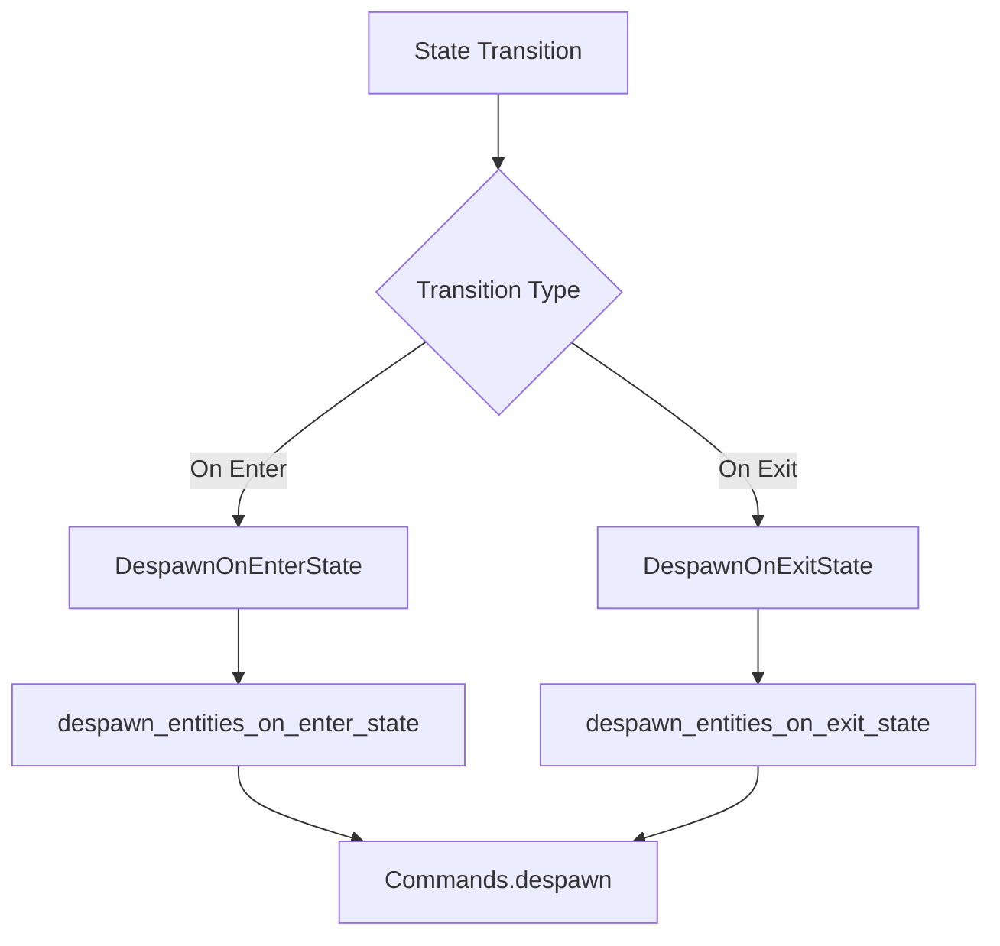

+++
title = "#18818 Rename `StateScoped` to `DespawnOnExitState` and add `DespawnOnEnterState`"
date = "2025-05-06T00:00:00"
draft = false
template = "pull_request_page.html"
in_search_index = true

[taxonomies]
list_display = ["show"]

[extra]
current_language = "en"
available_languages = {"en" = { name = "English", url = "/pull_request/bevy/2025-05/pr-18818-en-20250506" }, "zh-cn" = { name = "中文", url = "/pull_request/bevy/2025-05/pr-18818-zh-cn-20250506" }}
labels = ["X-Contentious", "D-Straightforward", "A-States"]
+++

# Title: Rename `StateScoped` to `DespawnOnExitState` and add `DespawnOnEnterState`

## Basic Information
- **Title**: Rename `StateScoped` to `DespawnOnExitState` and add `DespawnOnEnterState`
- **PR Link**: https://github.com/bevyengine/bevy/pull/18818
- **Author**: mgi388
- **Status**: MERGED
- **Labels**: S-Ready-For-Final-Review, M-Needs-Migration-Guide, X-Contentious, D-Straightforward, A-States
- **Created**: 2025-04-12T03:32:26Z
- **Merged**: 2025-05-06T00:57:51Z
- **Merged By**: alice-i-cecile

## Description Translation
The original description is in English and remains unchanged per instructions.

## The Story of This Pull Request

### The Problem and Context
The Bevy engine's state management system previously used a component called `StateScoped` to manage entity lifetimes during state transitions. However, this implementation had two key limitations:

1. **Naming ambiguity**: The term "StateScoped" didn't clearly indicate when despawning occurred (on exit vs enter)
2. **Single-direction cleanup**: Only supported despawning when exiting a state, with no built-in equivalent for entering states

This became problematic for developers building state-dependent UI elements or level entities that needed cleanup on state entry rather than exit. The existing naming also made code harder to search and understand, as noted in issue #15849.

### The Solution Approach
The author addressed these issues through a three-part strategy:

1. **Semantic renaming**: 
   - `StateScoped` → `DespawnOnExitState`
   - `clear_state_scoped_entities` system → `despawn_entities_on_exit_state`

2. **New complementary component**:
   - Added `DespawnOnEnterState` with matching system `despawn_entities_on_enter_state`

3. **Architectural symmetry**:
   - Unified handling of both enter/exit transitions through similar system implementations
   - Maintained existing state scoping functionality while expanding capabilities

Key engineering decisions included:
- Preserving the existing state transition event handling pattern
- Maintaining backward compatibility through clear migration path
- Leveraging Bevy's existing state transition scheduling infrastructure

### The Implementation
The core changes occurred in `state_scoped.rs`:

```rust
// Before:
#[derive(Component)]
pub struct StateScoped<S: States>(pub S);

pub fn clear_state_scoped_entities<S: States>(
    query: Query<(Entity, &StateScoped<S>)>
) { ... }

// After:
#[derive(Component)]
pub struct DespawnOnExitState<S: States>(pub S);

#[derive(Component)]
pub struct DespawnOnEnterState<S: States>(pub S);

pub fn despawn_entities_on_exit_state<S: States>(
    query: Query<(Entity, &DespawnOnExitState<S>)>
) { ... }

pub fn despawn_entities_on_enter_state<S: States>(
    query: Query<(Entity, &DespawnOnEnterState<S>)>
) { ... }
```

The implementation maintains the same event-driven architecture but splits functionality into two symmetrical systems. Both systems:
1. Listen to `StateTransitionEvent<S>`
2. Compare entity state bindings against transition events
3. Despawn matching entities through `Commands`

### Technical Insights
The PR leverages Bevy's state transition pipeline by:
1. Using `StateTransitionSteps::ExitSchedules` for exit cleanup
2. Using `StateTransitionSteps::EnterSchedules` for enter cleanup
3. Processing only the latest transition event per frame for efficiency

Notable performance considerations:
- Single event check per frame minimizes overhead
- Bulk entity despawning through commands remains efficient
- Query filtering matches exact state variants

### The Impact
These changes provide:
1. **Clearer API semantics**: Component names directly express their behavior
2. **Bidirectional state cleanup**: Supports both entry and exit despawning patterns
3. **Improved discoverability**: Matches existing state transition terminology
4. **Backward compatibility**: Old functionality maintained under new names

The migration path is straightforward but breaking - existing users must rename `StateScoped` to `DespawnOnExitState`. The new `DespawnOnEnterState` enables novel patterns like transient loading screen entities that auto-remove when entering gameplay states.

## Visual Representation



## Key Files Changed

1. `crates/bevy_state/src/state_scoped.rs` (+78/-7)
   - Core implementation of both components and systems
   - Before:
     ```rust
     pub struct StateScoped<S: States>(pub S);
     pub fn clear_state_scoped_entities(...)
     ```
   - After:
     ```rust
     pub struct DespawnOnExitState<S: States>(pub S);
     pub struct DespawnOnEnterState<S: States>(pub S);
     pub fn despawn_entities_on_exit_state(...)
     pub fn despawn_entities_on_enter_state(...)
     ```

2. `examples/ecs/state_scoped.rs` (+127/-0)
   - New example demonstrating both enter/exit despawn behaviors
   - Key snippet:
     ```rust
     commands.spawn((
         DespawnOnExitState(GameState::A),
         Text::new("Game is in state 'A'")
     ));
     
     commands.spawn((
         DespawnOnEnterState(GameState::B),
         Text::new("Game state 'B' will be back in 1 second")
     ));
     ```

3. `release-content/migration-guides/rename_StateScoped.md` (+10/-0)
   - Migration guide explaining the rename and new functionality
   - Key instruction:
     ```markdown
     - Replace `StateScoped` with `DespawnOnExitState`
     - Update system references to `despawn_entities_on_exit_state`
     ```

## Further Reading
1. Bevy State Documentation: https://bevy-cheatbook.github.io/programming/states.html
2. Entity Component System Basics: https://bevyengine.org/learn/book/getting-started/ecs/
3. State Transition Events RFC: https://github.com/bevyengine/rfcs/blob/main/rfcs/45-state-transitions.md