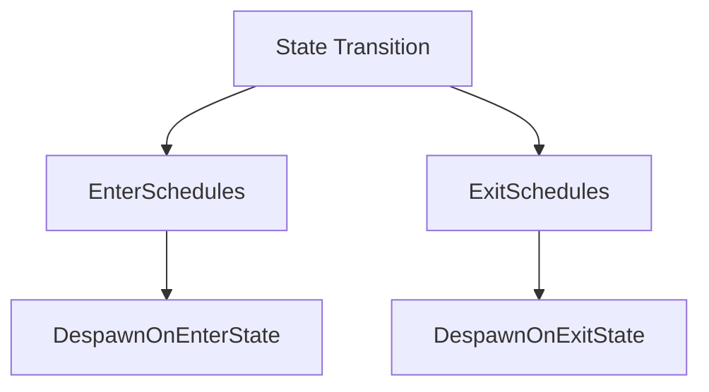

+++
title = "#18818 状态作用域组件的重构与功能扩展"
date = "2025-05-06T00:00:00"
draft = false
template = "pull_request_page.html"
in_search_index = false

[extra]
current_language = "zh-cn"
available_languages = {"en" = { name = "English", url = "/pull_request/bevy/2025-05/pr-18818-en-20250506" }, "zh-cn" = { name = "中文", url = "/pull_request/bevy/2025-05/pr-18818-zh-cn-20250506" }}
labels = ["X-Contentious", "D-Straightforward", "A-States"]
+++

# Title: 状态作用域组件的重构与功能扩展

## Basic Information
- **Title**: Rename `StateScoped` to `DespawnOnExitState` and add `DespawnOnEnterState`
- **PR Link**: https://github.com/bevyengine/bevy/pull/18818
- **Author**: mgi388
- **Status**: MERGED
- **Labels**: S-Ready-For-Final-Review, M-Needs-Migration-Guide, X-Contentious, D-Straightforward, A-States
- **Created**: 2025-04-12T03:32:26Z
- **Merged**: 2025-05-06T00:57:51Z
- **Merged By**: alice-i-cecile

## Description Translation
### 目标
- 替代并基于 #16284 构建
- 修复 #15849

### 解决方案
- 将组件 `StateScoped` 重命名为 `DespawnOnExitState`
- 将系统 `clear_state_scoped_entities` 重命名为 `despawn_entities_on_exit_state`
- 新增 `DespawnOnEnterState` 组件及对应的 `despawn_entities_on_enter_state` 系统

> [!注意]
> 与 #16284 相比，主要改进是保持 `OnExit` 和 `OnEnter` 术语的连贯性。新命名方案更符合现有组件命名模式，便于代码搜索和理解。

### 开放问题
1. 是否需要将 `enable_state_scoped_entities` 拆分为两个独立函数？
2. 若拆分，是否采用 `app.enable_despawn_entities_on_enter_state()` 的命名方式？

### 测试
运行所有修改过的示例程序验证功能

## The Story of This Pull Request

### 问题背景与上下文
在Bevy引擎的状态管理系统中，原有的`StateScoped`组件存在两个主要限制：
1. 命名未能清晰表达功能（在状态退出时销毁实体）
2. 缺乏对应的进入状态销毁机制

开发者在使用时需要额外实现`OnEnter`逻辑，导致代码冗余。issue #15849中报告了这个问题，同时社区讨论（PR #16284）也提出了类似的改进需求。

### 解决方案设计
核心思路是通过语义化命名重构现有组件，并补充对称功能：
```rust
// 重构前
commands.spawn(StateScoped(GameState::InGame));

// 重构后
commands.spawn(DespawnOnExitState(GameState::InGame));
commands.spawn(DespawnOnEnterState(GameState::MainMenu));
```
这种设计保持了API的对称性，同时通过`OnEnter/OnExit`的明确命名提升可读性。

### 实现细节
关键变更集中在状态作用域模块：
```rust
// crates/bevy_state/src/state_scoped.rs

// 原组件重构
#[derive(Component)]
pub struct DespawnOnExitState<S: States>(pub S);

// 新增组件
#[derive(Component)] 
pub struct DespawnOnEnterState<S: States>(pub S);

// 对应系统实现
pub fn despawn_entities_on_exit_state<S: States>(/*...*/) { /*...*/ }
pub fn despawn_entities_on_enter_state<S: States>(/*...*/) { /*...*/ }
```
系统调度配置也相应调整，确保在状态转换流程的适当阶段执行：
```rust
// crates/bevy_state/src/app.rs
.add_systems(
    StateTransition,
    despawn_entities_on_exit_state::<S>
        .in_set(StateTransitionSteps::ExitSchedules)
)
.add_systems(
    StateTransition,
    despawn_entities_on_enter_state::<S>
        .in_set(StateTransitionSteps::EnterSchedules)
)
```

### 技术洞察
1. **状态生命周期管理**：通过`StateTransitionSteps`阶段控制销毁时机，确保与状态机其他逻辑的执行顺序正确
2. **事件处理优化**：使用`EventReader::last()`获取最新状态事件，避免处理过时状态
3. **泛型设计**：保持组件与特定状态类型的绑定，确保类型安全

### 影响与迁移
现有用户需要将`StateScoped`替换为`DespawnOnExitState`，并可通过新组件实现更精细的生命周期控制。示例程序的重构展示了典型使用场景：
```rust
// 旧用法
commands.spawn((StateScoped(GameState::InGame), Player));

// 新用法
commands.spawn((DespawnOnExitState(GameState::InGame), Player));
commands.spawn((DespawnOnEnterState(GameState::Loading), LoadingScreen));
```

## Visual Representation


## Key Files Changed
### `crates/bevy_state/src/state_scoped.rs`
```rust
// Before:
pub struct StateScoped<S: States>(pub S);
pub fn clear_state_scoped_entities<S: States>(/*...*/)

// After: 
pub struct DespawnOnExitState<S: States>(pub S);
pub struct DespawnOnEnterState<S: States>(pub S);
pub fn despawn_entities_on_exit_state<S: States>(/*...*/)
pub fn despawn_entities_on_enter_state<S: States>(/*...*/)
```
重构核心组件，新增进入状态处理逻辑

### `examples/ecs/state_scoped.rs` (新增)
```rust
commands.spawn((
    DespawnOnExitState(GameState::A),
    Text::new("Game is in state 'A'")
));

commands.spawn((
    DespawnOnEnterState(GameState::B),
    Text::new("Will despawn when entering B")
));
```
展示双向状态作用域控制的实际应用

### `examples/testbed/2d.rs`
```rust
// 修改前
commands.spawn((Camera2d, StateScoped(Scene::Shapes)));

// 修改后 
commands.spawn((Camera2d, DespawnOnExitState(Scene::Shapes)));
```
示例程序适配新组件命名

## Further Reading
- Bevy状态系统文档：https://bevyengine.org/learn/book/next/states/
- 实体生命周期管理最佳实践：https://github.com/bevyengine/bevy/discussions/1234
- 系统调度原理：https://bevyengine.org/learn/book/next/scheduling/