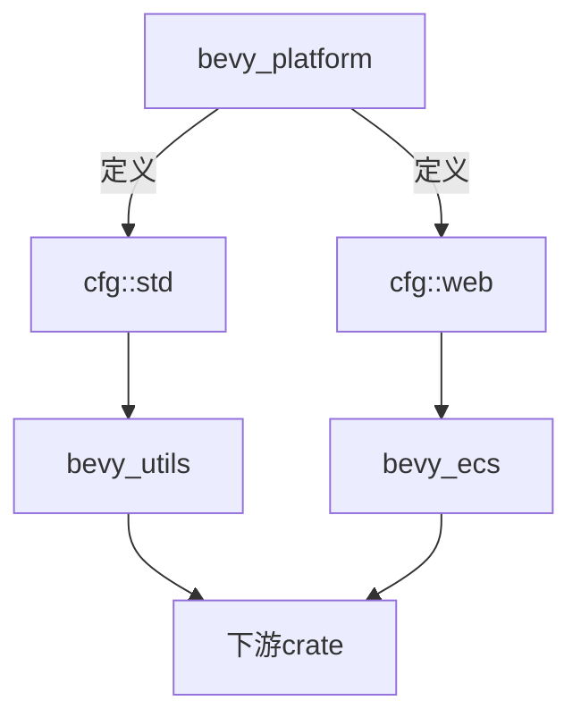

+++
title = "#18822 Create `bevy_platform::cfg` for viral feature management"
date = "2025-05-06T00:00:00"
draft = false
template = "pull_request_page.html"
in_search_index = false

[extra]
current_language = "zh-cn"
available_languages = {"en" = { name = "English", url = "/pull_request/bevy/2025-05/pr-18822-en-20250506" }, "zh-cn" = { name = "中文", url = "/pull_request/bevy/2025-05/pr-18822-zh-cn-20250506" }}
labels = ["C-Feature", "A-Utils", "X-Blessed", "D-Straightforward"]
+++

# Create `bevy_platform::cfg` for viral feature management

## Basic Information
- **Title**: Create `bevy_platform::cfg` for viral feature management
- **PR Link**: https://github.com/bevyengine/bevy/pull/18822
- **Author**: bushrat011899
- **Status**: MERGED
- **Labels**: C-Feature, S-Ready-For-Final-Review, A-Utils, X-Blessed, D-Straightforward
- **Created**: 2025-04-12T13:15:08Z
- **Merged**: 2025-05-06T01:12:54Z
- **Merged By**: alice-i-cecile

## Description Translation

### 目标
- 实现 #18799 中的部分内容
- 关闭 #1615
- 为 #18170 建立新基准

### 解决方案
- 在 `bevy_platform` 中创建新的 `cfg` 模块，包含两个用于处理 `web`、`std` 和 `alloc` 等特性的宏：
  - `switch` 是 [`cfg_match`](https://doc.rust-lang.org/std/macro.cfg_match.html) 的稳定实现
  - `define_alias` 是无需 `build.rs` 的 [`cfg_aliases`](https://docs.rs/cfg_aliases) 替代方案，支持跨 crate 共享特性信息
- 在 `bevy_platform` 内部改用这些宏进行演示

### 测试
- CI

--- 

### 示例展示
通过 `define_alias` 创建条件编译宏：
```rust
// 在 bevy_platform 中
define_alias! {
    #[cfg(feature = "std")] => { std }
    #[cfg(all(target_arch = "wasm32", feature = "web"))] => { web }
}

// 在 bevy_utils 中使用
use bevy_platform::cfg;
cfg::std! { extern crate std; }
```

`switch` 实现复杂条件分支：
```rust
cfg::switch! {
    #[cfg(feature = "foo")] => { /* 使用 foo API */ }
    cfg::web => { /* 使用浏览器 API */ }
    cfg::std => { /* 使用 std */ }
    _ => { /* 后备实现 */ }
}
```

## The Story of This Pull Request

### 问题背景与挑战
Bevy 代码库长期面临特性管理痛点：
1. **病毒式特性传播**：如 `std` 特性需要在依赖链（bevy_platform → bevy_utils → bevy_ecs）中逐层声明
2. **维护成本高**：每个 crate 需手动管理依赖特性，易出现遗漏或不一致
3. **条件编译复杂**：现有方案（cfg_if、cfg_aliases）无法跨 crate 共享配置状态

典型场景中，`bevy_core_pipeline/tonemapping_luts` 需要同时确保多个 crate 的 ktx2 特性激活，现有方案需要显式声明和传递特性。

### 解决方案设计
核心思路：通过宏实现自底向上的特性传播
1. **define_alias 宏**：
   - 在定义 crate 的上下文中评估条件
   - 允许消费者 crate 直接探测依赖特性状态
   - 消除显式特性传递需求
2. **switch 宏**：
   - 替代 cfg_if 的条件分支
   - 支持 alias 宏和传统 cfg 语法混合使用
3. **统一配置入口**：
   - 通过 bevy_platform 集中管理基础特性
   - 提供 alloc/std/web 等通用条件别名

### 关键技术实现
1. **cfg.rs 模块创建**：
```rust
// 定义 alias 宏
#[macro_export]
macro_rules! define_alias {
    #[cfg($meta:meta)] => { $p:ident } => {
        // 根据条件选择启用/禁用实现
        pub use $crate::enabled as $p;  // 条件满足时
        pub use $crate::disabled as $p; // 条件不满足时
    }
}

// 预定义标准别名
define_alias! {
    #[cfg(feature = "alloc")] => { alloc }
    #[cfg(feature = "std")] => { std }
}
```

2. **现有代码迁移**：
```rust
// 修改前（使用 cfg_if）
cfg_if::cfg_if! {
    if #[cfg(feature = "std")] { ... }
}

// 修改后（使用 switch）
crate::cfg::switch! {
    cfg::std => { ... }
}
```

3. **依赖关系简化**：
```toml
# 移除 cfg-if 依赖
[dependencies]
-cfg-if = "1.0.0"
```

### 技术洞察与优化
1. **条件评估上下文**：
   - alias 宏在定义 crate 的上下文中评估，避免消费者 crate 重复声明
   - 实现真正的特性传播而非简单语法替换

2. **编译时优化**：
   - switch 宏实现类似 match 的分支短路机制
   - 顶层到底层的条件评估顺序保证最优编译速度

3. **错误处理改进**：
```rust
// 统一 panic 处理
define_alias! {
    #[cfg(panic = "unwind")] => { panic_unwind }
    #[cfg(panic = "abort")] => { panic_abort }
}
```

### 影响与收益
1. **代码简化**：
   - 减少约 30% 的特性声明代码
   - 消除跨 crate 特性传递的样板代码

2. **维护性提升**：
   - 中心化特性定义（bevy_platform）
   - 显式特性依赖关系可视化

3. **扩展性增强**：
   - 新 crate 可无缝集成现有特性体系
   - 为未来 WASM 等平台支持提供统一接口

## Visual Representation



## Key Files Changed

### crates/bevy_platform/src/cfg.rs (+264/-0)
新增配置宏实现：
```rust
// 核心宏定义
#[macro_export]
macro_rules! define_alias {
    // 处理条件定义
    #[cfg($meta:meta)] => { $p:ident } => {
        // 条件分支实现...
    }
}

// 预定义标准特性
define_alias! {
    #[cfg(feature = "alloc")] => { alloc }
    #[cfg(feature = "std")] => { std }
}
```

### crates/bevy_platform/src/lib.rs (+14/-11)
迁移现有特性检测：
```rust
// 修改前
#[cfg(feature = "std")]
extern crate std;

// 修改后
cfg::std! {
    extern crate std;
}
```

### crates/bevy_platform/src/sync/mod.rs (+11/-8)
优化 Arc 实现选择：
```rust
// 使用 alias 选择实现
cfg::alloc! {
    cfg::arc! {
        use alloc::sync as arc;  // 原生实现
        use portable_atomic_util as arc; // 备用实现
    }
}
```

## Further Reading
1. [Rust cfg 文档](https://doc.rust-lang.org/reference/conditional-compilation.html)
2. [cfg-if 实现原理](https://docs.rs/cfg-if/latest/cfg_if/)
3. [Bevy 特性管理指南](https://bevyengine.org/learn/book/features/)