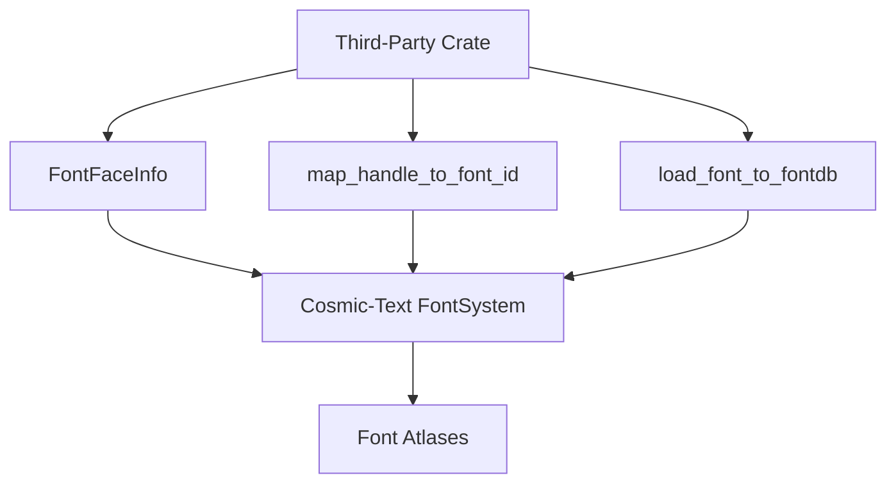

+++
title = "#18851 Allow access to font atlases"
date = "2025-05-26T00:00:00"
draft = false
template = "pull_request_page.html"
in_search_index = true

[taxonomies]
list_display = ["show"]

[extra]
current_language = "en"
available_languages = {"en" = { name = "English", url = "/pull_request/bevy/2025-05/pr-18851-en-20250526" }, "zh-cn" = { name = "中文", url = "/pull_request/bevy/2025-05/pr-18851-zh-cn-20250526" }}
labels = ["C-Performance", "C-Usability", "A-Text", "D-Straightforward"]
+++

# Allow access to font atlases

## Basic Information
- **Title**: Allow access to font atlases
- **PR Link**: https://github.com/bevyengine/bevy/pull/18851
- **Author**: ickshonpe
- **Status**: MERGED
- **Labels**: C-Performance, C-Usability, S-Ready-For-Final-Review, A-Text, D-Straightforward
- **Created**: 2025-04-15T10:45:09Z
- **Merged**: 2025-05-26T15:39:37Z
- **Merged By**: alice-i-cecile

## Description Translation
# Objective
It's not possible atm for third-party crates to create their own text systems that use the existing cosmic-text `FontSystem` and font atlases.

## Solution
Make  `FontFaceInfo`, `TextPipeline::map_handle_to_font_id`, and `load_font_fontdb` public so third-party crates can access and update the existing font atlases 

## The Story of This Pull Request

The PR addresses a limitation in Bevy's text system where third-party crates couldn't extend or interact with the existing font management infrastructure. Bevy's text rendering uses cosmic-text for font handling, which maintains font atlases through a `FontSystem`. However, key components managing font mappings and atlas generation were not exposed publicly.

The core problem stemmed from three private implementation details:
1. `FontFaceInfo` struct containing critical font metadata
2. `TextPipeline::map_handle_to_font_id` mapping between Bevy font assets and cosmic-text's internal IDs
3. `load_font_to_fontdb` function responsible for adding fonts to the font database

These private implementations prevented external crates from creating alternative text systems that reuse Bevy's font loading and atlas generation logic. Developers wanting to implement custom text layout or rendering had to duplicate font management code rather than building on existing infrastructure.

The solution focused on carefully exposing selected internals through targeted visibility changes:

```rust
// Before:
struct FontFaceInfo { ... }
// After: 
pub struct FontFaceInfo { ... }
```

Each field in `FontFaceInfo` was made public with added documentation explaining their purpose:
```rust
pub struct FontFaceInfo {
    pub stretch: cosmic_text::fontdb::Stretch,
    pub style: cosmic_text::fontdb::Style,
    pub weight: cosmic_text::fontdb::Weight,
    pub family_name: Arc<str>,
}
```

The `TextPipeline`'s font mapping was exposed to allow external access to the font ID relationships:
```rust
// Before:
map_handle_to_font_id: HashMap<AssetId<Font>, ...>
// After:
pub map_handle_to_font_id: HashMap<AssetId<Font>, ...>
```

The font loading function received both visibility changes and documentation:
```rust
/// Add the font to the cosmic text's `FontSystem`'s in-memory font database
pub fn load_font_to_fontdb(...) { ... }
```

These changes maintain Bevy's existing text rendering behavior while enabling new use cases:
1. Custom text layout engines using Bevy's font atlases
2. Dynamic font swapping/modification at runtime
3. Advanced typography features built as external crates
4. Performance optimizations through direct atlas access

The implementation preserves encapsulation where possible - only specific implementation details needed for extension points were exposed. The documentation added to `FontFaceInfo` fields helps consumers understand font metadata without reverse-engineering.

## Visual Representation



## Key Files Changed

### crates/bevy_text/src/pipeline.rs (+12/-7)
1. Made `FontFaceInfo` struct and its fields public
```rust
#[derive(Clone)]
pub struct FontFaceInfo {
    pub stretch: cosmic_text::fontdb::Stretch,
    pub style: cosmic_text::fontdb::Style,
    pub weight: cosmic_text::fontdb::Weight,
    pub family_name: Arc<str>,
}
```

2. Exposed font ID mapping in `TextPipeline`
```rust
#[derive(Default, Resource)]
pub struct TextPipeline {
    pub map_handle_to_font_id: HashMap<AssetId<Font>, ...>
}
```

3. Publicized and documented font loading function
```rust
pub fn load_font_to_fontdb(...) {
    // Existing implementation preserved
}
```

## Further Reading
- [Cosmic-text documentation](https://docs.rs/cosmic-text/latest/cosmic_text/) - Underlying text layout engine used by Bevy
- [Bevy Asset System](https://bevyengine.org/learn/book/assets/) - How font assets are managed
- [OpenType font features](https://learn.microsoft.com/en-us/typography/opentype/spec/) - Understanding font metadata fields