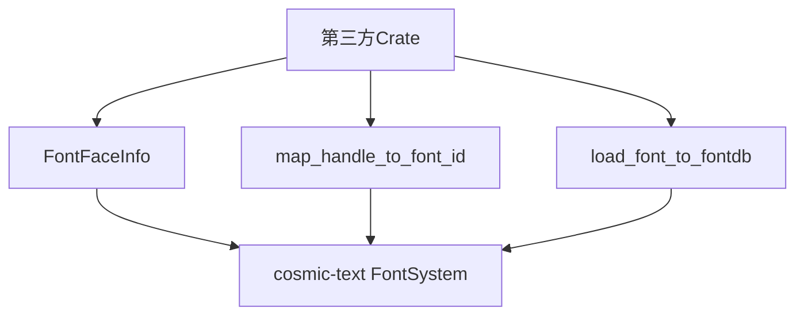

+++
title = "#18851 PR #18851 - Allow access to font atlases"
date = "2025-05-26T00:00:00"
draft = false
template = "pull_request_page.html"
in_search_index = false

[extra]
current_language = "zh-cn"
available_languages = {"en" = { name = "English", url = "/pull_request/bevy/2025-05/pr-18851-en-20250526" }, "zh-cn" = { name = "中文", url = "/pull_request/bevy/2025-05/pr-18851-zh-cn-20250526" }}
labels = ["C-Performance", "C-Usability", "A-Text", "D-Straightforward"]
+++

# Title: PR #18851 - Allow access to font atlases

## Basic Information
- **Title**: Allow access to font atlases
- **PR Link**: https://github.com/bevyengine/bevy/pull/18851
- **Author**: ickshonpe
- **Status**: MERGED
- **Labels**: C-Performance, C-Usability, S-Ready-For-Final-Review, A-Text, D-Straightforward
- **Created**: 2025-04-15T10:45:09Z
- **Merged**: 2025-05-26T15:39:37Z
- **Merged By**: alice-i-cecile

## Description Translation
### 目标
当前第三方 crate 无法使用现有的 cosmic-text `FontSystem` 和字体图集创建自己的文本系统。

### 解决方案
将 `FontFaceInfo`、`TextPipeline::map_handle_to_font_id` 和 `load_font_fontdb` 设为公开，使第三方 crate 能够访问和更新现有的字体图集。

## The Story of This Pull Request

### 问题与背景
Bevy 引擎的文本系统内部使用 cosmic-text 进行字体管理和渲染，但原有实现将关键数据结构标记为私有(private)。这导致第三方开发者无法实现自定义文本系统来复用现有的字体资源（FontSystem 和 font atlases）。具体来说：

1. 无法访问字体元信息（FontFaceInfo）
2. 无法映射字体资源到 cosmic-text 的字体 ID（map_handle_to_font_id）
3. 无法直接向字体数据库加载字体（load_font_to_fontdb）

这种限制迫使开发者要么重复实现整套字体管理系统，要么无法充分利用现有基础设施，造成资源浪费和潜在的性能问题。

### 解决方案
通过有选择地公开三个关键组件来解决问题：

1. **FontFaceInfo 结构体**：包含字体拉伸(stretch)、样式(style)、字重(weight)和家族名称等元数据
2. **TextPipeline::map_handle_to_font_id**：维护字体资源与 cosmic-text 字体 ID 的映射关系
3. **load_font_to_fontdb 函数**：负责将字体加载到 cosmic-text 的内存数据库

这种改动保持原有架构不变，仅调整可见性修饰符(pub)，实现最小暴露原则。

### 实现细节
主要修改集中在 `crates/bevy_text/src/pipeline.rs` 文件：

```rust
// 修改前
struct FontFaceInfo {
    stretch: cosmic_text::fontdb::Stretch,
    style: cosmic_text::fontdb::Style,
    // ...其他字段
}

// 修改后
pub struct FontFaceInfo {
    pub stretch: cosmic_text::fontdb::Stretch,
    pub style: cosmic_text::fontdb::Style,
    // ...其他字段标记为 pub
}
```

```rust
// 修改前
fn load_font_to_fontdb(...) {...}

// 修改后
/// Add the font to the cosmic text's `FontSystem`'s in-memory font database
pub fn load_font_to_fontdb(...) {...}
```

这些改动允许外部代码：
- 直接访问字体元数据
- 跟踪字体资源与底层系统的映射关系
- 向现有字体系统添加新字体

### 技术洞察
1. **可见性控制**：通过精确控制 pub 修饰符，在保持封装性的同时暴露必要接口
2. **文档注释**：为公开的 load_font_to_fontdb 添加使用说明，提升 API 可用性
3. **兼容性**：保持原有数据结构不变，确保向后兼容

### 影响
1. **扩展性**：第三方开发者可以构建自定义文本布局系统
2. **性能**：避免重复创建字体图集，减少内存占用
3. **生态系统**：促进 Bevy 文本相关插件的多样化发展

## Visual Representation



## Key Files Changed

### `crates/bevy_text/src/pipeline.rs` (+12/-7)
1. **FontFaceInfo 结构体公开化**
```rust
// Before:
#[derive(Clone)]
struct FontFaceInfo {...}

// After:
#[derive(Clone)]
pub struct FontFaceInfo {
    pub stretch: ...,
    pub style: ...,
    // 所有字段标记为 pub
}
```
允许外部访问字体元数据

2. **map_handle_to_font_id 可见性变更**
```rust
// Before:
map_handle_to_font_id: HashMap<...>

// After:
pub map_handle_to_font_id: HashMap<...>
```
暴露字体资源映射关系

3. **load_font_to_fontdb 函数公开**
```rust
// Before:
fn load_font_to_fontdb(...)

// After:
/// Add the font to... 
pub fn load_font_to_fontdb(...)
```
提供标准字体加载接口

## Further Reading
1. [cosmic-text 文档](https://docs.rs/cosmic-text/latest/cosmic_text/)
2. [Bevy 资源系统设计](https://bevyengine.org/learn/book/features/assets/)
3. [Rust 可见性控制](https://doc.rust-lang.org/rust-by-example/mod/visibility.html)