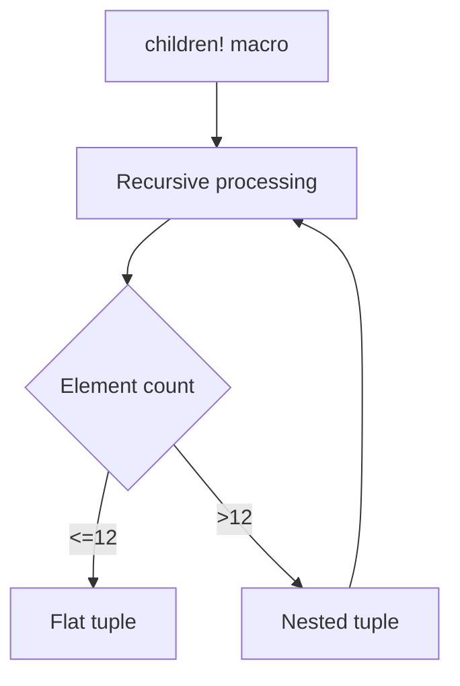

+++
title = "#18865 Increase upper limit of `children!`"
date = "2025-05-06T00:00:00"
draft = false
template = "pull_request_page.html"
in_search_index = true

[taxonomies]
list_display = ["show"]

[extra]
current_language = "en"
available_languages = {"en" = { name = "English", url = "/pull_request/bevy/2025-05/pr-18865-en-20250506" }, "zh-cn" = { name = "中文", url = "/pull_request/bevy/2025-05/pr-18865-zh-cn-20250506" }}
labels = ["C-Bug", "A-ECS", "C-Usability", "D-Macros"]
+++

# Increase upper limit of `children!`

## Basic Information
- **Title**: Increase upper limit of `children!`
- **PR Link**: https://github.com/bevyengine/bevy/pull/18865
- **Author**: CorvusPrudens
- **Status**: MERGED
- **Labels**: C-Bug, A-ECS, C-Usability, S-Ready-For-Final-Review, D-Macros
- **Created**: 2025-04-17T04:25:29Z
- **Merged**: 2025-05-06T01:19:07Z
- **Merged By**: alice-i-cecile

## Description Translation
# Objective

Currently, `bevy_ecs`'s `children!` macro only supports spawning up to twelve children at once. Ideally there would be no limit.

## Solution

`children!` is limited because `SpawnableList`, [the primary trait bound here](https://docs.rs/bevy/0.16.0-rc.5/bevy/ecs/hierarchy/struct.Children.html#method.spawn), uses the fake variadics pattern on tuples of up to twelve elements. However, since a tuple itself implements `SpawnableList`, we can simply nest tuples of entities when we run out of room.

This PR achieves this using `macro_rules` macros with a bit of brute force, following [some discussion on Discord](https://discord.com/channels/691052431525675048/692572690833473578/1362174415458013314). If we create patterns for lists of up to eleven bundles, then use a repetition pattern to handle the rest, we can "special-case" the recursion into a nested tuple.

In principle, this would permit an arbitrary number of children, but Rust's recursion limits will cut things short at around 1400 elements by default. Of course, it's generally not a good idea to stick that many bundles in a single invocation, but it might be worth mentioning in the docs.

## Implementation notes

### Why are cases 0-11 expanded by hand?

We could make use of a tertiary macro:

```rs
macro_rules! recursive_spawn {
    // so that this...
    ($a:expr, $b:expr) => {
        (
            $crate::spawn::Spawn($a),
            $crate::spawn::Spawn($b),
        )
    };
    
    // becomes this...
    ($a:expr, $b:expr) => {
        $crate::spawn_tuple!($a, $b)
    };
}
```

But I already feel a little bad exporting `recursive_spawn`. I'd really like to avoid exposing more internals, even if they are annotated with `#[doc(hidden)]`. If I had to guess, I'd say it'll also make the expansion a tiny bit slower.

### Do we really need to handle up to twelve elements in the macro?

The macro is a little long, but doing it this way maximizes the "flatness" of the types to be spawned. This should improve the codegen a bit and makes the macro output a little bit easier to look at.

## Future work

The `related!` macro is essentially the same as `children!`, so if this direction is accepted, `related!` should receive the same treatment. I imagine we'd want to extract out the `recursive_spawn` macro into its own file since it can be used for both. If this should be tackled in this PR, let me know!

## Testing

This change is fairly trivial, but I added a single test to verify that it compiles and nothing goes wrong once recursion starts happening. It's pretty easy to verify that the change works in practice -- just spawn over twelve entities as children at once!

## The Story of This Pull Request

The `children!` macro in Bevy's ECS hierarchy system had a hard limitation of 12 child entities per invocation due to Rust's tuple implementation constraints. This restriction stemmed from how the `SpawnableList` trait was implemented for tuples up to 12 elements. While sufficient for basic use cases, this became problematic for scenarios requiring more children in a single operation.

The core issue was addressed through macro-driven tuple nesting. The solution introduces a `recursive_spawn!` helper macro that:

1. Directly handles 1-11 elements as flat tuples
2. Implements recursive nesting for 12+ elements

For example, spawning 13 children would generate:
```rust
(
    (Spawn(c1), Spawn(c2), ..., Spawn(c11)),
    (Spawn(c12), Spawn(c13))
)
```
This approach maintains compatibility with existing `SpawnableList` implementations while bypassing the 12-element limit through nested tuple structures.

The implementation required careful macro design to balance:
- Compiler recursion limits
- Code generation efficiency
- Developer ergonomics

Key technical decisions included:
- Manual expansion of 0-11 element cases to optimize type flatness
- Recursive pattern for 12+ elements to enable arbitrary-length spawning
- Preservation of existing spawn semantics through `Spawn` wrapper types

Two primary files were modified:
1. **hierarchy.rs**: Updated `children!` macro to use `recursive_spawn!`
2. **spawn.rs**: Added `recursive_spawn!` implementation with pattern matching

New test cases verify correct behavior at both the boundary (12 children) and beyond (13 children):
```rust
// Tests flat tuple handling
let id = world.spawn(children![(); 12]).id();
assert_eq!(world.entity(id).get::<Children>().unwrap().len(), 12);

// Tests nested tuple handling
let id = world.spawn(children![(); 13]).id(); 
assert_eq!(world.entity(id).get::<Children>().unwrap().len(), 13);
```

While theoretically supporting ~1400 elements before hitting Rust's recursion limits, the implementation intentionally keeps direct cases for 0-11 elements to:
- Improve compiler error messages
- Maintain better type visibility in IDE tooling
- Reduce macro expansion depth

The solution maintains backward compatibility while significantly improving usability. Future work could extend this pattern to the similar `related!` macro, though that was intentionally left for follow-up PRs to keep this change focused.

## Visual Representation



## Key Files Changed

### crates/bevy_ecs/src/hierarchy.rs
**Modification**: Updated `children!` macro to use recursive spawning
```rust
// Before:
[$($child:expr),*$(,)?] => {
    $crate::hierarchy::Children::spawn(($($crate::spawn::Spawn($child)),*))
};

// After: 
[$($child:expr),*$(,)?] => {
    $crate::hierarchy::Children::spawn($crate::recursive_spawn!($($child),*))
};
```

### crates/bevy_ecs/src/spawn.rs
**Addition**: Implemented recursive_spawn! macro
```rust
// Direct cases for 1-11 elements
($a:expr) => { ... };
($a:expr, $b:expr) => { ... };
// ... patterns up to 11 elements

// Recursive case for 12+ elements
(
    $a:expr, $b:expr, $c:expr, $d:expr, $e:expr, $f:expr,
    $g:expr, $h:expr, $i:expr, $j:expr, $k:expr, $($rest:expr),*
) => {
    (
        // First 11 elements as tuple
        $crate::spawn::Spawn($a),
        ...
        $crate::spawn::Spawn($k),
        // Recursive call for remaining elements
        $crate::recursive_spawn!($($rest),*)
    )
};
```

## Further Reading
- [Rust Macro Little Book](https://veykril.github.io/tlborm/) - For understanding macro patterns
- [Bevy ECS Hierarchy Documentation](https://bevyengine.org/learn/book/ecs/hierarchy/) - Context on parent-child relationships
- [Type-Driven API Design in Rust](https://www.youtube.com/watch?v=bnnacleqg6k) - Explains tuple-based trait implementations