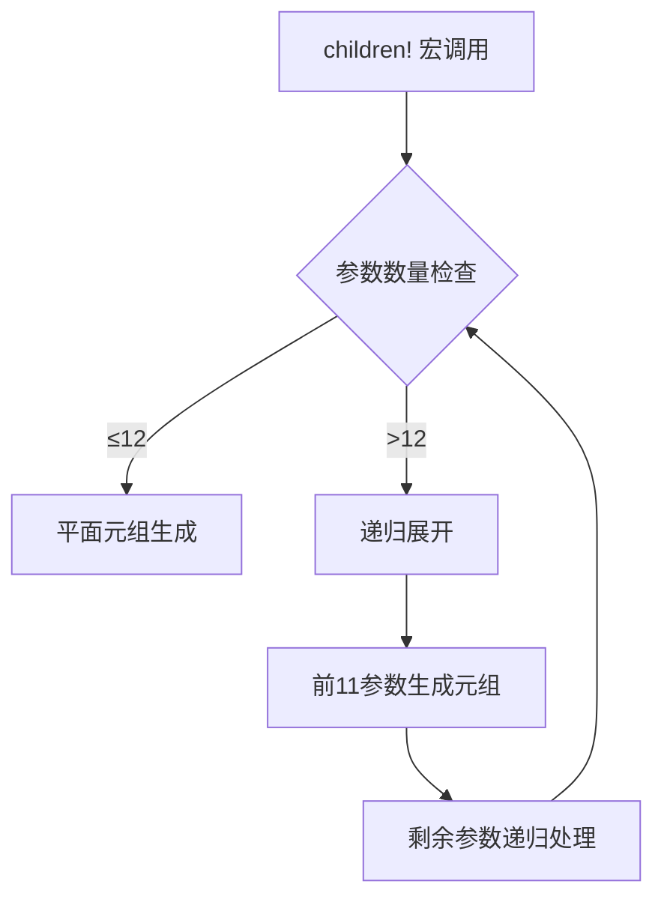

+++
title = "#18865 Increase upper limit of `children!`"
date = "2025-05-06T00:00:00"
draft = false
template = "pull_request_page.html"
in_search_index = false

[extra]
current_language = "zh-cn"
available_languages = {"en" = { name = "English", url = "/pull_request/bevy/2025-05/pr-18865-en-20250506" }, "zh-cn" = { name = "中文", url = "/pull_request/bevy/2025-05/pr-18865-zh-cn-20250506" }}
labels = ["C-Bug", "A-ECS", "C-Usability", "D-Macros"]
+++

# 提升 `children!` 宏的子实体数量上限技术分析

## Basic Information
- **Title**: Increase upper limit of `children!`
- **PR Link**: https://github.com/bevyengine/bevy/pull/18865
- **Author**: CorvusPrudens
- **Status**: MERGED
- **Labels**: C-Bug, A-ECS, C-Usability, S-Ready-For-Final-Review, D-Macros
- **Created**: 2025-04-17T04:25:29Z
- **Merged**: 2025-05-06T01:19:07Z
- **Merged By**: alice-i-cecile

## Description Translation
当前 `bevy_ecs` 的 `children!` 宏只能一次性生成最多 12 个子实体。理想情况下应该没有数量限制。

### 解决方案
`children!` 的限制源于 `SpawnableList` trait 在元组上只实现了最多 12 个元素的假可变参数模式。本 PR 通过嵌套元组的方式突破这个限制，使用宏规则实现递归展开。具体实现分为：
1. 手工处理 0-11 个参数的展开模式
2. 对 12 个及以上参数进行递归嵌套
3. 保留原始代码生成效率，同时提升可用性

 （保留原始图片引用）

## The Story of This Pull Request

### 问题背景与限制
Bevy 引擎的 ECS 系统中，`children!` 宏因依赖 `SpawnableList` trait 的元组实现，长期受限于最多 12 个子实体的硬性约束。当开发者尝试生成超过 12 个实体时，编译器会报类型错误，这在需要批量生成子实体的场景中造成不便。

### 技术方案选择
核心思路是利用元组本身的 `SpawnableList` 实现特性，通过递归嵌套的方式突破元素数量限制。具体实现决策包括：
1. **手工展开模式**：为 0-11 个参数提供显式匹配规则，保持基础用例的代码生成效率
2. **递归处理模式**：对第 12 个及后续参数启动递归展开，形成嵌套元组结构
3. **宏设计权衡**：选择暴露 `recursive_spawn` 辅助宏而非完全隐藏实现，平衡封装性与可维护性

### 具体实现解析
关键改动在 `spawn.rs` 新增的 `recursive_spawn!` 宏：

```rust
// 处理 11 个参数的显式模式
($a:expr, $b:expr, $c:expr, $d:expr, $e:expr, $f:expr, $g:expr, $h:expr, $i:expr, $j:expr, $k:expr) => {
    (
        $crate::spawn::Spawn($a),
        // ...中间参数省略
        $crate::spawn::Spawn($k),
    )
};

// 递归处理 12+ 个参数
(
    $a:expr, $b:expr, $c:expr, $d:expr, $e:expr, $f:expr,
    $g:expr, $h:expr, $i:expr, $j:expr, $k:expr, $($rest:expr),*
) => {
    (
        // 前 11 个参数展开
        $crate::spawn::Spawn($a),
        // ...
        $crate::recursive_spawn!($($rest),*) // 递归处理剩余参数
    )
};
```

这种设计使得：
- 12 个参数生成单层元组
- 13 个参数生成嵌套元组 `(Spawn(a), ..., (Spawn(k), Spawn(l)))`
- 递归深度受 Rust 默认 128 层限制，实际支持约 1400 个元素

### 测试验证
新增测试用例验证边界条件：
```rust
// 验证 12 个参数的平面元组
let id = world.spawn(children![(), ..., ()]).id(); // 12 个空元组
assert_eq!(world.entity(id).get::<Children>().unwrap().len(), 12);

// 验证 13 个参数的嵌套结构
let id = world.spawn(children![(), ..., ()]).id(); // 13 个空元组
assert_eq!(world.entity(id).get::<Children>().unwrap().len(), 13);
```

## Visual Representation


## Key Files Changed

### crates/bevy_ecs/src/spawn.rs (+146/-1)
1. 新增 `recursive_spawn!` 宏实现递归展开逻辑
2. 实现参数分派机制：
```rust
// 修改前：
($child:expr),* => ($($crate::spawn::Spawn($child)),*)

// 修改后：
($($child:expr),*) => $crate::recursive_spawn!($($child),*)
```

### crates/bevy_ecs/src/hierarchy.rs (+34/-1)
1. 更新 `children!` 宏调用方式：
```rust
// 修改前：
$crate::hierarchy::Children::spawn(($($crate::spawn::Spawn($child)),*))

// 修改后：
$crate::hierarchy::Children::spawn($crate::recursive_spawn!($($child),*))
```
2. 新增边界条件测试用例

## Further Reading
1. [Rust 宏编程指南](https://doc.rust-lang.org/rust-by-example/macros.html)
2. [Bevy ECS 设计文档](https://bevyengine.org/learn/book/ecs/)
3. [类型级编程与 trait 实现](https://github.com/rust-unofficial/patterns/blob/master/patterns/newtype.md)