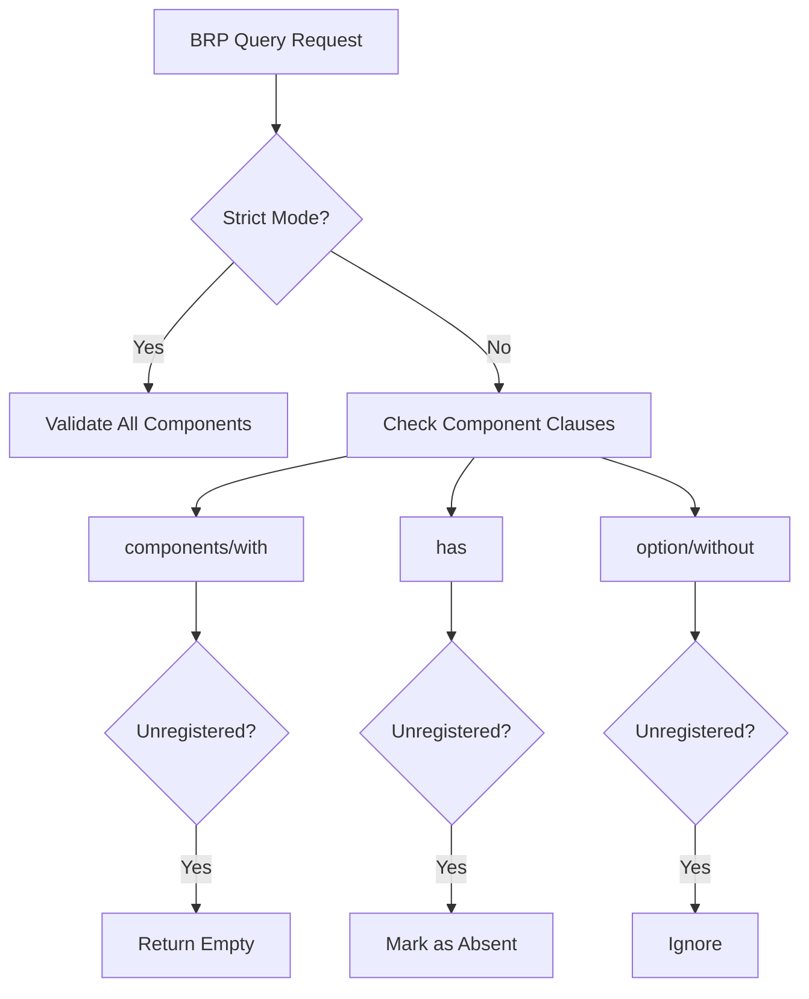

+++
title = "#18871 Fix BRP query failing when specifying missing/invalid components"
date = "2025-05-26T00:00:00"
draft = false
template = "pull_request_page.html"
in_search_index = true

[taxonomies]
list_display = ["show"]

[extra]
current_language = "en"
available_languages = {"en" = { name = "English", url = "/pull_request/bevy/2025-05/pr-18871-en-20250526" }, "zh-cn" = { name = "中文", url = "/pull_request/bevy/2025-05/pr-18871-zh-cn-20250526" }}
labels = ["C-Bug", "A-Diagnostics", "A-Networking", "A-Dev-Tools", "D-Modest"]
+++

# Fix BRP query failing when specifying missing/invalid components

## Basic Information
- **Title**: Fix BRP query failing when specifying missing/invalid components
- **PR Link**: https://github.com/bevyengine/bevy/pull/18871
- **Author**: splo
- **Status**: MERGED
- **Labels**: C-Bug, S-Ready-For-Final-Review, A-Diagnostics, A-Networking, A-Dev-Tools, D-Modest
- **Created**: 2025-04-17T15:44:11Z
- **Merged**: 2025-05-26T15:46:14Z
- **Merged By**: alice-i-cecile

## Description Translation
**Objective**
- Fixes #18869.

**Solution**
The issue was caused by improper error handling using the `?` operator on a `Result`. The fix involves using `ok`, `and_then`, and `map` for better error handling. Additional logic was added for non-strict remote queries:
- Ignore unregistered components in `option` and `without` clauses
- Treat unregistered components in `has` as absent
- Return empty responses for unregistered components in `components` and `with` clauses

The `get_component_ids` function now returns both registered components and unregistered component paths.

**Testing**
Validated using server/client setup with strict and non-strict modes:
```sh
# Non-strict
$ curl -X POST http://localhost:15702 -H "Content-Type: application/json" -d '{...}'
{"jsonrpc":"2.0","id":0,"result":[]}

# Strict
$ curl -X POST http://localhost:15702 -H "Content-Type: application/json" -d '{...}'
{"jsonrpc":"2.0","id":0,"error":{...}}
```

## The Story of This Pull Request

The PR addresses a critical issue in Bevy's remote query system where specifying unregistered components would cause unexpected failures. The root problem lay in how the system handled component registration checks and error propagation.

**Problem Context**
When making BRP (Bevy Remote Protocol) queries with components not registered in the target world:
1. Strict mode queries failed correctly but provided unclear errors
2. Non-strict mode queries crashed instead of gracefully handling missing components
3. Component presence checks (`has`) didn't account for unregistered types

This caused reliability issues for distributed applications using Bevy's networking features, particularly when dealing with components that might exist only on certain nodes.

**Solution Approach**
The author restructured error handling to:
1. Separate registered and unregistered components during lookup
2. Implement different handling strategies per query clause type
3. Maintain strict mode's validation while making non-strict mode more resilient

Key decision points included:
- Choosing to return empty results instead of errors for non-strict hard requirements
- Treating unregistered `has` components as explicitly absent
- Modifying return types to track registration status without breaking existing APIs

**Implementation Details**
The core changes center around the `get_component_ids` function and its callers:

1. Modified return type to track unregistered components:
```rust
// Before: AnyhowResult<Vec<(TypeId, ComponentId)>>
// After: AnyhowResult<(Vec<(TypeId, ComponentId)>, Vec<String>)>
```

2. Added filtering logic in query processing:
```rust
if !unregistered_in_components.is_empty() || !unregistered_in_with.is_empty() {
    return serde_json::to_value(BrpQueryResponse::default())
        .map_err(BrpError::internal);
}
```

3. Enhanced `build_has_map` to handle unregistered components:
```rust
unregistered_components.iter().for_each(|component| {
    has_map.insert(component.to_owned(), Value::Bool(false));
});
```

**Technical Insights**
- The solution uses Rust's type system to track registration status through tuples rather than side channels
- Error handling shifts from early returns (`?`) to phased validation with `and_then`/`map`
- Component presence checks become explicit rather than implicit through the world's component registry

**Impact**
- Improves reliability of distributed Bevy applications
- Maintains backward compatibility through strict mode
- Reduces false positives in component presence checks
- Provides clearer error messages for misconfigured components

## Visual Representation



## Key Files Changed

**crates/bevy_remote/src/builtin_methods.rs** (+61/-27)

1. **Component ID Handling**
```rust
// Before
let components = get_component_ids(...)?;

// After
let (components, unregistered_in_components) = get_component_ids(...)?;
```

2. **Strict Mode Enforcement**
```rust
// Added validation check
if !unregistered_in_components.is_empty() || !unregistered_in_with.is_empty() {
    return empty_response();
}
```

3. **Has Map Enhancement**
```rust
// Modified function signature
fn build_has_map(..., unregistered_components: &[String]) {
    // Added unregistered handling
    unregistered_components.iter().for_each(...);
}
```

## Further Reading
- [Bevy ECS System](https://bevyengine.org/learn/book/ecs/)
- [Rust Error Handling](https://doc.rust-lang.org/book/ch09-00-error-handling.html)
- [TypeId Documentation](https://doc.rust-lang.org/std/any/struct.TypeId.html)