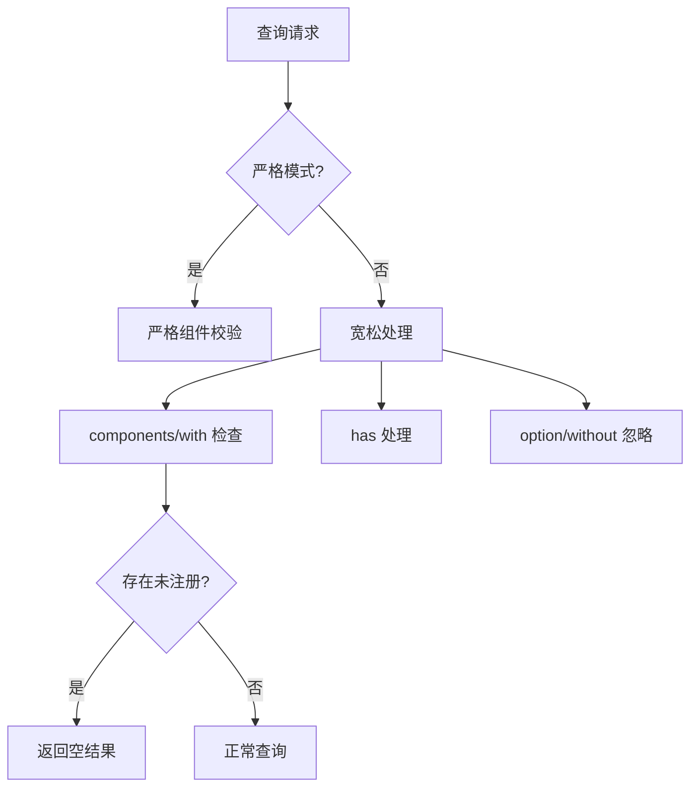

+++
title = "#18871 Fix BRP query failing when specifying missing/invalid components"
date = "2025-05-26T00:00:00"
draft = false
template = "pull_request_page.html"
in_search_index = false

[extra]
current_language = "zh-cn"
available_languages = {"en" = { name = "English", url = "/pull_request/bevy/2025-05/pr-18871-en-20250526" }, "zh-cn" = { name = "中文", url = "/pull_request/bevy/2025-05/pr-18871-zh-cn-20250526" }}
labels = ["C-Bug", "A-Diagnostics", "A-Networking", "A-Dev-Tools", "D-Modest"]
+++

# Fix BRP query failing when specifying missing/invalid components

## Basic Information
- **Title**: Fix BRP query failing when specifying missing/invalid components
- **PR Link**: https://github.com/bevyengine/bevy/pull/18871
- **Author**: splo
- **Status**: MERGED
- **Labels**: C-Bug, S-Ready-For-Final-Review, A-Diagnostics, A-Networking, A-Dev-Tools, D-Modest
- **Created**: 2025-04-17T15:44:11Z
- **Merged**: 2025-05-26T15:46:14Z
- **Merged By**: alice-i-cecile

## Description Translation
此 PR 解决了当指定不存在/无效组件时 BRP 查询失败的问题

# 目标
- 修复 #18869

# 解决方案
问题在于对 `Result` 使用 `?` 运算符导致错误传播，现改用 `ok`、`and_then`、`map` 等方法处理错误

新增逻辑：
- 当 `strict` 模式关闭时：
  - `option` 和 `without` 中的未注册组件会被忽略
  - `has` 中的未注册组件视为不存在于实体
  - `components` 和 `with` 中的未注册组件会导致空响应（因其为硬性要求）

修改 `get_component_ids` 函数返回类型为 `AnyhowResult<(Vec<(TypeId, ComponentId)>, Vec<String>)>`，新增未注册组件列表返回

# 测试验证
使用与 issue 相同的测试流程：
```sh
cargo run --example server --features="bevy_remote"
```
另一终端执行：
```sh
# 非严格模式
$ curl -X POST http://localhost:15702 -H "Content-Type: application/json" -d '{ "jsonrpc": "2.0", "method": "bevy/query", "id": 0, "params": { "data": { "components": [ "foo::bar::MyComponent" ] } } }'
{"jsonrpc":"2.0","id":0,"result":[]}

# 严格模式
$ curl -X POST http://localhost:15702 -H "Content-Type: application/json" -d '{ "jsonrpc": "2.0", "method": "bevy/query", "id": 0, "params": { "data": { "components": [ "foo::bar::MyComponent" ] }, "strict": true } }'
{"jsonrpc":"2.0","id":0,"error":{"code":-23402,"message":"Component `foo::bar::MyComponent` isn't registered or used in the world"}}
```

## 本 PR 的技术实现过程

### 问题背景
在 Bevy 远程查询（BRP）系统中，当客户端请求包含未注册组件时，特别是在非严格（strict）模式下，系统会出现非预期的错误响应。原始实现使用 `?` 运算符直接传播错误，导致即使应该容忍缺失组件的情况也会失败。

### 解决方案设计
核心修改点在于重构组件 ID 获取逻辑，使其能够区分已注册和未注册组件。具体策略：
1. **返回类型扩展**：`get_component_ids` 返回 tuple `(有效组件列表, 未注册组件列表)`
2. **条件处理逻辑**：根据查询参数类型和 strict 模式标志，应用不同处理策略
3. **错误处理改进**：用组合方法替代直接错误传播，实现更细粒度的控制

### 关键技术实现
在 `builtin_methods.rs` 中主要修改了组件处理流程：

```rust
// 修改后的组件获取逻辑
let (components, unregistered_in_components) = 
    get_component_ids(&type_registry, world, components, strict)
        .map_err(BrpError::component_error)?;

// 新增过滤逻辑
if !unregistered_in_components.is_empty() || !unregistered_in_with.is_empty() {
    return serde_json::to_value(BrpQueryResponse::default()).map_err(BrpError::internal);
}
```

`get_component_ids` 函数重构后实现双列表返回：
```rust
fn get_component_ids(...) -> AnyhowResult<(Vec<(TypeId, ComponentId)>, Vec<String>)> {
    // ...
    if let Some((type_id, component_id)) = maybe_component_tuple {
        component_ids.push((type_id, component_id));
    } else if strict {
        return Err(...);
    } else {
        unregistered_components.push(component_path);
    }
    // ...
}
```

### 技术影响
1. **错误处理改进**：使用组合方法（`ok` + `and_then`）替代直接 `?` 传播，实现更灵活的错误处理
2. **查询语义明确**：
   - `components`/`with` 作为硬性条件，存在未注册组件时返回空集
   - `has` 条件中的未注册组件视为 false
   - `option`/`without` 直接忽略未注册组件
3. **兼容性保障**：严格模式维持原有行为，确保向后兼容

## 可视化架构



## 关键文件变更

### `crates/bevy_remote/src/builtin_methods.rs` (+61/-27)
主要重构了组件查询处理逻辑：

**核心修改前对比**：
```rust
// 修改前：单列表返回
fn get_component_ids(...) -> AnyhowResult<Vec<(TypeId, ComponentId)>> {
    // 直接返回错误或有效列表
}

// 修改后：双列表返回
fn get_component_ids(...) -> AnyhowResult<(Vec<(TypeId, ComponentId)>, Vec<String>)> {
    // 分离有效组件和未注册路径
}
```

**查询处理逻辑增强**：
```rust
// 新增未注册组件检查
if !unregistered_in_components.is_empty() || !unregistered_in_with.is_empty() {
    return empty_response();
}

// 更新 has 映射构建
let has_map = build_has_map(
    row.clone(),
    has_paths_and_reflect_components.iter().copied(),
    &unregistered_in_has,  // 新增未注册组件参数
);
```

## 延伸阅读
1. [Bevy ECS 组件系统文档](https://bevyengine.org/learn/book/ecs/components/)
2. [Rust 错误处理最佳实践](https://doc.rust-lang.org/book/ch09-00-error-handling.html)
3. [JSON-RPC 2.0 规范](https://www.jsonrpc.org/specification)