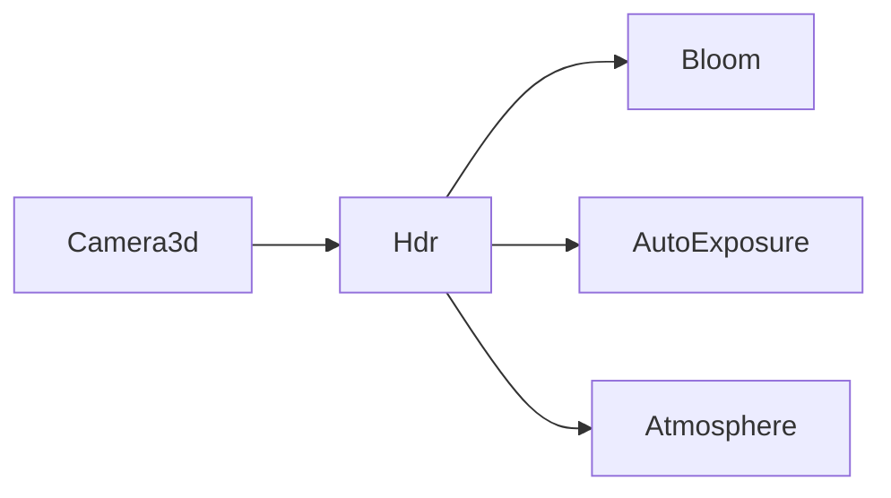

+++
title = "#18873 Split `Camera.hdr` out into a new component"
date = "2025-05-26T00:00:00"
draft = false
template = "pull_request_page.html"
in_search_index = true

[taxonomies]
list_display = ["show"]

[extra]
current_language = "en"
available_languages = {"en" = { name = "English", url = "/pull_request/bevy/2025-05/pr-18873-en-20250526" }, "zh-cn" = { name = "中文", url = "/pull_request/bevy/2025-05/pr-18873-zh-cn-20250526" }}
labels = ["A-Rendering", "C-Usability", "D-Straightforward"]
+++

# Title

## Basic Information
- **Title**: Split `Camera.hdr` out into a new component
- **PR Link**: https://github.com/bevyengine/bevy/pull/18873
- **Author**: ecoskey
- **Status**: MERGED
- **Labels**: A-Rendering, C-Usability, S-Ready-For-Final-Review, M-Needs-Migration-Guide, D-Straightforward
- **Created**: 2025-04-18T04:09:12Z
- **Merged**: 2025-05-26T19:44:26Z
- **Merged By**: alice-i-cecile

## Description Translation
# Objective

- Simplify `Camera` initialization
- allow effects to require HDR

## Solution

- Split out `Camera.hdr` into a marker `Hdr` component

## Testing

- ran `bloom_3d` example

---

## Showcase

```rs
// before
commands.spawn((
  Camera3d
  Camera {
    hdr: true
    ..Default::default()
  }
))

// after
commands.spawn((Camera3d, Hdr));

// other rendering components can require that the camera enables hdr!
// currently implemented for Bloom, AutoExposure, and Atmosphere.
#[require(Hdr)]
pub struct Bloom;
```

## The Story of This Pull Request

The PR addresses two related issues in Bevy's rendering system. First, camera initialization required setting HDR through a boolean flag in the `Camera` component, which was non-idiomatic for ECS patterns. Second, post-processing effects couldn't formally require HDR support, potentially leading to runtime errors if misconfigured.

The solution introduces a new `Hdr` marker component to replace the `Camera.hdr` boolean. This change simplifies camera setup by allowing developers to compose camera entities using discrete components:

```rust
// Before: Verbose configuration
commands.spawn((Camera3d, Camera { hdr: true, ..default() }));

// After: Component-based approach
commands.spawn((Camera3d, Hdr));
```

Key technical changes include:
1. Removing `hdr` field from `Camera` struct
2. Adding `Hdr` marker component with `ExtractComponent` implementation
3. Updating rendering systems to check for `Hdr` component presence
4. Adding `#[require(Hdr)]` attribute to effects like `Bloom` and `AutoExposure`

The implementation required modifying camera extraction logic in `bevy_render/src/camera/camera.rs`:

```rust
// Before: Checking camera.hdr boolean
if camera.hdr { ... }

// After: Checking Hdr component presence
type QueryFilter = With<Hdr>;
```

This change improves code clarity by separating concerns - cameras now explicitly declare their HDR capability through component composition rather than implicit boolean flags. The `#[require(Hdr)]` attribute ensures compile-time validation that required features are present, preventing runtime errors.

## Visual Representation



## Key Files Changed

1. `crates/bevy_render/src/camera/camera.rs` (+5/-7)
   - Removed `hdr` field from `Camera` struct
   - Updated extraction system to use `Has<Hdr>` check
   ```rust
   // Before:
   pub hdr: bool,
   
   // After:
   // HDR moved to separate component
   ```

2. `crates/bevy_render/src/view/mod.rs` (+16/-0)
   - Added new `Hdr` marker component
   ```rust
   #[derive(Component, Default, Copy, Clone, ExtractComponent)]
   pub struct Hdr;
   ```

3. `examples/3d/bloom_3d.rs` (+0/-1)
   - Updated camera setup
   ```rust
   // Before:
   Camera { hdr: true, ..default() }
   
   // After:
   Hdr
   ```

4. `crates/bevy_core_pipeline/src/bloom/settings.rs` (+9/-5)
   - Added HDR requirement to Bloom
   ```rust
   #[require(Hdr)]
   pub struct Bloom;
   ```

5. `release-content/migration-guides/camera_restructure.md` (+12/-0)
   - Added migration guide for breaking change
   ```markdown
   - before: commands.spawn((Camera3d, Camera { hdr: true }))
   - after: commands.spawn((Camera3d, Hdr))
   ```

## Further Reading

- ECS Composition Patterns: https://bevy-cheatbook.github.io/programming/ecs-intro.html
- Bevy Component Documentation: https://docs.rs/bevy_ecs/latest/bevy_ecs/component/trait.Component.html
- HDR Rendering Concepts: https://en.wikipedia.org/wiki/High-dynamic-range_rendering