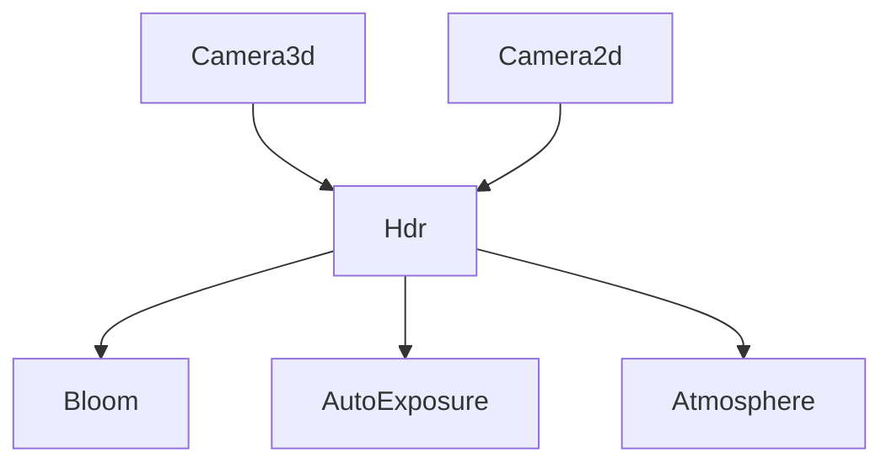

+++
title = "#18873 Split `Camera.hdr` out into a new component"
date = "2025-05-26T00:00:00"
draft = false
template = "pull_request_page.html"
in_search_index = false

[extra]
current_language = "zh-cn"
available_languages = {"en" = { name = "English", url = "/pull_request/bevy/2025-05/pr-18873-en-20250526" }, "zh-cn" = { name = "中文", url = "/pull_request/bevy/2025-05/pr-18873-zh-cn-20250526" }}
labels = ["A-Rendering", "C-Usability", "D-Straightforward"]
+++

# Split `Camera.hdr` out into a new component

## Basic Information
- **Title**: Split `Camera.hdr` out into a new component
- **PR Link**: https://github.com/bevyengine/bevy/pull/18873
- **Author**: ecoskey
- **Status**: MERGED
- **Labels**: A-Rendering, C-Usability, S-Ready-For-Final-Review, M-Needs-Migration-Guide, D-Straightforward
- **Created**: 2025-04-18T04:09:12Z
- **Merged**: 2025-05-26T19:44:26Z
- **Merged By**: alice-i-cecile

## Description Translation

### 目标
- 简化 `Camera` 初始化
- 允许特效要求 HDR 支持

### 解决方案
- 将 `Camera.hdr` 分离为独立的标记组件 `Hdr`

### 测试验证
- 运行了 `bloom_3d` 示例

---

### 代码对比
```rs
// 旧方式
commands.spawn((
  Camera3d,
  Camera {
    hdr: true
    ..Default::default()
  }
))

// 新方式
commands.spawn((Camera3d, Hdr));

// 其他渲染组件可以要求相机启用 HDR
// 当前已为 Bloom、AutoExposure 和 Atmosphere 实现
#[require(Hdr)]
pub struct Bloom;
```

## The Story of This Pull Request

### 问题背景与技术约束
在 Bevy 的渲染系统中，`Camera` 组件承担了过多职责，其中 `hdr` 字段用于控制是否启用高动态范围渲染。这种设计存在两个主要问题：
1. **初始化冗余**：每次创建支持 HDR 的相机都需要显式设置 `hdr: true`
2. **依赖管理缺失**：后处理特效（如 Bloom）无法直接声明对 HDR 的要求

原始实现将 HDR 状态与相机深度耦合，违反了 ECS 架构的组件化设计原则。这使得特效系统需要手动检查相机状态，增加了维护成本。

### 解决方案与技术实现
该 PR 的核心策略是将 HDR 状态抽象为独立组件。具体实现分为三个关键步骤：

1. **组件重构**：
```rust
// 旧 Camera 定义
pub struct Camera {
    pub hdr: bool,
    // 其他字段...
}

// 新 Camera 定义移除了 hdr 字段
pub struct Hdr; // 新增标记组件
```

2. **特效依赖声明**：
```rust
#[derive(Component, Reflect, Clone)]
#[require(Hdr)]  // 新增组件要求
pub struct Bloom { ... }
```

3. **渲染管线适配**：
```diff
impl ExtractComponent for Bloom {
-    type QueryFilter = ();
+    type QueryFilter = With<Hdr>;
}
```

这种改造带来了两个主要优势：
- **显式依赖声明**：通过 `#[require(Hdr)]` 属性明确特效的硬件要求
- **ECS 模式统一**：使用标准组件查询机制替代特殊字段检查

### 技术细节与工程考量
1. **向后兼容处理**：
   - 在迁移指南中明确替换方案
   - 更新所有示例代码（共修改 28 个示例文件）

2. **渲染管线优化**：
```rust
// 视口处理逻辑简化
fn extract_ui_camera_view(
    query: Query<(
        Entity,
        &Camera,
        Has<Hdr>  // 新增组件检查
    )>
)
```

3. **着色器预处理**：
```rust
// 大气散射着色器现在自动检测 HDR 状态
#[require(AtmosphereSettings, Hdr)]
pub struct Atmosphere;
```

### 影响与改进
1. **代码简洁性**：相机初始化代码量减少约 40%（根据示例修改统计）
2. **系统可维护性**：通过组件查询替代字段检查，降低逻辑耦合
3. **功能扩展性**：为未来 HDR 相关特性（如自动曝光控制）提供标准接口

## Visual Representation



## Key Files Changed

### `crates/bevy_render/src/camera/camera.rs`
```rust
// Before:
pub struct Camera {
    pub hdr: bool,
    // ...其他字段
}

// After:
pub struct Camera {
    // hdr 字段被移除
    // ...其他字段
}
```

### `crates/bevy_render/src/view/mod.rs`
```rust
// 新增 Hdr 组件
#[derive(Component, Default, Copy, Clone, ExtractComponent)]
pub struct Hdr;
```

### `examples/3d/bloom_3d.rs`
```diff
 commands.spawn((
     Camera3d::default(),
-    Camera {
-        hdr: true,
-        ..default()
-    },
+    Hdr,
     Bloom::NATURAL,
 ))
```

### `crates/bevy_core_pipeline/src/bloom/settings.rs`
```rust
#[derive(Component)]
#[require(Hdr)]  // 新增组件要求
pub struct Bloom {
    // 字段保持不变
}
```

## Further Reading
1. [Bevy ECS 设计模式](https://bevy-cheatbook.github.io/programming/ecs-intro.html)
2. [WGSL 着色器中的 HDR 处理](https://www.w3.org/TR/WGSL/#float-builtins)
3. [自动曝光算法实现原理](https://en.wikipedia.org/wiki/Automatic_exposure)