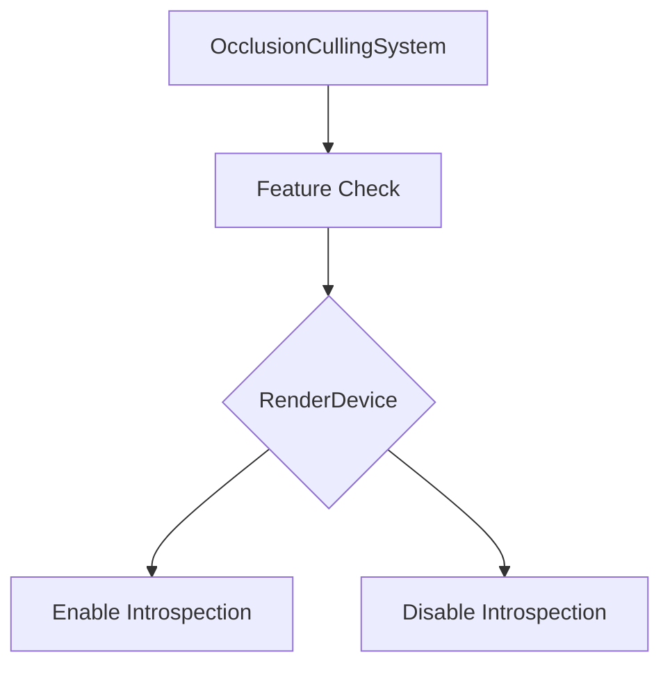

+++
title = "#18974 Fix occlusion culling not respecting device limits"
date = "2025-05-05T00:00:00"
draft = false
template = "pull_request_page.html"
in_search_index = true

[taxonomies]
list_display = ["show"]

[extra]
current_language = "en"
available_languages = {"en" = { name = "English", url = "/pull_request/bevy/2025-05/pr-18974-en-20250505" }, "zh-cn" = { name = "中文", url = "/pull_request/bevy/2025-05/pr-18974-zh-cn-20250505" }}
labels = ["C-Bug", "A-Rendering"]
+++

# Fix occlusion culling not respecting device limits

## Basic Information
- **Title**: Fix occlusion culling not respecting device limits
- **PR Link**: https://github.com/bevyengine/bevy/pull/18974
- **Author**: greeble-dev
- **Status**: MERGED
- **Labels**: C-Bug, A-Rendering, S-Ready-For-Final-Review
- **Created**: 2025-04-28T16:34:13Z
- **Merged**: 2025-05-05T18:25:03Z
- **Merged By**: mockersf

## Description Translation
The occlusion culling plugin checks for a GPU feature by looking at `RenderAdapter`. This is wrong - it should be checking `RenderDevice`. See these notes for background: https://github.com/bevyengine/bevy/discussions/18973

I don't have any evidence that this was causing any bugs, so right now it's just a precaution.

## Testing

```
cargo run --example occlusion_culling
```

Tested on Win10/Nvidia across Vulkan, WebGL/Chrome, WebGPU/Chrome.

## The Story of This Pull Request

The PR addresses a fundamental mismatch in feature detection within Bevy's occlusion culling system. The core issue stemmed from querying the wrong hardware abstraction layer when checking for the `MULTI_DRAW_INDIRECT_COUNT` feature - a critical capability for efficient occlusion query introspection.

In Bevy's rendering architecture, `RenderAdapter` represents physical GPU capabilities, while `RenderDevice` reflects the actual enabled features of the logical device. The original implementation incorrectly checked the adapter's features, which could differ from the device's enabled features due to backend limitations or explicit feature selection during device creation.

The key realization was that feature availability must be determined at the device level rather than the adapter level. This distinction becomes crucial when:
1. Using WebGL/WebGPU backends with stricter feature requirements
2. Working with adapters that support features but have them disabled at device creation
3. Handling platforms with partial feature support

The fix involved three strategic changes in `occlusion_culling.rs`:
1. Removing the `RenderAdapter` import
2. Accessing `RenderDevice` instead of `RenderAdapter` from the World resources
3. Querying the device's features directly for capability checks

These changes ensure the occlusion culling system:
- Accurately respects the device's actual capabilities
- Avoids potential invalid API calls on platforms where features are adapter-supported but device-disabled
- Maintains correct behavior across different rendering backends

While no specific bugs were documented, this correction prevents subtle rendering issues that could manifest as:
- Invalid draw calls on WebGL/WebGPU targets
- Incorrect occlusion statistics display
- Potential GPU validation errors in strict environments

## Visual Representation



## Key Files Changed

### `examples/3d/occlusion_culling.rs` (+3/-3)
**Purpose**: Correct feature capability checks for occlusion culling introspection

Key modifications:
```rust
// Before:
use renderer::{RenderAdapter, RenderContext, RenderDevice};
// ...
let render_adapter = world.resource::<RenderAdapter>();
// ...
occlusion_culling_introspection_supported: render_adapter
    .features()
    .contains(WgpuFeatures::MULTI_DRAW_INDIRECT_COUNT)

// After:
use renderer::{RenderContext, RenderDevice};
// ...
let render_device = world.resource::<RenderDevice>();
// ...
occlusion_culling_introspection_supported: render_device
    .features()
    .contains(WgpuFeatures::MULTI_DRAW_INDIRECT_COUNT)
```

These changes ensure feature checks align with actual device capabilities rather than theoretical adapter support.

## Further Reading
- [WebGPU Feature Enumeration](https://gpuweb.github.io/gpuweb/#gpufeaturename)
- [Bevy RenderDevice Documentation](https://docs.rs/bevy_render/latest/bevy_render/renderer/struct.RenderDevice.html)
- [wgpu Feature Flags](https://docs.rs/wgpu/latest/wgpu/struct.Features.html)

# Full Code Diff
```diff
diff --git a/examples/3d/occlusion_culling.rs b/examples/3d/occlusion_culling.rs
index 4c69db0a4a101..9268f1dc6a8d3 100644
--- a/examples/3d/occlusion_culling.rs
+++ b/examples/3d/occlusion_culling.rs
@@ -32,7 +32,7 @@ use bevy::{
         experimental::occlusion_culling::OcclusionCulling,
         render_graph::{self, NodeRunError, RenderGraphApp, RenderGraphContext, RenderLabel},
         render_resource::{Buffer, BufferDescriptor, BufferUsages, MapMode},
-        renderer::{RenderAdapter, RenderContext, RenderDevice},
+        renderer::{RenderContext, RenderDevice},
         settings::WgpuFeatures,
         Render, RenderApp, RenderDebugFlags, RenderPlugin, RenderSet,
     },
@@ -140,7 +140,7 @@ struct SavedIndirectParametersData {
 
 impl FromWorld for SavedIndirectParameters {
     fn from_world(world: &mut World) -> SavedIndirectParameters {
-        let render_adapter = world.resource::<RenderAdapter>();
+        let render_device = world.resource::<RenderDevice>();
         SavedIndirectParameters(Arc::new(Mutex::new(SavedIndirectParametersData {
             data: vec![],
             count: 0,
@@ -152,7 +152,7 @@ impl FromWorld for SavedIndirectParameters {
             // supports `multi_draw_indirect_count`. So, if we don't have that
             // feature, then we don't bother to display how many meshes were
             // culled.
-            occlusion_culling_introspection_supported: render_adapter
+            occlusion_culling_introspection_supported: render_device
                 .features()
                 .contains(WgpuFeatures::MULTI_DRAW_INDIRECT_COUNT),
         })))
```