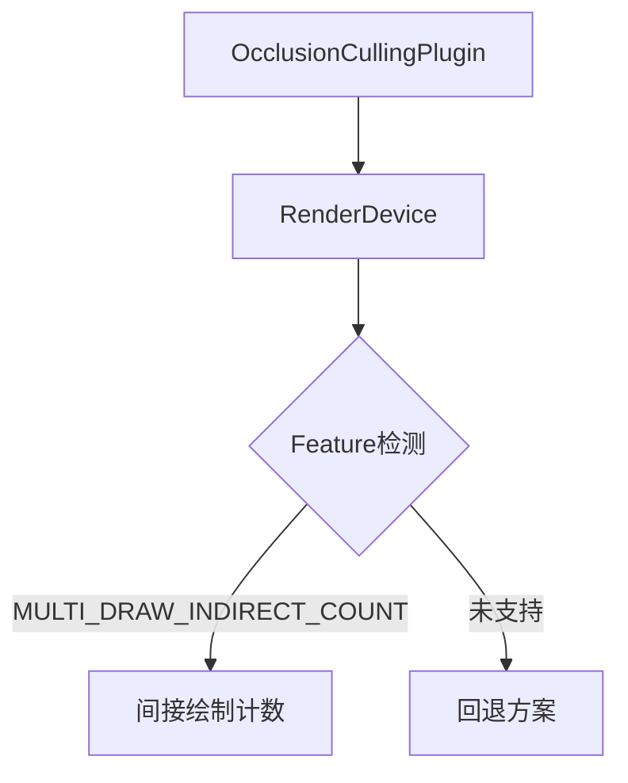

+++
title = "#18974 Fix occlusion culling not respecting device limits"
date = "2025-05-05T00:00:00"
draft = false
template = "pull_request_page.html"
in_search_index = false

[extra]
current_language = "zh-cn"
available_languages = {"en" = { name = "English", url = "/pull_request/bevy/2025-05/pr-18974-en-20250505" }, "zh-cn" = { name = "中文", url = "/pull_request/bevy/2025-05/pr-18974-zh-cn-20250505" }}
+++

# 修复遮挡剔除未正确遵循设备限制的问题

## 基本信息
- **标题**: Fix occlusion culling not respecting device limits
- **PR链接**: https://github.com/bevyengine/bevy/pull/18974
- **作者**: greeble-dev
- **状态**: 已合并
- **标签**: C-Bug, A-Rendering, S-Ready-For-Final-Review
- **创建时间**: 2025-04-28T16:34:13Z
- **合并时间**: 2025-05-05T18:25:03Z
- **合并者**: mockersf

## 问题描述与解决

### 问题背景
在Bevy引擎的遮挡剔除（occlusion culling）实现中，存在一个潜在的问题：插件通过检查`RenderAdapter`而非`RenderDevice`来判断GPU是否支持`multi_draw_indirect_count`特性。这两个关键组件的区别在于：
- `RenderAdapter`：表示物理图形适配器（如GPU硬件）
- `RenderDevice`：表示实际使用的逻辑设备（与具体API上下文关联）

这种错误可能导致特性检测与实际渲染设备能力不匹配，特别是在多后端（如Vulkan/WebGL）或复杂设备配置环境下。

### 问题定位
在`SavedIndirectParameters`的`from_world`实现中，原始代码错误地从World获取`RenderAdapter`资源：

```rust
// 修改前
let render_adapter = world.resource::<RenderAdapter>();
// ...
occlusion_culling_introspection_supported: render_adapter
    .features()
    .contains(WgpuFeatures::MULTI_DRAW_INDIRECT_COUNT)
```

### 解决方案
将资源获取对象改为`RenderDevice`，确保检测的是实际渲染设备的能力：

```rust
// 修改后
let render_device = world.resource::<RenderDevice>();
// ...
occlusion_culling_introspection_supported: render_device
    .features()
    .contains(WgpuFeatures::MULTI_DRAW_INDIRECT_COUNT)
```

### 技术影响
1. **正确性提升**：确保特性检测与实际渲染设备状态一致
2. **跨后端兼容**：避免在WebGL/WebGPU等环境下出现设备能力误判
3. **防御性编程**：预防未来可能出现的间接绘制计数错误问题

## 关键代码变更

### 文件：examples/3d/occlusion_culling.rs
```diff
@@ -32,7 +32,7 @@ use bevy::{
         experimental::occlusion_culling::OcclusionCulling,
         render_graph::{self, NodeRunError, RenderGraphApp, RenderGraphContext, RenderLabel},
         render_resource::{Buffer, BufferDescriptor, BufferUsages, MapMode},
-        renderer::{RenderAdapter, RenderContext, RenderDevice},
+        renderer::{RenderContext, RenderDevice},
         settings::WgpuFeatures,
         Render, RenderApp, RenderDebugFlags, RenderPlugin, RenderSet,
     },
@@ -140,7 +140,7 @@ struct SavedIndirectParametersData {
 
 impl FromWorld for SavedIndirectParameters {
     fn from_world(world: &mut World) -> SavedIndirectParameters {
-        let render_adapter = world.resource::<RenderAdapter>();
+        let render_device = world.resource::<RenderDevice>();
         SavedIndirectParameters(Arc::new(Mutex::new(SavedIndirectParametersData {
             data: vec![],
             count: 0,
@@ -152,7 +152,7 @@ impl FromWorld for SavedIndirectParameters {
             // supports `multi_draw_indirect_count`. So, if we don't have that
             // feature, then we don't bother to display how many meshes were
             // culled.
-            occlusion_culling_introspection_supported: render_adapter
+            occlusion_culling_introspection_supported: render_device
                 .features()
                 .contains(WgpuFeatures::MULTI_DRAW_INDIRECT_COUNT),
         })))
```

变更要点：
1. 移除不必要的`RenderAdapter`导入
2. 将资源获取从`RenderAdapter`改为`RenderDevice`
3. 特性检测改为基于实际渲染设备

## 技术验证
开发者通过以下方法验证改动：
```bash
cargo run --example occlusion_culling
```
测试覆盖：
- Windows 10 + NVIDIA显卡
- Vulkan/WebGL/WebGPU后端
- Chrome浏览器环境

## 组件关系图



## 延伸阅读
1. [WebGPU规范 - 特性枚举](https://www.w3.org/TR/webgpu/#gpufeaturename)
2. [Bevy渲染架构设计文档](https://bevyengine.org/learn/book/rendering/)
3. [WGPU特性管理最佳实践](https://wgpu.rs/guide/features/)