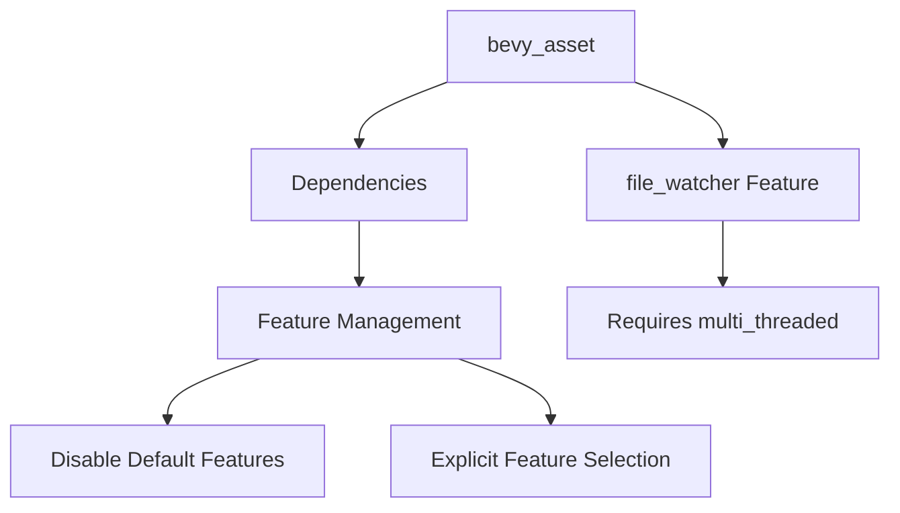

+++
title = "#18979 Strip unused features from `bevy_asset` dependencies"
date = "2025-05-05T00:00:00"
draft = false
template = "pull_request_page.html"
in_search_index = true

[taxonomies]
list_display = ["show"]

[extra]
current_language = "en"
available_languages = {"en" = { name = "English", url = "/pull_request/bevy/2025-05/pr-18979-en-20250505" }, "zh-cn" = { name = "中文", url = "/pull_request/bevy/2025-05/pr-18979-zh-cn-20250505" }}
+++

# Title: Strip unused features from `bevy_asset` dependencies

## The Story of This Pull Request

### The Problem and Context
The `bevy_asset` crate carried unnecessary dependency features that increased build times and binary size. This technical debt became more apparent when preparing for potential `no_std` support (#18978), where extraneous features could complicate the transition. A specific compilation error existed when enabling the `file_watcher` feature without `multi_threaded`, enforced through a `compile_error!` macro.

### The Solution Approach
The author implemented a two-pronged strategy:
1. **Dependency feature pruning**: Disabled default features for all dependencies, explicitly enabling only required features
2. **Feature dependency resolution**: Modified the `file_watcher` feature to automatically enable `multi_threaded`, resolving the compilation error at the feature declaration level rather than through runtime checks

### The Implementation
The core changes appear in `Cargo.toml`, with strategic dependency modifications:

```toml
# Before:
bevy_app = { path = "../bevy_app", version = "0.16.0-dev" }

# After:
bevy_app = { 
  path = "../bevy_app", 
  version = "0.16.0-dev", 
  default-features = false, 
  features = ["bevy_reflect"]
}
```
This pattern repeats across all dependencies, ensuring each only pulls necessary features. The `file_watcher` feature definition changed to include its actual dependency:
```toml
[features]
-file_watcher = ["notify-debouncer-full", "watch"]
+file_watcher = ["notify-debouncer-full", "watch", "multi_threaded"]
```

### Technical Insights
Key implementation details include:
1. **Feature propagation**: Ensuring parent features (like `file_watcher`) properly declare their dependencies
2. **Cross-platform consistency**: Maintaining platform-specific dependencies while stripping defaults
3. **Error prevention**: Removing the `compile_error!` check in `lib.rs` since the feature dependency tree now enforces correct configuration

### The Impact
1. **Reduced build overhead**: Eliminating unused features decreases compile times and final binary size
2. **Cleaner feature graph**: Explicit dependencies prevent unexpected feature interactions
3. **Foundation for future work**: Prepares for `no_std` support by removing implicit std dependencies through default features

## Visual Representation



## Key Files Changed

1. **crates/bevy_asset/Cargo.toml**
```toml
# Before general dependency pattern:
bevy_app = { path = "../bevy_app", version = "0.16.0-dev" }

# After:
bevy_app = { 
  path = "../bevy_app", 
  version = "0.16.0-dev", 
  default-features = false, 
  features = ["bevy_reflect"]
}

# Feature dependency resolution:
-file_watcher = ["notify-debouncer-full", "watch"]
+file_watcher = ["notify-debouncer-full", "watch", "multi_threaded"]
```

2. **crates/bevy_asset/src/lib.rs**
```rust
# Removed compile-time check:
-#[cfg(all(feature = "file_watcher", not(feature = "multi_threaded")))]
-compile_error!("...");
```

## Further Reading
1. [Cargo Features Documentation](https://doc.rust-lang.org/cargo/reference/features.html)
2. [Rust Dependency Optimization Guide](https://github.com/johnthagen/min-sized-rust)
3. [Bevy Engine Feature Management](https://bevyengine.org/learn/book/getting-started/features/)